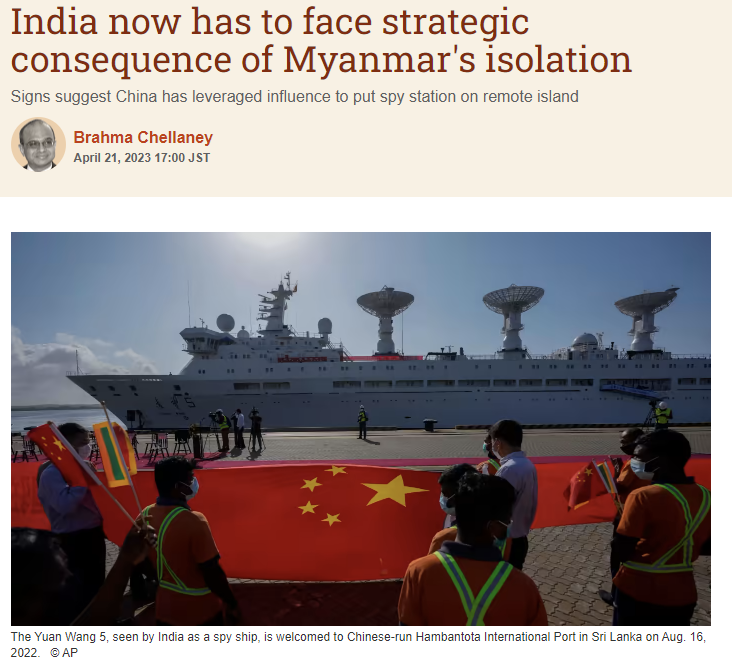

# 印度想买美国“死神”无人机，借口是对付“印度洋小岛上的中国基地”

印度想买美国的MQ-9
“死神”无人机了，据印媒报道，其动因是为了监视孟加拉湾科科群岛上“令人震惊的新建的空军基地设施”。这是属于缅甸的岛屿，但印度《欧亚时报》网站5月18日这样介绍：“这个岛屿即使没有受到中国的控制，也处于中国的影响之下。”

《欧亚时报》引用印度一名退役海军中将的话说，未来，印度洋的海上监视将主要依靠航时较长的无人机。“对于长时间的常规任务，无人机具有成本优势，也不会像飞行员操作的侦察机那样出现机组人员疲劳的情况。”

印度目前只有两架从华盛顿租借的长航时MQ-9“死神”无人机。此外还有从波音采购的12架P8I“海神”反潜机，但它们已经服役10年了。

据称，印度海军一架租借的“死神”无人机最近在缅甸科科群岛附近飞行时，发现了那里“有一个空军基地正在进行现代化升级以及其他建设”。

然而，整篇报道提到“空军基地”就只有这一句话，此外就是以十分警惕的语气描述这些岛屿的重要战略意义：它们靠近印度海岸线，靠近具有重要战略意义的安达曼和尼科巴群岛；报道还声称，上世纪90年代末，缅甸
“曾允许中国在科科群岛上建立一个情报站”。

因此，《欧亚时报》说，印度海军想要拥有“死神”无人机的海上守护型号MQ-9B，他们寄希望于在总理莫迪下个月访问美国的时候，向美国购买这种无人机。

实际上，近期有关科科群岛所谓“军事建设”的炒作，已经有一阵子了，始于3月31日英国查塔姆研究所发表的题为《缅甸是否在科科群岛建间谍基地》的报告。随后西方媒体就开始了各种猜测性和倾向性报道，很多直接炒作这个群岛“建有中国军事设施”。

比如英国《卫报》，发了文章还发了推特：缅甸科科群岛上的军事建设引发了对中国介入的担忧。

《外交学者》网站5月4日这样写道：最近的卫星照片显示，科科群岛上新扩建的飞机跑道长度几乎增加了一倍，还可以看到两个新的机库和一条堤道。“这种改进不是普通的升级。机库足够宽，可以容纳高性能飞机，也许是侦察机。这里可能会变成一个海军情报收集基地。”

日本经济新闻则发表文章称，印度现在“不得不面对缅甸孤立的战略后果”， “有迹象表明，中国利用影响力在这个偏远岛屿上设立了间谍站”。

配图是被印度诬陷为“间谍船”的中国远望5号在斯里兰卡汉班托塔港受到欢迎。

好在，这个世界上总还有几个真正从事独立研究的学者，澳大利亚智库洛伊研究所本月发表了一篇反驳上述荒谬说法的文章，
“又来了”，这位名为安德鲁•塞尔斯的学者写道：“了解一点历史应该有助于打消一些疯狂的猜测”。

塞尔斯介绍，早在1992年，日本共同社就发表文章，声称中国正在科科群岛建设“雷达设施”，“这一事件引起了其他记者和评论员的注意，他们在主流媒体上发表了一系列危言耸听的报道。当他们试图在报道的精彩上超越对手时，故事变得越来越离奇。”

“在没有引用任何证据的情况下，这些文章的作者提到了天线场、天线罩、巨型望远镜和其他专门的情报收集设备。安装在岛上机场的小型雷达很快被描述为一个中国信号情报站，可以窃听印度海军，以及一个可以监视印度导弹发射的电子监听站。它还被描述为能够拦截来自印度潜艇的深海通信。”

“时任印度外交部长费尔南德斯一些不同寻常的发言助长了这种胡言乱语。1998年，他声称中国从缅甸租借了科科群岛，并在那里建立了一个信号情报基地，以‘包围’印度。”

“但从商业卫星图像上看，科科群岛上没有任何可疑设施，于是又有人用2004年的印度洋海啸来解释，说海啸把这些设施都冲走了。”

塞尔斯说，对这些谣言，缅甸方面多次否认，后来印度人还被允许飞越科科群岛，以证实新闻报道的不准确。最后，在2005年，印度军队总参谋长公开承认，这个岛上并没有中国的情报基地。

这位学者写道，查塔姆研究所的论文主要基于商业卫星图像，指出科科群岛的跑道正在延长，几个新的飞机机库正在建设中。“但没有任何情报收集设施的迹象，更不用说任何表明中国永久存在的迹象了。所看到的一切可能只是缅甸武装部队适度升级计划的一部分，而这个小岛恰好位于战略敏感地带。”

这篇论文在最后写道：缅甸的将军们非常务实，但也有着强烈的民族主义，实在难以想象他们会允许任何国家在缅甸领土上建立“间谍站”。

事实上，上个月，缅甸国家管理委员会发言人绍敏通已经声明，有关中国在科科群岛建造间谍设施的传言“荒谬可笑”，并表示缅甸绝不会允许外国军队进入本国领土。

说到警惕，倒是印度，用了中国作买“死神”无人机的借口，到底想监视谁？要说警惕，也该是缅甸和中国警惕才对。

