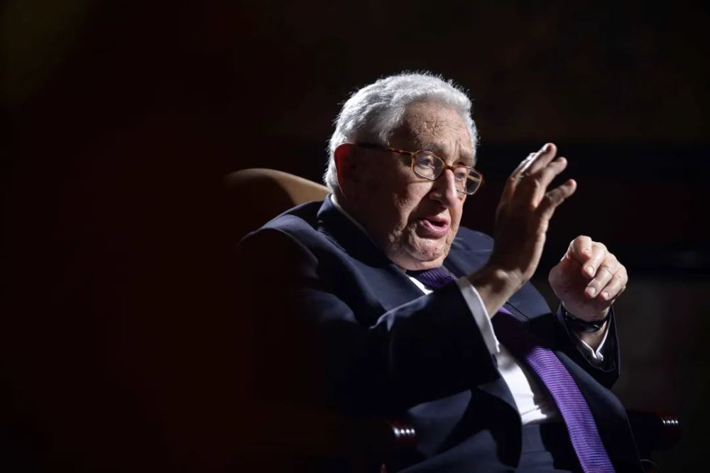
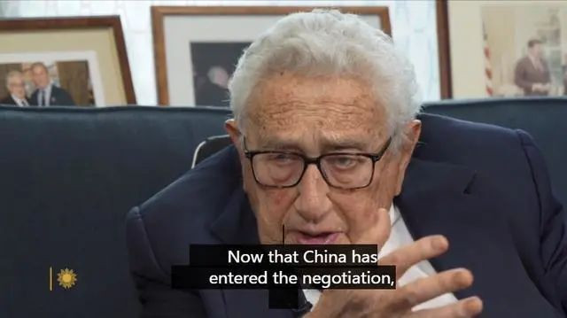

# 基辛格：49年前日本就想搞核武

**“日本在不进行核试验的情况下，也可能获得多枚核弹。”**

作者：温宪（本刊前驻美国特派记者）

田亮 郑敖天 冯群星

编辑：田亮

“他们（日本）的方向很清楚，日本正朝着在5年内成为拥核国家迈进。”

此话一出，各路媒体和学者争相转发。

说这话的正是美国前国务卿基辛格。据俄罗斯卫星社5月18日报道，基辛格在接受英国《经济学人》周刊采访时表达了这样的观点。他还补充说，日本一直“想靠近”美国，但不排除东京会达成对华盛顿不利交易的可能性。

媒体转发此消息时，标题更加直接：基辛格预测日本或5年内拥核。

前几天，基辛格刚刚接受美国哥伦比亚广播公司（CBS）采访，还和主持人小吵了一架。这让人很难想象，这位精力如此充沛的政坛明星，已经100岁了。

**对日本强烈担忧**

二战后，日本宪法专门拿出一章来讲“放弃战争”，实际上其中只有一条，即第九条：“永远放弃以国权发动的战争、武力威胁或武力行使作为解决国际争端的手段”“不保持陆海空军及其他战争力量，不承认国家的交战权”。日本宪法也被称为“和平宪法”。

1967年，时任日本首相佐藤荣作提出著名的“无核三原则”，即不制造、不拥有、不运进核武器。时过境迁，日本前首相安倍晋三曾明确表示，有过拥核的想法。

现任首相岸田文雄也把追求“无核武器世界”挂在嘴边，因为广岛是他的家乡，从儿时起，广岛原子弹爆炸带来的灾难就深深印在他的脑海中。可矛盾的是，既然他知道核辐射的危害，却坚持把含有放射性元素的核废水排入大海。

显然，拥有百年阅历的基辛格不相信日本首相说的话。

_·近日，基辛格接受英国《经济学人》杂志采访。_

早在1974年，基辛格在与澳大利亚驻美大使会谈时就说过，“日本在现行《不扩散核武器条约》机制下能制造多枚核弹”，并对日本的核武装抱有强烈担忧。

这次会谈是在印度进行首次地下核试验3个月后进行的。基辛格说，《不扩散核武器条约》只把制造并爆炸了核武器的国家定义为“有核国家”，而日本在不进行核试验的情况下也可能获得多枚核弹。

他认为，日本当时研制的气象卫星运载火箭“肯定不仅以气象观测为目的”。言外之意，这运载火箭有可能被改装为能运载核弹头的导弹。

2015年接受日本《读卖新闻》报采访时，基辛格挑明说，日本将在本国和国际安全保障上投入更多精力，这意味着日本将成为“普通国家”。也就是说，日本将和其他国家一样，拥有军队，并可以加入战争。

那么，日本有能力制造核武器吗？

据日本2013年10月解密的一份外交文件显示，美国早在1977年就发现日本有能力在乏核燃料中提取武器级钚，从而发展核武器，并将相关意见通知了日本当局。日本原子能界多年来一直表示，反应堆级钚无法用于制造核武器。

这就难怪基辛格近来会说日本或将拥核了。

11年前，《环球人物》记者专访基辛格时，他就说过一段耐人寻味的话：“我们很清楚的一件事是，在此之前的历史时期，处于敌对状态的美中两国在一些问题上势必引发关系紧张，而这一紧张关系会使别人乘虚而入，并因此得利。了解这一点，我们就有责任努力合作。”

如今，美国对中国再次采取敌视态度。按照基辛格的逻辑，美国此举会不会导致有人“乘虚而入”呢？

**总统和媒体追逐的对象**

自1977年卸任美国国务卿一职后，基辛格仍时刻关注着国际局势。特别是近年来，国际局势发生深刻变化，媒体也热衷于采访基辛格。

今年5月7日，在美国哥伦比亚广播公司的节目中，基辛格在谈到俄乌冲突时，提到中国在其中发挥的作用，称因为中国的加入，双方的和平谈判可能在今年年底前进入关键阶段。

_2023年5月7日，基辛格接受美国哥伦比亚广播公司采访。_

“既然中国已经加入了谈判，我认为，到今年年底，谈判将进入关键阶段，”他说，“我们将讨论谈判进程，甚至是真正的谈判。”

在提及美国人批评他当年轰炸柬埔寨的决策时，基辛格立即变得精神了，面带愠色反击道：“这个采访是为了庆祝我100岁生日（5月27日）的，结果抓住60年前的事不放！如果他们动动脑子思考一下，就不会质疑我的决策！”

在最近的《经济学人》采访中，基辛格再次谈到了乌克兰，表示支持乌克兰加入北约，这不仅符合俄乌双方利益，同时能确保乌克兰政府日后不会寻求以军事途径解决领土争议。

他的话立即引起俄联邦安全会议副主席梅德韦杰夫的注意。梅德韦杰夫在社交媒体发文回应说，基辛格完全错了，“乌克兰潜在的加入北约比美中之间的冲突更加危险”；北约已对俄罗斯发动了一场混合战争，乌方不会放弃试图夺回领土的努力，这意味着俄罗斯“将不得不用采取一切可能的手段予以回应”。

火药味飘起来了。

梅德韦杰夫之所以这么急切，可能还与基辛格改口有关。起初，基辛格反对乌克兰加入北约。“因为我担心事态会如我们现在所看到的这般发展。”但随着事态的发展，他又觉得乌克兰保持中立化的想法不再有意义。“我相信乌克兰加入北约组织将是一个合适的结果。”

_2022年12月，基辛格在美国国务院参加活动。_

为什么基辛格说的话，会引起各国政要和全世界媒体如此强烈的反应？

这就要说到他独特的身份了。

再过8天就100岁的基辛格，还在参与大量国际形势和地缘政治的研究、咨询活动，至今在华盛顿、纽约等地都拥有自己的办公室。当然，最重要的咨询者，还是那些政治家们，这中间包括当代大多数美国总统。

2001年“9·11”事件发生后，时任美国总统小布什第一时间任命基辛格为调查委员会主席。

2008年，奥巴马当选后，基辛格就像20世纪70年代那样，替新总统探路，在莫斯科郊外的别墅与时任俄罗斯总统梅德韦杰夫会面。

2013年，英国媒体报道，在叙利亚危机和销毀化学武器的问题上，美国人积极与普京合作，这让人困惑，又受到欢迎，而幕后推手正是基辛格。

2017年特朗普入主白宫后，也邀请基辛格会面。

“历任总统都邀请我去白宫，而拜登没有。”基辛格有时也会发些牢骚。

“基辛格的许多外交活动仍处于保密期，我们并不知道基辛格在重要外交事务上参与程度有多高。可以肯定的是，他在过去几十年里一直在美国外交事务中扮演着极为重要的角色。”
美国范德比尔特大学教授、基辛格传记作者施瓦茨告诉《环球人物》记者。

**“美中双方别无选择”**

《环球人物》记者曾在美国3次专访基辛格。2012年的专访发生在时任中国国家副主席习近平对美国进行正式访问的背景下。这一年还是尼克松访华和《上海公报》发表40周年，也是美国总统大选年。

《环球人物》：最近，很多人在谈论中美两国间的“战略信任”问题，还有人称中美间有“信任赤字”。您认为如何加强两国间的战略信任？

基辛格：战略信任问题之所以被提出来，是因为一些人认为，如果一个国家想掌握自己的命运，就不应该依赖别的国家，就必须拥有支配优势。然而，美中两国没有任何一方处于可以支配对方的位置，也不应支配对方。所以，在一定程度上，我们必须相互依赖。我们必须与对方坦率、经常地进行对话。我们必须避免发生采取某种行动但不向对方解释的情况。

_2015年3月17日，中国国家主席习近平在北京人民大会堂会见基辛格。_

第二次专访是在2015年9月中国国家主席习近平应邀对美国进行国事访问之前进行的，地点在基辛格纽约的办公室。

《环球人物》：中美关系是否到了“临界点”？

基辛格：我经常读一些美国对中国崛起的争论。事实就是，不管美国接不接受，中国都会继续发展。我们应接受中国与其资源和人口规模等量齐观的发展。

至于有说法称美中关系到了“临界点”，我想美中若发生冲突，对双方都是不幸。在我观察美中关系发展的近50年中，有关“临界点”的说法出现过好多次，但事实上我所经历的8任美国总统、5任中国领导人都采取了同样的政策，我们必须合作。有关美国是否能接受中国发展的讨论根本就不应该存在，因为双方除了合作别无选择。

2015年10月，《环球人物》记者三访基辛格时，向他呈递了新出版的《世界秩序》一书简体中文版。

《环球人物》：您在书中说，评判每一代人时，要看他们是否正视了人类社会最宏大和最重要的问题。在我们所处的时代，这一问题是什么？

基辛格（沉默片刻）：我们这一代人在这一历史时期最重要的经历便是学会如何使不同文明和平相处，以及如何通过不同文明间的共同努力将争端变为共识。但在当今世界中，不同文明间多多少少还是各行其是。如何创建一种将争端变为共识的新秩序，是一个前所未有的重大挑战。

《环球人物》：中美两国具有不同文化和历史经历，面对一些困难与挑战，形成有共识的发展秩序的要旨何在？

基辛格：首先，我们必须学习各自的文化；其次，我们必须尊重对方的文化；第三，现代技术发展“强制”推动我们进行合作，否则的话，我们就会遭受技术带来的伤害，并极难得到恢复。因此，我们有机遇也有责任进行合作。这也是我从《习近平谈治国理政》一书中读到的思想。

我逐字逐句地通读了《习近平谈治国理政》的英文版。有着十几亿人口的中国发展是人类社会的伟大实践活动。中国未来走向关乎整个世界。我亲眼看到中国已经做出令人难以相信的事情。如果有人在1971年将北京现在的照片给我看，告诉我40多年后的北京将变成这样，我绝对不会相信。现在中国正在计划着又一次飞跃，这将是又一个有着深远意义的事件。中国的“两个一百年”计划将是对人类社会的发展、和平作出的伟大贡献。

总监制： 吕 鸿

监 制： 张建魁

主 编： 许陈静

编 审： 苏 睿

（文章未经授权不得转载，转载请加微信“HQRW2H”了解细则。欢迎大家提供新闻线索，可发至邮箱tougao@hqrw.com.cn。）

