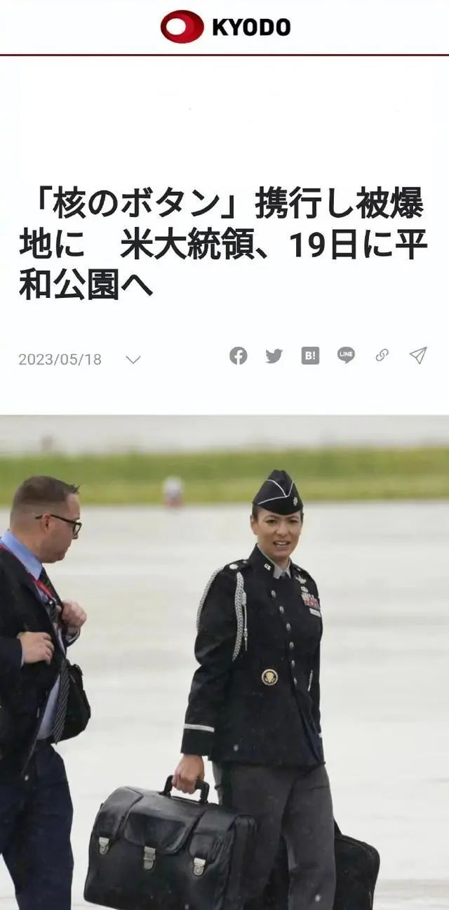

# 拜登带着核按钮抵达广岛，将会见二战时期核爆炸中的幸存者

据环球网援引日本共同通讯社18日消息，美国总统拜登于美东时间17日启程赴日本，参加七国集团(G7)广岛峰会。据日本共同社报道，
**拜登助手们携带的公文包中，有美国总统用来下令授权使用核武器的手提箱。**

第二次世界大战末期，美国于1945年8月6日、9日分别在日本广岛和长崎上空引爆了两枚原子弹。

_日本共同社报道截图_

《纽约时报》曾解释称，无论美国总统走到哪里，都会有一个45磅（约合20公斤）重的公文包跟着。公文包里有一份实施打击的指导手册，包括一份清单，上面列出了构成美国武器库的900件核武器可以瞄准的地点。包里还有一个无线电收发机和多个代码验证器。

要授权攻击，总统必须先提供一个代码，证实自己的身份。他应该把这个代码随时带在身上。这个代码常被说成是一张“卡片”，绰号“饼干”。总统不需要得到其他任何人的批准，包括国会或军方，便可授权打击。

据中新网综合外媒报道，白宫表示， **拜登不会为二战期间美国在日本广岛和长崎投放原子弹道歉。**

据外媒披露的行程，拜登将在G7峰会期间参观日本广岛和平纪念公园，并会见核爆炸中的幸存者。

当地时间17日，白宫记者会上，有记者提问美国总统国家安全事务助理沙利文，询问拜登是否会在访问广岛和平纪念公园期间，代表美国向日本道歉。沙利文回答：“不。”

沙利文说：“ **总统不会在和平纪念公园发表声明。他将与其他七国集团领导人一起参加献花圈和其他一些活动，**
但在总统看来，这并不是双边时刻。这是他作为七国集团领导人之一，向这段历史和日本首相岸田文雄表示敬意。”

拜登成为继2016年奥巴马访问广岛之后，第二位访问广岛的在任美国总统。

此外， **拜登18日与日本首相岸田文雄举行会晤时再次出现口误，错将岸田称为“总统”。**

共同社称，拜登在18日与岸田会谈上发言时使用了发言稿，而在会谈开始之际与岸田即兴打招呼时，脱稿发言的拜登出现了上述口误。现年80岁的拜登是有史以来年龄最大的美国总统，他口误的情况并不罕见，但日媒在报道时不忘帮拜登找理由。共同社特意提到，“拜登刚刚经历了一次横跨太平洋的长途旅行”。

拜登口误将岸田称为“总统”的报道也引发日本网友的关注。 **一些人认为拜登“应该退休了”** ，另一方面，也有日本网友讽刺称，
**“还好被叫成‘总统’，而不是‘州长’”。**

**编辑|** 王月龙 杜恒峰

**校对|** 孙志成

