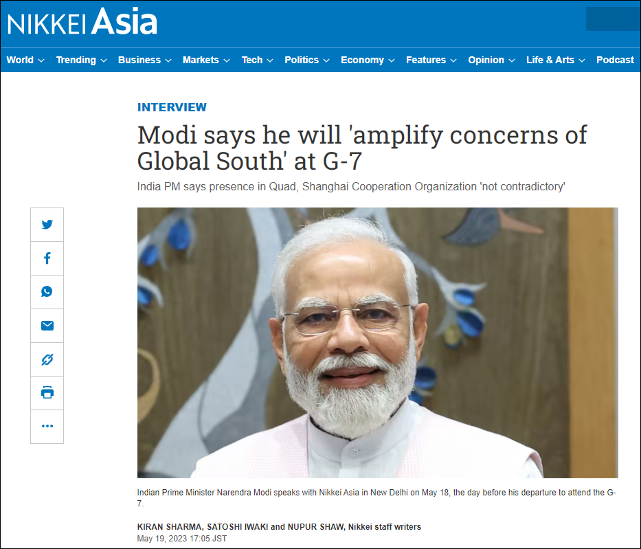
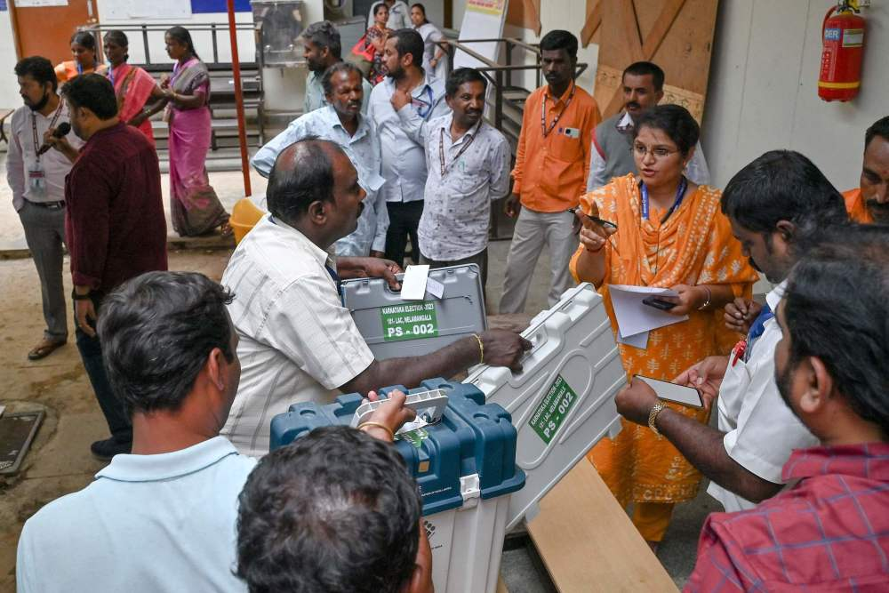
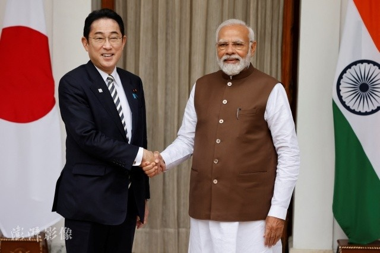
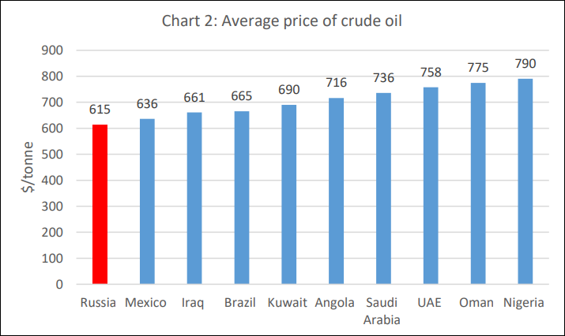

# 莫迪：印度同时加入“四方安全对话”与上海合作组织，不矛盾不互斥

【文/观察者网
熊超然】当地时间5月19日至21日，七国集团（G7）领导人峰会将在日本广岛举行。在19日飞抵日本的前一天，印度总理莫迪在其位于新德里的总理办公室，接受了《日经亚洲》（Nikkei
Asia）书面形式和以面对面形式结合的独家专访，议题涵盖诸多方面。

近期，莫迪可谓“行程满满”，除受邀去日本参加G7峰会，他还将访问澳大利亚和美国，这也正好涉及美日印澳构成的“四方安全对话”（QUAD），而印度同时也是上海合作组织（SCO）的成员国。莫迪认为，印度同时加入这两个组织并不矛盾或相互排斥，他称通过“四方安全对话”可关注“印太地区”，而身处上合组织则可促进同中亚地区的交往。

莫迪表示，他将借参加此次G7峰会，“扩大‘全球南方’国家的声音和关切”，也强调印度在国际舞台上具有重要作用。他还提到联合国改革等话题，声称若印度无法成为安理会常任理事国，这一国际机构的可信度及其决策过程将永远受到质疑。

尽管想要拉拢印度乃至更多“全球南方”国家的意图十分明显，但G7也被质疑是在给这些国家开“空头支票”。同时，在俄乌冲突问题上，印度也依旧面临到来自G7国家的压力，到目前为止，印度仍未明确谴责俄罗斯，同俄罗斯的贸易也依旧活跃。

_《日经亚洲》报道截图_

**印度同时加入QUAD和上合，莫迪认为“不矛盾”**

《日经亚洲》指出，印度不是G7成员国，但莫迪参加此次峰会是受到东道主、日本首相岸田文雄的邀请。G7非常强调其所谓的“基于规则的国际秩序”，因此非常希望将印度拉向本方阵营，但长期以来，印度在地缘政治光谱中一直不愿意接受被简单地分类。

由美日印澳构成的“四方安全对话”，原定于下周在澳大利亚悉尼举行领导人峰会，不过因急于处理国内愈演愈烈的债务违约危机，美国总统拜登日前取消了访澳行程，“四方安全对话”领导人峰会也随之被取消。

有消息称，美日印澳正努力安排四国领导人在G7广岛峰会期间碰面，澳大利亚总理阿尔巴尼斯则透露，莫迪“仍有可能”在下周访问澳大利亚并与其开展双边会晤。同时，莫迪下个月还将访问其称之为“重要战略伙伴”的美国，白宫将以“最高规格”接待。

值得注意的是，印度在加入“四方安全对话”的同时，也是上海合作组织的成员国。

对此，莫迪对《日经亚洲》表示，印度从未想过将自己束缚在某个单一的安全联盟中。“相反，我们基于我们的国家利益，与世界各地广泛的朋友和志同道合的伙伴进行接触。”

莫迪一方面声称，“四方安全对话”的共同关注点是“促进一个自由、开放、繁荣和包容的‘印太地区’”；他另一方面又表示，上合组织在印度同中亚这一重要地区的交往中也发挥着重要作用。

“对印度来说，参加这两个组织并不矛盾或相互排斥。”莫迪还说：“作为‘全球南方’的一员，我们对任何多边环境的兴趣，都是充当不同声音之间的桥梁，为具有建设性和积极的议程做出贡献。”

针对美日印澳“四方安全对话”这一机制，中国外交部此前就曾表示，中方一贯认为，任何地区合作机制不应针对第三方，或损害第三方利益，搞封闭排他、针对他国的“小圈子”，违背时代潮流，与地区国家的愿望背道而驰，不得人心，注定不会得逞。

_去年5月，日本东京，美日印澳四国领导人参加QUAD会晤（资料图）_

**“中印两国关系正常化，有利于更广泛的地区和世界”**

与此同时，莫迪还谈到了印度与其两个邻国中国和巴基斯坦的关系，《日经亚洲》形容，印度与这两个国家之间的关系“令人担忧”。

“印度已做好充分准备，并致力于保护主权和尊严。”莫迪在谈到中印边境问题时称，印度尊重主权、法治以及和平解决争端。

莫迪说：“边境地区的和平与安宁，对印中双边关系的正常发展至关重要。”他还说：“印中关系的未来发展只能建立在相互尊重、相互谅解和基于共同利益的基础上。”他指出，两国关系正常化将有利于更广泛的地区和世界。

此前，据微信公众号“国防部发布”消息，今年4月23日，中印两军在莫尔多/楚舒勒会晤点中方一侧举行第十八轮军长级会谈。双方本着友好和坦诚的精神，就有关问题交换意见。在两国领导人共同指引下，根据两国外长会晤成果，双方同意通过军事和外交渠道保持密切沟通对话，加快解决中印边界西段有关问题，同时继续维护边境地区的和平与安宁。

对于巴基斯坦，莫迪则称，印度希望与该国保持“正常的睦邻关系”。“但是，他们有责任创造一个没有恐怖主义和敌对行动的有利环境，巴基斯坦有责任在这方面采取必要措施。”莫迪表示。

在谈到外交问题的同时，莫迪也密切关注明年的印度大选，他本人将寻求第二次连任，外界也预计他的胜选概率很大。

不过就在此时，据《印度快报》5月15日报道，印度卡纳塔克邦议会选举结果14日正式出炉，总理莫迪所在的印度人民党失去联合执政的多数席位，反对党国大党赢得地方议会半数以上席位，将独立组建邦政府。这是印度人民党遭遇的一次罕见政治挫折，或将影响明年印度大选的走势。

_当地时间5月9日，印度选举官员在卡纳塔克邦收集电子投票机
图自视觉中国_

在谈到国内优先事项时，莫迪指出，印度经济一直是世界上增长速度最快的国家之一，已从2014年的全球第十大经济体上升至目前的全球第五大经济体。他表示，其政府的目标是在未来25年内把印度转变为一个发达国家，以到时候庆祝印度独立100周年。

**自诩是“全球南方”和重要大国，印度“啥都想关注”**

访谈中，莫迪非常强调印度作为“全球南方”国家的定位，也毫不掩饰印度想要在国际社会扮演更重要的角色。此次参加G7峰会，他就将此与“全球南方”、联合国改革以及印度今年年底将主办的二十国集团（G20）领导人峰会等议题相联系。

莫迪表示，此次参加G7峰会，他誓言要在会议上“扩大‘全球南方’国家的声音和关切”，并认为G7可以和G20“促进协同增效”。他期待在会上讨论能源、数字技术和供应链等领域的全球变化和挑战，并强调作为应对这些挑战的可靠伙伴，印度的经验“将在会上引起强烈共鸣”。

去年12月，印度接替印度尼西亚成为G20轮值主席国；今年1月，印度主办了首届“全球南方国家之声”线上峰会，125个国家参与，其中的讨论涉及，许多国家希望改革国际机构，使代表权更加均衡。

比如，在联合国改革问题上，印度就一直在争取成为安理会常任理事国，莫迪在谈到此话题时，认为这些全球性机构有“局限性”，“仍局限于过时的思维方式”。

莫迪说：“在应对气候变化、新冠疫情大流行、恐怖主义和金融危机等当代挑战时，这些缺陷已经变得明显。如果联合国安理会继续拒绝世界上最大的‘民主国家’（他指印度）以及非洲和拉丁美洲等整个大陆的永久代表权，它的可信度及其决策过程将永远受到质疑。”

_当地时间3月20日，印度新德里，日本首相岸田文雄与印度总理莫迪在会晤前握手。图自澎湃影像_

此次除了邀请印度参加G7峰会，东道主日本还邀请了巴西、越南、科摩罗（今年非洲联盟主席国）等国参加。日本首相岸田文雄此前多次表示，他决心加强与“全球南方”或发展中国家的关系，而路透社更是分析认为，G7正寻求同“全球南方”国家拉近关系，以在国际舞台上抗衡中国。

对此，莫迪声称，印度和日本两国的关系因“共同的民主、自由和法治价值观”，自然而然变得更加密切。“我们现在看到，我们在政治、战略、安全和经济利益方面日益趋同。”

不过，颇具讽刺意味的是，就在G7广岛峰会召开前夕，德国《时代》周报网站5月17日援引慈善机构乐施会的估计指出，G7国家欠贫穷国家约13万亿美元未兑现的发展援助和应对气候变化支持。该组织批评道，G7国家及其银行反而要求全球南方国家偿还2.32亿美元债务。

**尽管受邀参会，但印度在俄乌冲突上也遭受G7“考验”**

《日经亚洲》还指出，尽管有许多共同利益，但印度在G7广岛峰会上也面临潜在的摩擦点，比如俄乌冲突问题。

报道称，俄乌冲突是G7国家的关注焦点，G7内部也正在进一步加强对俄罗斯的制裁。然而，印度到目前为止仍没有明确谴责俄罗斯，尽管莫迪也一再呼吁和平，并向俄罗斯总统普京喊话“今天的时代不是战争的时代”，但印度和俄罗斯的贸易往来依旧活跃。

当地时间5月10日，印度国有银行巴罗达银行（Bank of
Baroda）发布了一份有关“进口俄油所获收益”数据报告，其中指出：“受俄乌冲突影响，原油价格在这一年中波动很大。印度与俄罗斯达成协议，以更优惠的条件进口石油，事实证明这对我们有利。”

英国广播公司（BBC）当地时间5月11日援引这份数据报告指出，去年印度从俄罗斯进口的石油总量增长了10倍，节省了大约50亿美元（约合人民币347亿元）。

_过去两年印度从各国进口原油占比统计图
图自巴罗达银行_

_印度从各国进口原油的平均价格比较图
图自巴罗达银行_

而近日，欧盟外交与安全政策高级代表何塞普·博雷利（Josep
Borrel）告诉英国《金融时报》，布鲁塞尔方面已经意识到，印度炼油商正在大量购买俄罗斯原油并将其加工成精炼燃料出售给欧洲。这名欧盟首席外交官员首次表示，欧盟应当加以制止，打击印度将俄油转售至欧洲的这一做法。

对于博雷利的警告，印度外交部长苏杰生当地时间5月16日予以反击，建议他好好去翻一翻欧盟理事会的法规。“读一读欧盟理事会的规定，俄罗斯原油在第三国经过高度加工后，不再被视为来自俄罗斯。我想敦促你们去看看理事会规定的第833/2014号条例。”苏杰生回应记者提问时说。

在采访中，当被问及印度是否可以扮演俄乌冲突调解人的角色时，莫迪回答说，印度对俄乌冲突的立场是“明确和坚定不移的”。

“印度站在和平一边，并将坚定地站在这一边。我们致力于支援那些在满足基本需求方面面临挑战的人，特别是在食品、燃料和化肥价格不断上涨的情况下。我们与俄罗斯和乌克兰都保持着沟通。”莫迪表示：“合作与协作应该定义我们的时代，而非冲突。”

**本文系观察者网独家稿件，未经授权，不得转载。**

