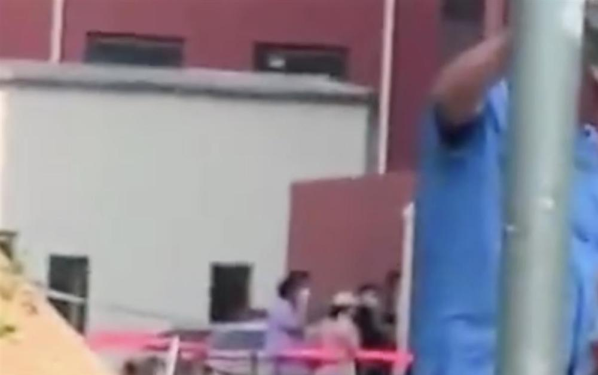
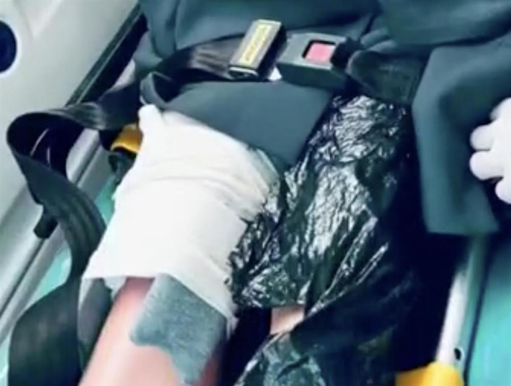

# 辽宁一小学宣传栏砸倒学生致1死2伤，家长：临时放墙边没固定

5月18日，辽宁大连理工大学附属学校小学部发生一起事故，校内宣传栏（广告牌）砸倒学生致2伤1死。

_图源：视频截图_

其中一名受伤学生家长称他家孩子还在抢救中。他称，学校挪动校内的广告牌临时放在墙边，没有固定好，课间孩子玩耍的时候，广告牌砸到多名孩子，比较严重的有三名学生，有一名学生已死亡，另外两名学生在重症监护室救治。

_图源：视频截图_

高家派出所回应称他们已到现场处置。18日，高新区教育文体局发布通知要求学校深入开展校园安全隐患排查。当地高新区教育文体局18日下发通知，要求进一步加强教育系统安全隐患排查工作。

_图源：视频截图_

记者致电大连理工大学附属学校小学部，截至19日12时，没有收到回信。伤者家人希望孩子得到最好的救治，同时也希望监管部门介入调查此事。

（极目新闻综合百姓关注报道）

（来源：极目新闻）

