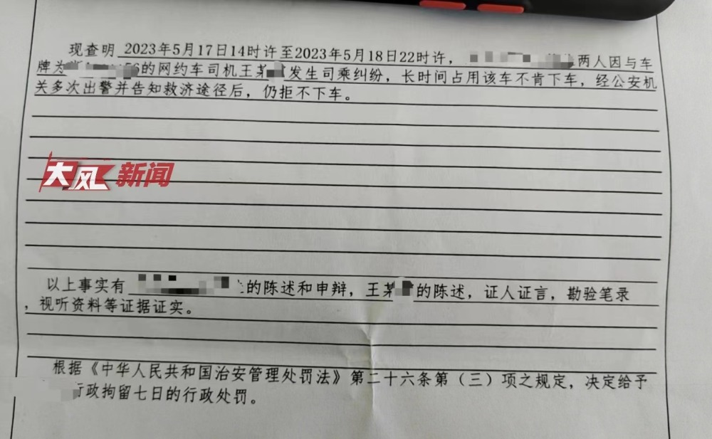
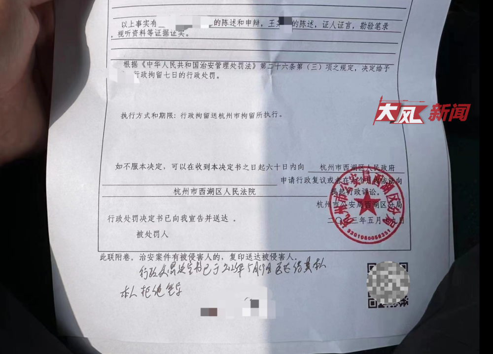
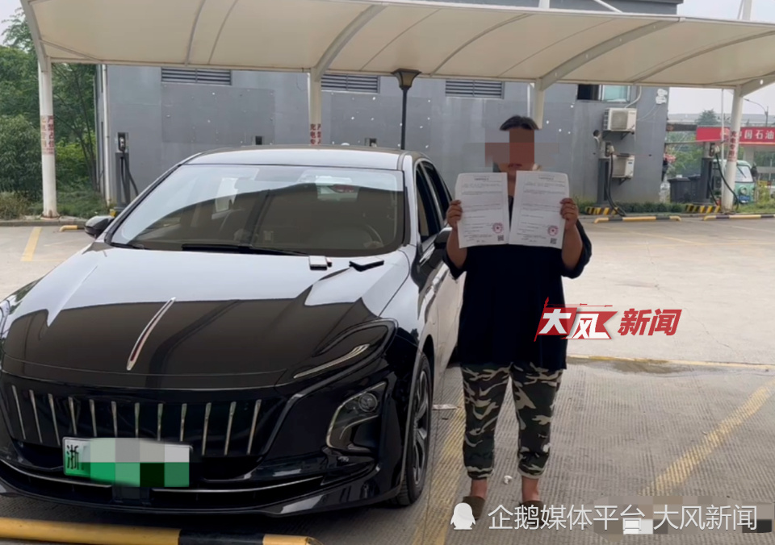

# 两乘客因网约车拒违停“赖”车里超30小时，警方：行政拘留7日

这场“闹剧”，终于有了结果。

5月20日上午10时30分，华商报大风新闻记者从司机王女士处获悉，杭州警方已对两名乘客行政拘留7日。

根据《行政处罚决定书》显示，现查明
**2023年5月17日14时许至2023年5月18日22时许，两乘客因与网约车司机王某发生司乘纠纷，长时间占用该车不肯下车，经公安机关多次出警并告知救济途径后，仍拒不下车。**

_杭州警方出具的《行政处罚决定书》_

根据 《中华人民共和国治安管理处罚法》 第三十六系第（三）项之规定， **决定给两名乘客行政拘留七日的行政处罚**
。下方有杭州市公安局西湖分局印章，时间为“2023年5月19日”。记者注意到，该文书下方写着“该行政处罚决定书已于2023年5月19日送达其本人，本人拒绝签字。”

_《行政处罚决定书》_

司机王女士说，民警告诉她，关于她提出的索赔、道歉问题，将在行政拘留结束后，由警方再次进行调解，若调解无果，将走法律程序。

“这是最好的证明。”王女士说，从5月17日至今，她的遭遇受到了社会各界的关注，T3出行也给了她很大的支持，对她的损失进行了减免。另外，留下派出所民警夜以继日的调查，还给她了一份公道，“希望网约车司机们遇到问题不要怕，相信有关部门会给大家公道。”

_5月20日，司机王女士表示，希望平台给出一个合理的处理方案，20分的信用分，需要连续跑很久的车才能弥补_

另外，司机王女士说，因为这次订单，高德地图平台以“快速完单违规”为由，扣除了她20分信用分，她无法接受。为此，她在事发前已经向平台报备，结果还是被判定违规，后多次向平台申诉，但均被驳回，
**“希望平台给出一个合理的处理方案，20分的信用分，需要连续跑很久的车，才能弥补。”**

**华商报大风新闻记者 张鹏康 编辑 董琳**

