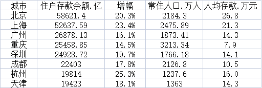

# 住户存款8强城市：京沪超5万亿，杭州人均存款达16万元

住户存款，是指银行业金融机构通过信用方式吸收的居民储蓄存款及通过其他方式吸收的由住户部门（由住户和为其服务的非营利机构组成的部门）支配的存款。那么，哪些城市的住户存款多呢？

第一财经记者根据各地统计公报和公开数据发现，目前在住户存款余额前8城市中，已有6个城市超过2万亿元，其中京沪均超过了5万亿元。此外杭州和天津也接近2万亿大关，杭州住户存款增速在8个城市中位居榜首。人均存款方面，京沪杭三城位居前三。

数据显示，北京、上海、广州三城住户存款余额继续位居前三。其中，北京2022年末住户存款达到了58621.4亿元，比年初增加了9877亿元，总量继续稳居榜首。北京之后，上海住户存款达到52637.59亿元，比年初增加了9984.98亿元，增量位居第一。

整体来看，京沪两市的住户存款余额处于第一梯队。数据显示，住户存款余额第二名的上海比第三名的广州多了25759.46亿元，这一领先优势超过了第四名重庆的住户存款总量。

京沪两地作为强一线城市，高新产业、现代服务业、总部经济等十分发达。国家统计局近期发布的数据显示，2022年，在城镇非私营单位中，收入最高的为信息传输、软件和信息技术服务业从业人员，年平均工资达22.04万元，紧随其后的是金融业，科学研究和技术服务业，分别为17.43万元和16.35万元。京沪是这些高收入行业、岗位十分集中的城市。

比如，在信息传输、软件和信息技术服务业方面，北京集聚了大量的互联网大厂，根据《2020中国人口普查分县资料》，北京信息传输、软件和信息技术服务业从业人员占就业人员比重达9.4%，上海这一比重为6.1%。此外，京沪的总部经济都十分突出，比如北京坐拥大批央企总部和民企巨头的总部，上海则有大量的跨国公司地区总部和江浙、安徽、福建等地大量民企巨头总部迁入。

京沪之后，广州、重庆、深圳和成都四城市的住户存款均处于2万亿梯队，其中广州、重庆和深圳之间相处差距很小，三城住户存款均处于2.4万亿至2.7万亿之间。

成都2022年住户存款突破2万亿大关，达到22403亿元。加上成都，2022年末，共有6个城市住户存款超过了2万亿大关。此外，杭州和天津2022年末住户存款也超过了1.9万亿，距离2万亿大关近在咫尺。其中，杭州2022年末住户存款达19814亿元，住户存款增速达到了25.3%，在8个城市位居第一位。

值得注意的是，住户存款前8强城市，包括了我国的7个城区人口过千万的超大城市北京、上海、广州、重庆、深圳、成都和天津。只有位居第七的杭州尚不是超大城市。不过，杭州是14个特大城市之一，2020年城区人口达到了874.17万人，未来也有望进入到超大城市行列。

总体来看，城市规模大，中心城区人口规模大，城市的住户存款总量也往往位居前列。这是因为，城镇居民的人均收入水平要明显高于农村居民，因此城镇人口越多，整体的住户存款也多。同时，超大城市、特大城市的城区以新兴产业、现代服务业、先进制造业发展突出，尤其是现代服务业、高新产业的很多从业人员收入水平较高。因此，住户存款总量也比较大。

从人均存款来看，8个城市，京沪两市的人均住户存款已经超过了20万元，分别达到了26.8万和21.3万人。京沪之后，杭州人均存款达到了16万元，位居第三，超过了广州、深圳这两个一线城市。

杭州规划委员会专家委员会副主任委员汤海孺对第一财经分析，杭州作为浙江的省会，是全省的中心，全省不少重要企业将总部迁移到杭州，杭州集聚了一大批高薪人才。同时，杭州的金融业比较发达，包括基金、创投等金融机构方面的发展很快。第三，杭州电商、数字经济十分发达，集聚了头部企业和大量的人才。高薪岗位多，因此人均存款也比较多。

杭州市统计局的数据显示，2022年，杭州市紧紧围绕“1248”计划，持续推动数字经济和实体经济加速融合。全年数字经济核心产业实现增加值5076亿元，占GDP比重为27.1%，按可比价增长2.8%，高于全市GDP增速1.3个百分点，占全省数字经济核心产业比重为56.5%。

**表：2022年末住户存款余额前八城市**

_（数据来源：第一财经记者根据各地统计公报、公开数据整理）_

