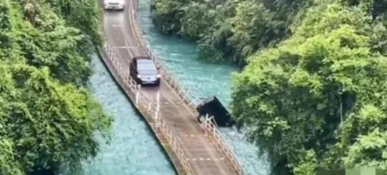
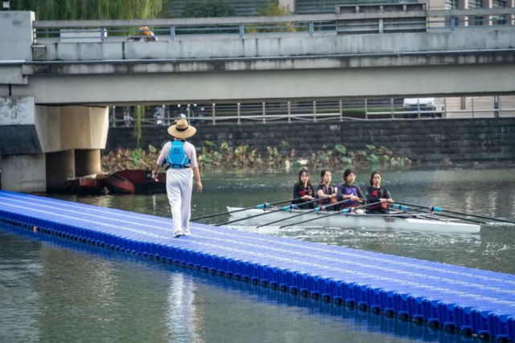
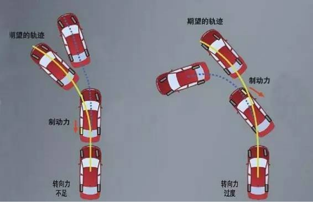

# 网红浮桥“翻车”致5人遇难，怪桥还是怪车？

5月16日，湖北省恩施州宣恩县珠山镇狮子关景区一辆商务面包车在网红景点浮桥坠入水中。

宣恩县政府新闻办当天发布通报称，事发时间为11时19分许，车上载有8人，3人脱险上岸，5人搜救上岸后经抢救无效死亡。

同日，宣恩县文旅局发布停业通知，称由于狮子关旅游区出现安全隐患需要进行紧急治理，现决定自5月16日起，狮子关旅游区暂停营业。

网传视频显示，落水车辆车速过快导致失控，疑违反景区规定。该浮桥有限速20公里/小时的安全提示，禁止超过7座车上桥。

但仍有很多人质疑浮桥的安全性能以及景区的救援措施是否到位。车和桥，究竟各该担几分责？

_超载车辆坠入湖水瞬间
图/视频截图_

**安全存在盲区？**

公开信息显示，狮子关浮桥于2014年建造而成，又名“廊桥遗梦”，桥长约500米，宽4.5米。

经企查查平台查询显示，浮桥所在的狮子关景区，运营公司为宣恩县狮子关旅游投资开发有限公司，成立于2005年2月，注册资本5000万人民币，田昊林为法定代表人。

事发后，中国新闻周刊尝试联系田昊林，其手机处于无人接听状态。后得知，其已被相关部门控制，正配合调查等相关工作。

事发后，相关部门抽调了一台吊车，正在狮子关景区进行打捞等后续工作。

一位当日早些时候到访浮桥的游客对中国新闻周刊表示，5月15日晚至16日凌晨持续下了大雨，16日事发当天，湖面的水位有明显上升。

“我在网上看其他游客发布的‘打卡笔记’几乎都是晴天，没觉得有啥问题。有些无人机拍摄的‘打卡’短视频确实拍得挺漂亮，车从桥上经过，会带起一丝波涛。但我去当天，因为夜里下过大雨，水面涨了，桥面也是比较湿的。”

据核实，浮桥的桥头位置确实摆放了公告牌：“浮桥限行七座及以下车辆，不准逆行，限速20公里/小时。”此外，景区还在此处用广播不断循环播报。这一点也得到了上述游客的确认。

一位与狮子关景区曾有过往来合作的恩施当地商人对中国新闻周刊表示：“这座浮桥，一直是他们（景区）引以为傲的设计，成为‘网红’景点多年来，从未发生过事故。”

受访商人介绍称，自己陪客户多次前往狮子关浮桥景点游玩，采用过自驾车通行的方式，也采用过景区提供的电瓶车通行的方式，在以往的游玩过程中，景区的工作人员没有人提醒过游客要穿着救生衣。

“这座桥，本身就只有500米的距离，很快就从桥的起点到终点了，游客们普遍默认了它的安全性。另外，游客过这座浮桥的时候，一般都是很兴奋的状态，拿着手机录制短视频，可能也会忽略一些安全方面的问题。”该商人表示，“感觉大家都没有想过这样一个问题，万一掉下去，后果会有多严重呢？确实，这次意外‘炸’出了一些过去大家不太关注到的问题。”

**建设方认为自己没有错**

事故发生后，除了景区的安全救援部署问题，引发关注的还有桥体的安全性能问题。据报道，这座网红浮桥的建设方，为上海旗华水上工程建设股份有限公司。

2022年，上海旗华水上工程建设股份有限公司董事长孔飞对外公开介绍：“浮桥建造最重要的是安全问题，我们采用了水上锚固系统专利技术，可保证浮桥在300米深、45米水位落差情况下也可以安全使用。该浮桥选用了结构强度高、柔韧性强、耐久性强的进口南方松防腐木材作为浮桥表面铺装和龙骨的基础材料。同时，浮桥两侧安装了高强度柔性安全护栏。为了提高浮桥的耐久性，还采用了高性能抗长期老化环保水上专用复合材料，可抵抗15级台风且可抵抗洪水冲击和长期的水浪波动。”

此前的报道中，田昊林亦对外公开答疑该桥的安全性能：“浮桥采用的是德国技术，没有底座，是靠PVE材质的浮筒来支撑，在水的动力下，可以以柔克刚。其次，浮桥通过对直线桥身的修改、使用钢索固定和通行车辆限重等措施来保证浮桥不会侧翻。”

一位供职于某国企的桥梁、建筑结构工程师对中国新闻周刊表示：“这座桥与钢筋混凝土的桥有很大的不同。据我所知，国内没有浮桥这种品类的全国性标准。只有河南省出于防汛问题的考量，曾出台过一份《河南省浮桥管理办法》。”

经查阅，《河南省浮桥管理办法》第十四条规定：浮桥应当设置非机动车和行人通道、拦车杆、安全通行标牌和限速、限载、限重、限高、限距、限宽等标志牌及人员安全警示标志。浮桥两侧应当设置安全可靠的护栏，配备足够的救生、消防、照明设备。浮桥用电线路及其敷设应符合有关技术规定。

“这种材质的浮桥，在赛艇、皮划艇等水上体育运动比赛赛场比较常见。运动员比赛前上艇，比赛后下艇，普遍要从这样一个浮桥上入水、出水，业内普遍叫‘水上码头’。相关训练、比赛单位，都是可以采购到该材质产品的。”一位中国赛艇协会工作人员对中国新闻周刊介绍。

_“浮桥”在水上运动赛场较为常见
图/浙江大学微信公众号_

该工作人员表示：“不过对水上运动领域，此类产品就是供人行走，我印象中从没有在此类漂浮物上开车的情况。”

对于浮桥过车的相关性能标准，浮桥承建方苏州九翔水上浮筒工程有限公司和上海旗华水上工程建设股份有限公司都对外公开表示，自己施工合法合规，有相关的产品生产标准。该“坠车”事件与公司生产的产品安全性能、生产标准无关。

**司机有多大的过失？**

北京觅氪汽车科技有限公司总经理黄锐曾是职业拉力赛车手，车手教官。由于车辆打滑、出现漂移等现象在赛车领域非常普遍，他反复研究了车辆落水的视频后，对中国新闻周刊从其个人角度解析了汽车落水的四个阶段和原因。

第一阶段：车辆行进中速度较快，方向盘轻微左转过程中，此时前轮抓地力低，后轮抓地力大；第二阶段：左转向中前轮失去导向力，导致车辆产生跟随惯性轨迹向右侧的“推头”现象，学名叫转向不足；第三阶段：此时驾驶员发现车辆“推头”，采取力度较大的制动措施，导致车辆重心前移，前轮恢复抓地力，但是后轮抓地力突然变小，车辆惯性使后轮以前轮为轴心开始出现甩尾现象；第四阶段：甩尾过程中，驾驶员继续施加刹车力量，导致车辆横滑甩尾了约几米，又与左侧栏杆发生剐蹭，车头停止，尾部惯性继续推行车身，随后车头先落水，整车滑入水中。

_推头（转向不足）和甩尾（转向过度）的区别
图/汽车之家官方微信公众号_

在黄锐看来，该事故意外成分极大，有不少综合因素酿成了这次悲剧：

“首先是外力因素，9座MPV车普遍都在2吨左右，按8个人平均体重65公斤计算，车辆自重很可能超过2.5吨。”

黄锐指出，在车辆满载，自身重量大的情况下，加之路面湿滑，速度快（目测约为40公里的时速），驾驶员疑有操作不当。

“当开始发生‘推头’的时候，如果采取收油门和轻踩刹车保持车辆重心平稳的方式，就不会出现‘甩尾’现象。‘推头’没有修正，随后‘甩尾’发生，理论上不应继续踩刹车，应同时反向修正车轮，也可中止横滑，以此补救。”

黄锐再三强调：“我并非是要求所有的司机都具有赛车手的驾驶、急救能力，但此类事件在湿滑的普通交通路面上亦有可能发生。普遍来看，绝大多数司机在紧急情况下，下意识中只会记住驾校教练告诉的‘遇到问题踩死刹车’。殊不知，在车辆失控时，踩死刹车极大概率会造成车辆更大幅度的失控和更大损失。”

北京人民警察学院应急驾驶资深专家柳实教授在此基础上，向中国新闻周刊补充了一些湿滑路面、涉水驾驶的经验。

“在湿滑的路面行进，甚至涉水行进，司机要目视远处固定目标，且不要看水流，以防因视觉上判断错误而导致行驶方向的偏移。涉水后，刹车盘内会积压大量水分，影响刹车制动的效果。因此通过积水时，司机应保持低速行驶，并间断轻踩制动踏板，及时排除刹车盘内的水分，以恢复制动效果。”

“当车辆陷入水中后，在水压的作用下车门不易打开。此时，车内驾乘人员要抓住机会使用安全锤、千斤顶等坚硬工具破窗。破窗成功后车外的水会随即涌入车内，当车内灌入水后，车内外压力相近时，驾乘人员要抓住时机用力推开车门进行逃生。而此类商务车，后排座普遍为推拉门，落水后对于后排乘客逃生极为不利。”

柳实表示，在涉水驾驶时，系安全带非常重要。他分析道：“这起事件中，能够逃生的人，我推测应是在车内系着安全带，或者是手扶支撑做得比较牢靠。正是因为人在车内的位置相对稳固，没有产生空间落差，所以车在落水瞬间，没有造成他们在车内的翻滚和碰撞受伤，因此头脑更清醒，落水后能及时开门逃生。”

从法律角度来看，北京市博圣律师事务所白小勇律师对中国新闻周刊表示：“责任是否全部由浮桥所在景区来承担，应持保留意见。现在关键要看浮桥所在的景区，在具备经营资质的前提下，浮桥桥体的安全指标是否达到安全生产部门的要求，救援措施是否符合相关规定，在满足相关要求和规定的前提下，可在一定限度内减轻责任。商务用车的驾驶人员和乘坐人员，如果均是完全民事行为能力人，要对自己的行为承担一定责任，其应该能预见到自己作为或者不作为造成的后果及可能造成的后果。在我看来，发生事故的商务车司机或许应该承担一定的责任。商务车的车况、司机是否有不正当的驾驶行为等，都可能对落水事故有一定的影响。”

作者：叶珠峰

