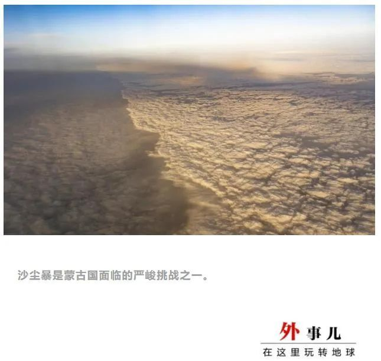

# 蒙古国沙尘暴卷土重来，100多人一度失踪

蒙古国沙尘暴又来了。

当地时间5月20日，蒙古国国家应急管理局在其官网表示，受沙尘暴等天气影响，蒙古国肯特省等地共计120人失踪。该局通过打电话搜寻失踪人员后找到104人，仍有16人下落不明。

蒙古国今年入春以来已发生多次强沙尘暴天气，并成为我国北方沙尘的重要来源地。中央气象台于5月20日6时发布沙尘暴蓝色预警，京津冀等地部分地区有扬沙或浮尘天气。

蒙古国多地共计120人失踪

已找到104人

蒙古国气象监测机构表示，当地时间5月19日，强风、沙尘暴和暴风雪开始席卷蒙古国东部、东南部和南部的戈壁省份，风速最高时达到每秒30米。

对此，蒙古国国家应急管理局提醒称，恶劣天气情况下，出门被雪困住或在暴风雪中迷路的情况时有发生。除非绝对必要，建议不要短途出行或长途旅行。如属必要情况，出行时请确保带上保暖衣物、车辆储备足够汽油等。

但受恶劣天气影响，仍有部分人员失踪。蒙古国国家应急管理局官网20日更新的消息显示，蒙古国肯特省等地共计120人失踪。蒙古国国家应急管理局通过打电话搜寻失踪人员，已找到104人，救援人员正在努力搜寻下落不明的16人。

同时，蒙古国国家应急管理局还表示，受风暴影响，蒙古国部分地区出现房屋倒塌、屋顶被掀翻的情况，所幸手机天线并未受损。

蒙古国气象部门预计，未来几天，蒙古国大部分地区天气依然多变，警告民众采取预防措施。

这不是蒙古国第一次出现因沙尘暴天气导致人员走丢的情况。早在2021年3月15日，蒙古国国家应急管理局曾通报称，蒙古国遭受了一场极为严重的沙尘暴袭击，多名牧民在沙尘暴中失踪，包括一名5岁孩子在内的6人不幸遇难。

专家：蒙古国对我国北方沙尘的平均贡献约为42%

蒙古国今年入春以来已发生多次强沙尘暴天气，3月20日、4月13日和18日，蒙古国国家气象与环境监测局接连发布大风警报，现已成为我国北方的重要沙源地。

近日，中国科学院院士、兰州大学教授黄建平研究团队借助先进的空气污染模型和卫星遥感技术，发现在我国今年春季频发的沙尘天气事件中，蒙古国对我国北方沙尘的平均贡献约为42%，塔克拉玛干沙漠的平均贡献约为26%。

我国防沙治沙多年，为何无法避免蒙古国沙尘的影响？气象专家张明英在5月初接受新京报记者采访时表示，环境治理只是起一定作用，能够降低沙尘的强度和频数，但关键还是大气的作用。

“沙源地也是很难治理的，蒙古国沙漠地区位于中国北方上游，一刮西北风，沙尘比较容易吹到北方地区。”张明英说。

本月19日、20日，中国北方地区经历了一次明显的大风降温及沙尘过程，这也是今年以来影响中国的第14次沙尘天气过程。中央气象台同时发布了大风、沙尘暴蓝色预警。

蒙古国沙尘暴多发

系多种因素复杂作用的结果

蒙古国何以成为频发沙尘暴的沙源地？有分析认为，这是一系列因素复杂作用的结果。

其中，气候变化增加了蒙古国发生沙尘暴的风险。施普林格科学出版社的一份报告称，1940年至2015年，蒙古年平均气温上升了2.24°C，而年降水量减少了7%，导致全国干旱加剧，土壤水分不足和地表变暖之间的正反馈循环导致该地区气候更加炎热干燥。同时，蒙古国76.8%的土地遭遇不同程度退化，其中22.9%属严重退化级别。

日本环境部发布的一份题为《蒙古国的气候变化》的文件显示，1996年至2015年，蒙古国的草原生态系统经历了快速变暖和降水减少，气候温暖干燥加上植被退化为沙尘的形成创造了条件。

人类活动对沙尘暴频发所起的作用也无法忽略。《蒙古国的气候变化》的文件指出，自20世纪90年代以来，蒙古国过度放牧现象越发严重。根据蒙古科学院植物研究所研究员奥云比勒格·蒙赫苏尔的研究，与1961年相比，牲畜数量在2017年增加了3倍，畜牧业的野蛮发展造成蒙古国各地牧场生态普遍退化。

沙尘暴问题会对粮食安全、人类健康和基础设施产生重大影响，现已成为蒙古国面临的严峻挑战之一。

美国亚太安全研究中心题为《蒙古沙尘暴对亚太环境安全的影响》的研究指出，沙尘暴意味着荒漠化、土地退化以及风沙和灰尘的复杂作用会降低粮食生产。沙尘暴也会增加心血管疾病以及因呼吸系统疾病导致死亡或住院的风险，对人类健康构成威胁。沙尘暴还会破坏建筑物，中断交通枢纽、通信网络、配电和供水系统等基础设施运营，从而影响人类安全。该研究称，减轻沙尘暴及其相关环境现象对于维持蒙古的农业生产力乃至粮食安全至关重要。

记者 | 朱月红

编辑 | 樊一婧

