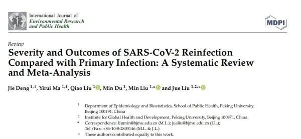

# 一个人最多感染8次新冠，第9次人就没了？专家：这种说法毫无科学依据

最近，一些“未阳”的人“查漏补缺”感染了新冠病毒，也有人此前“阳过”又“二阳”了。

“一个人不管多健康，多强壮，最多只能感染新冠8次，第9次人就没了”，近日，这种说法引发讨论，社交平台上相关词条搜索更是靠前。

_▲截图来源 短视频平台_

据人民日报健康客户端报道，多位专家表示，这种说法毫无科学依据。

浙江大学医学院附属第一医院国家传染病医学中心副主任医师李永涛表示，目前，对于没有基础疾病的正常人而言，“最多只能感染8次”的说法毫无科学性，且再感染后普遍症状较轻，大家无需太过担心。

南方医科大学公共卫生学院生物安全研究中心主任赵卫也表示，虽然目前并没有会感染多少次的定论，但一个人多次反复感染新冠的可能性的确存在。目前的观察研究均表明，再感染后的症状会越来越轻。“一方面是因为机体在首次感染后产生了对病原体的免疫力。另一方面，病原体在传播流行的过程中，通常自身也会朝着致病性逐渐减弱、感染能力逐渐增强的方向发生变异。”

赵卫建议，如果实在担心反复感染的问题，60岁以上的老人和有基础病的人，可以进行疫苗和加强针的接种。其次，去往人员密集的场所，尤其是医院，尽量全程佩戴口罩，回到家后及时洗手消毒。

就在5月17日，国家卫健委全国新型冠状病毒专家组成员、北京大学公共卫生学院流行病学与卫生统计学系研究员刘珏表示，“我们进行了一个全球数据的大样本研究，结果显示，与原发新冠病毒感染相比，重复感染更易表现为轻症病例，发生危重症的风险减少86%。”

此次研究是基于全球文献的汇总分析结果，样本量合计为530万人。研究结果已于近日发表在《国际环境研究和公共健康》上。

“第一次感染提供了一些防止再次感染的保护和抵抗力，降低了感染的风险和感染者转变为重症的概率。根据全球大样本数据来看，再次感染不会增加额外风险住院、重症监护室或死亡。”刘珏教授表示，但老年人等高风险人群需要更加注意。

上述研究结果显示，严重急性呼吸系统综合征冠状病毒2型再次感染的合并病死率为2.95%，若再次感染，老年人可能会面临更高的不良风险。预防新冠病毒再次感染，对老年人来说很重要。

当前“二阳”、感染人群均有所上升。比如据广西新闻网19日报道，自治区疾病预防控制中心急性传染病防制所主任医师周树武回复，从传染病网络直报系统的监测数据来看，我区自4月底开始病例数出现小幅波动上升趋势，医疗机构核酸检测阳性率也呈现小幅上升，但上升幅度未超过预期。

据川观新闻18日报道，据四川疾控专家介绍，四川省疫情在2022年12月中旬达到高峰后，目前已经超过4个月。根据监测结果显示，四川省报告新冠感染病例数5月呈上升趋势，医疗机构发热门诊新冠检测阳性率有所上升。最近一周四川省报告的新冠病例中，部分病例有既往感染史，为重复感染病例。重复感染病例以轻症和无症状为主。

刘珏解释，首先由于人体中和抗体水平随着时间推移会出现衰减，对个体的保护力下降；其次是因为奥密克戎变异株在人群中依然处于散发流行状态，并没有消失，传染源依然存在。

**编辑|** 卢祥勇 盖源源

**校对|** 孙志成

封面图来源：每日经济新闻 叶晓丹 摄

每日经济新闻综合自人民日报健康客户端、广西新闻网、川观新闻

每日经济新闻

