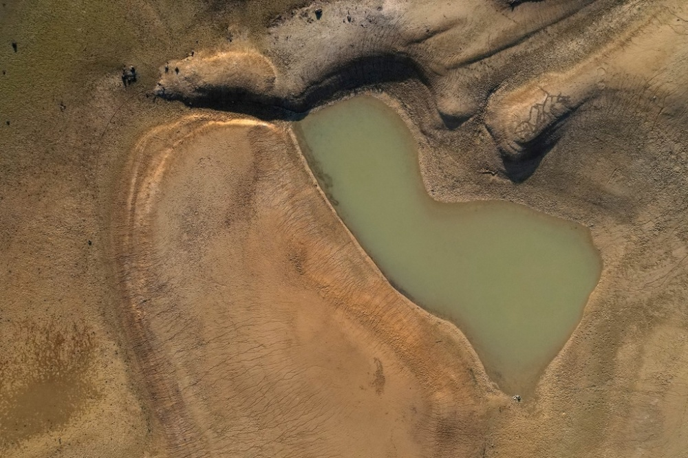
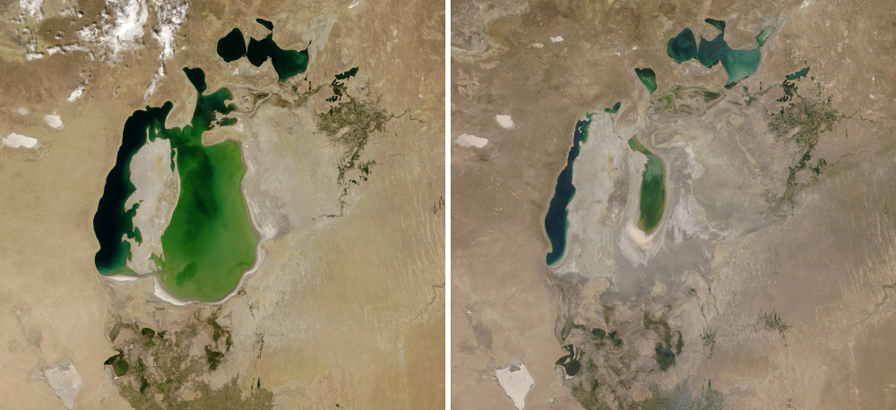

# 全球大型湖泊水库近30年大幅缩水，年均净减少约220亿吨

一支由多国研究人员组成的研究团队在知名学术期刊《科学》18日刊载的论文中说，由于气候变化和人类过度用水等，自上世纪90年代初开始的近30年间，全球大型湖泊和水库中53%的水体蓄水量大幅减少，平均每年净减少量大致相当于美国1995年全年用水量。考虑到湖泊水库储存了全球地表约87%的淡水，论文呼吁加强可持续水资源管理，重视气候变化在其中发挥的重要作用。

_当地时间2023年5月13日，西班牙格拉纳，Los
Bermejales水库受到干旱影响，水库库容仅为18%。_

**湖泊陷入困境**

研究人员来自美国科罗拉多大学博尔德分校、法国图卢兹大学和沙特阿拉伯阿卜杜拉国王科技大学等机构。他们利用1992年至2020年的卫星观测数据，结合气候数据和水文模型，研究了全球1051个大型湖泊和921个大水库，它们的蓄水量分别占全球天然湖泊和水库蓄水量的96%和83%。

_当地时间2022年7月28日，罗马尼亚斯洛博齐亚，阿玛拉湖干涸的湖床。由于缺乏降水和极端高温，绵延约8平方公里的阿玛拉湖几近蒸发。_

_当地时间2022年7月28日，罗马尼亚斯洛博齐亚，牧羊人在阿玛拉湖床旁的井打水。_

研究人员说，他们之所以关注这些大型淡水水体，是因为观测范围越大，卫星观测数据的准确度就越高，且大型水体对人类和野生生物而言也很重要。28年间，他们对这些水体年均评估6次。结果显示，虽然有的湖泊水库蓄水量增加，但整体而言，全球湖泊水库蓄水量普遍下降，年均净减少约220亿吨，相当于美国1995年全年用水量；水体体积累计减少约603立方千米，相当于美国最大水库米德湖水体体积的17倍。米德湖由科罗拉多河上的胡佛大坝拦蓄而成，面积600多平方公里。

_2000年-2022年卫星拍摄的美国米德湖变化。_

_当地时间2023年3月6日，美国内华达州博尔德市，沿着内华达州和亚利桑那州的边界，“浴缸环”显示了米德湖的水位线。_

_当地时间2023年4月16日，美国内华达州，在米德湖的低水位期间，可以看到圣托马斯城遗址。当米德湖在20世纪30年代首次蓄水时，圣托马斯城遗址被水库所淹没。_

_当地时间2023年4月16日，美国内华达州，棕色的科罗拉多河流经水位下降的米德湖。_

科罗拉多大学博尔德分校教授巴拉吉·拉贾戈帕兰说，世界上约20亿人、即总人口的25%生活在蓄水量大幅减少的大型湖泊及其流域，而从全球范围看，“湖泊陷入了困境，其影响深远”。

**气候因素更大**

研究人员使用包含气候和水文趋势的统计模型梳理水体蓄水量缩减原因，发现对天然湖泊而言，56%的净损失由气候变化和人类活动造成，其中气候变化“所占比例更大”，最明显的表现是气温升高导致水体蒸发量增加。

_当地时间2022年8月20日，西班牙维拉诺瓦德索，水从大坝倾泻而下。_

_当地时间2022年8月20日，西班牙维拉诺瓦德索，干旱导致水库的水位较低。_

对水库而言，蓄水量减少的主要原因是沉积：由于上游泥沙淤积，堵塞水库，加速水库老化，蓄水量下降。这些变化不是一蹴而就，而是如温水煮青蛙般缓慢发生。
研究人员指出，沉积同样会受到气候变化影响。例如，随着全球变暖，野火规模变得越来越大，烧毁树木，破坏土壤稳定，导致流入湖泊水库的沉积物增加。

_当地时间2022年8月31日，美国亚利桑那州大理石峡谷，当沉积物在流经鲍威尔湖下游的大理石峡谷时，红色砂岩悬崖倒映在科罗拉多河中。近几年，气候变化导致的干旱使美国第二大水库鲍威尔湖的水位下降。_

_当地时间2022年8月31日，美国亚利桑那州，鲍威尔湖下游的科罗拉多河通过大理石峡谷时，沉积物被搅动。_

_当地时间2023年3月21日，韩国罗州，罗州湖遭遇严重干旱，水量下降，河床裸露。_

_当地时间2022年2月15日，西班牙马拉加70公里的石泉湖近乎干涸。官员声称西班牙水储备目前不足其容量的45%，_

_当地时间2023年5月15日，乌拉圭卡内洛内斯，Canelon
Grande水库。乌拉圭持续的干旱导致蒙得维的亚和大都市区的饮用水严重盐碱化，附近水库的水位下降。_

_当地时间2023年3月4日，英国肯特郡，兰博赫斯特郊区Bewl水库。自3月份以来，该水库的蓄水量稳步下降，目前为67%，而去年10月份仅为42%。_

_当地时间2023年3月13日，法国蒙贝尔湖大部分区域干涸见底。据悉，法国已连续32天未下雨，这是自1959年有记录以来最长的冬季干旱，异常的干旱引发人们担忧。_

**湿的也在变干**

以往谈及气候变化的影响时，不少人认为它导致“干旱地区更干燥，湿润地区更湿润”。这项最新研究推翻了后半句的观点——即使在潮湿地区，水分也会大量流失，“这一点不应被忽视”。研究人员说，过去近30年间，无论是潮湿的热带地区还是寒冷的高纬度地带，全球范围内湖泊储水量普遍下降。这表明“全球范围内干旱趋势比以往设想的更为广泛”。

_（左图）当地时间2000年8月25日，哈萨克斯坦和乌兹别克斯坦之间的咸海。(右图)当地时间2018年8月21日，哈萨克斯坦和乌兹别克斯坦之间的咸海。_

2023年5月18日一项新研究称，自20世纪90年代初以来，气候变化导致的高温和社会对水资源的分流，世界湖泊每年减少数万亿加仑的水量。

_当地时间2019年12月2日，格陵兰岛冰盖上一个由融冰的水形成的湖泊在蓄满水之后开始快速破裂和排水，由于气候变化，这种现象越来越频繁。_

他们认为，在气候变暖的大环境下，水循环加剧可能不会导致潮湿地区储水量增加，部分原因是土壤蒸发量增多以及可能需要更长时间从干旱中恢复过来。

**图文来源：新华社、视觉中国、澎湃影像**

