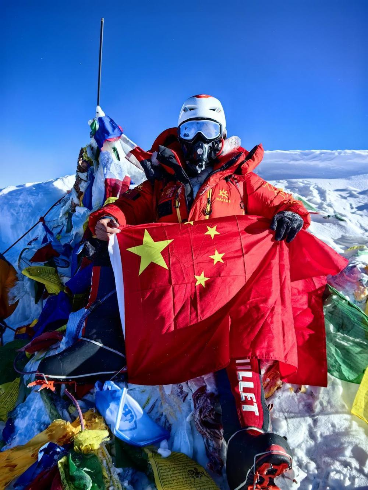

# 女登山者目击攀登珠峰遇难者最后时刻：眼睁睁看他倒挂面前，跪在那里哭了半小时

5月18日，52岁的中国贵州登山者陈学斌在从南坡攀登珠穆朗玛峰途中不幸遇难。

在此次成功冲顶珠峰的登山者中，有来自浙江杭州、被登山界称为“考拉”的登山者朱霞。此次冲顶珠峰，她一度和陈学斌同行，有时陈学斌走在她前面，有时陈学斌走在她后面。她说，看见陈学斌的遗体时，心里一下子就崩了，待在那里哭了半个多小时，却又无能为力。她也向红星新闻记者证实，陈学斌是冰爪勾住绳子了，当时没在现场看见其夏尔巴协作（当地向导，以下简称“夏尔巴”）。

_↑朱霞登顶珠峰_

5月21日，红星新闻记者联系上已下撤到尼泊尔加德满都的朱霞。她讲述了陈学斌人生中的最后细节，以及这个登山季珠峰上管理混乱的“夏尔巴”。她说，今年攀登珠峰的人特别多，“夏尔巴”是不够的。有充分登顶经验的或者说经验老到的“夏尔巴”原本就不多，所以就把其他一些参差不齐的“夏尔巴”调过来用，以至于厨师等后勤保障人员也开始充当“夏尔巴”。

“眼睁睁看着同胞倒在我面前”

**红星新闻：这次攀登珠峰，哪些细节让你印象深刻？你遇到的最大困难是什么？**

**朱霞：** 最大的困难，是眼睁睁看着中国同胞倒在我面前。

**红星新闻：是陈学斌吗？**

**朱霞：**
（是）陈学斌。我们脑子里想象很多，登山过程中可能会遇到很多过去遇难者的遗体。但今年情况特殊，我们从C3（营地）上去时，刚刚倒下一个亚洲人，他的死态很安详。我经过他时，亲眼看到一个跟我们有同样爱好的人，在面前倒下，冲击是非常大的。

_↑C3营地_

所以，我经过他们遗体时，根本走不动。

我现在脑子里想象他们时，很痛苦，因为他们热爱登山，又热爱生命，用生命去热爱，那种感受对我冲击很大，很震撼。特别是陈学斌老师，他一直在我前面，然后有时在我后面。

**红星新闻：为什么要去登山，因为“山就在那里”？**

**朱霞：**
不登山的人不能理解，对我来说，我有自己的想法。我小时候看过《走进空气稀薄地带》，爱看爱阅读，所以一直登山。这本书对我的触动特别大，我就想“这是一种什么样的精神”？后来成年以后，因为人生的一些变故，热爱登山是因为喜欢融入自然里面去治愈自己，这是第一。

第二就是美。在极端条件下，或者是在这种（环境）你能体会极度的痛苦，极度的壮美，你喜欢待在那个状态里面，或者说你只能待在那种状态里面。

第三就是你没到那种情况下，你是没办法去领略那种特别壮美景象的，肯定是由于极致的热爱。

他遗体倒挂着，没看见他的“夏尔巴”

**红星新闻：你和陈学斌一前一后？**

**朱霞：**
是的，我们是5月18日冲顶第一集团的。但是我看见他是一个人，我们都有“夏尔巴”，他没有“夏尔巴”。经过8200米时，我换了氧气，就走得很快，超过他了。我下撤时，看见他的遗体倒挂在那里。

**红星新闻：他的“夏尔巴”不在吗？**

**朱霞：** 没看见他的“夏尔巴”。

**红星新闻：你下撤时，没看到他的“夏尔巴”在旁边？**

**朱霞：**
是的，他一个人倒挂在那里。我冲顶跟他在一起，下山经过他的遗体时，我本身是失温的，就扑通一下跪在那里，我已经无法走路了。是我的“夏尔巴”拖着我，把自己的氧气面罩给我，我才存活下来的。

登顶，其实我不是特别兴奋，因为我知道我会到达顶峰，我那时是麻木的，机械地打开红旗，拍点登顶照下山。但是我看见陈学斌的遗体后，我就扛不住了。

**红星新闻：那一瞬间，所有情绪都宣泄了出来？**

**朱霞：**
不是宣泄，是特别可惜和遗憾。他是中国同胞，前一刻还活生生站在我面前，为了共同的登山爱好倒在我眼前，而我无法救他。如果我跟他走到一起，我可能会救他，但我们是不同的队，而且我走得比较快。

**红星新闻：这事让你特别感触？**

**朱霞：**
我觉得，两方面的极端。第一，为什么用生命去热爱？因为毕竟还有责任和家人，其实我也挺矛盾。第二，我特别敬佩他，因为热爱（登山），特别值得敬佩。我们登山的人其实是有执念和执拗。当然，我比较敬佩潘正胜。他所谓的“转身即放下”，放下比坚持更难，他是第二次（登珠峰）。但是不代表不放弃的人就不值得敬佩，因为可能是意外，也不知道会出现意外。

心里一下就崩了，想帮他却无能为力

**红星新闻：有（尼泊尔）媒体报道说，倒下时，他（陈学斌）试图扔掉护目镜，还扔掉了氧气罐？**

**朱霞：**
不是的。我经过他（遗体），在他身边待了很久，他的冰爪勾住绳子了。在那样陡峭的坡上，如果不小心勾住绳子，很容易被绊倒。绊倒在陡坡上，是没办法凭自己能力起来的。他是倒挂在那里，冰爪勾住绳子。也有可能在倒下一瞬间，眼镜被甩出去。因为我们天亮以后，是不可能扔掉眼镜的，那样很容易导致雪盲。

**红星新闻：当时，他的护目镜和氧气罐都不在吗？你看到他当时的情况怎样？**

**朱霞：** 眼镜是没有了，氧气罐我没有仔细观察，一般氧气罐在背包里面。

**红星新闻：你如何看当地媒体的说法？**

**朱霞：**
我不认可。我们是5月17日晚上7点开始冲顶，都是黑夜，那时眼镜对我们来说帮助不大，（次日）早上大概是4点半开始破晓，我是将近6点登顶，晚上长时间是不用眼镜的。

**红星新闻：你之前认识陈学斌吗？**

**朱霞：** 不认识。但我们胸前都贴有牌子。遇到中国人都很亲切，都会打招呼，做个手势，表示“加油”。

**红星新闻：你下撤时，在陈学斌遇难的位置待了多久？哭了很久？**

**朱霞：** 待了那里哭了半个多小时。我下山时看见他，心里一下子就崩了。

**红星新闻：想帮帮他，但自己无能为力？**

**朱霞：** 是的。他那会儿已没有生命体征了。没生命体征的人嘴巴是张开的，长时间张开，能感觉到肯定是没有生命体征了。

**红星新闻：整个下撤，都是“夏尔巴”扶着你下来的？**

**朱霞：** 我的氧气面罩是坏的，那个时候，他把他的氧气面罩给了我，所以我慢慢有氧气了，我就能自己行走了。

**红星新闻：作为一个冲顶成功的人，你对以后攀登珠峰或者立志攀登珠峰的人，有什么建议？**

**朱霞：** 首先是体能，一定要有充足的体能准备。陈学斌也有可能是体力不支。第二，想清楚，为什么要这样去做？是不是还有其他要完成的事情？

“今年‘夏尔巴’管理非常混乱”

**红星新闻：如何看待这个登山季，以及国外登山公司和“夏尔巴”的服务？**

**朱霞：** 这个登山季，整个大本营的“夏尔巴”管理非常混乱。

第一，今年来（攀登）的人特别多，“夏尔巴”是不够的。（来的）人多，导致他们（“夏尔巴”）需要前期运送大量物资上山，消耗了一些体能。

第二，（今年是人类首次登顶珠峰）70周年，（来的）人数是历史上最多，中国人最多。有的人是1:2的比例，就是两个“夏尔巴”服务一个人。有的为了70周年纪念来登顶，他们担心体力准备不足，会叫两个“夏尔巴”，导致“夏尔巴”不够用。“夏尔巴”总量不多，有充分登顶经验的或者说经验老到的“夏尔巴”原本就不多，所以就把其他一些参差不齐的“夏尔巴”调过来用，以至于厨师等后勤保障人员也开始充当“夏尔巴”。

第三，就是文化不同。有的“夏尔巴”不服从管理。我们队伍里，有一个脑部受损伤的队友，他的“夏尔巴”抛弃他了，他是靠自救能力爬下来的，差一点就没命了。而我的“夏尔巴”很好，他把他的氧气面罩给我了。大部分“夏尔巴”由于前期大量运输导致体力严重不行，他们其实是没有能力去服务客户的。我们队伍里有很多“夏尔巴”，走在队员后面很远找不到人了，他们自己都走不上来。所以，“夏尔巴”也有死亡的。

第四，今年天气影响特别大。山上的风力特别大，很多有非常体能冲锋的人都没有成功登顶，导致登顶率不高，那么大的风冲顶是很不容易的。

红星新闻记者 蒋麟 姚永忠 王明平 受访者供图

编辑 彭疆 责编 冯玲玲

