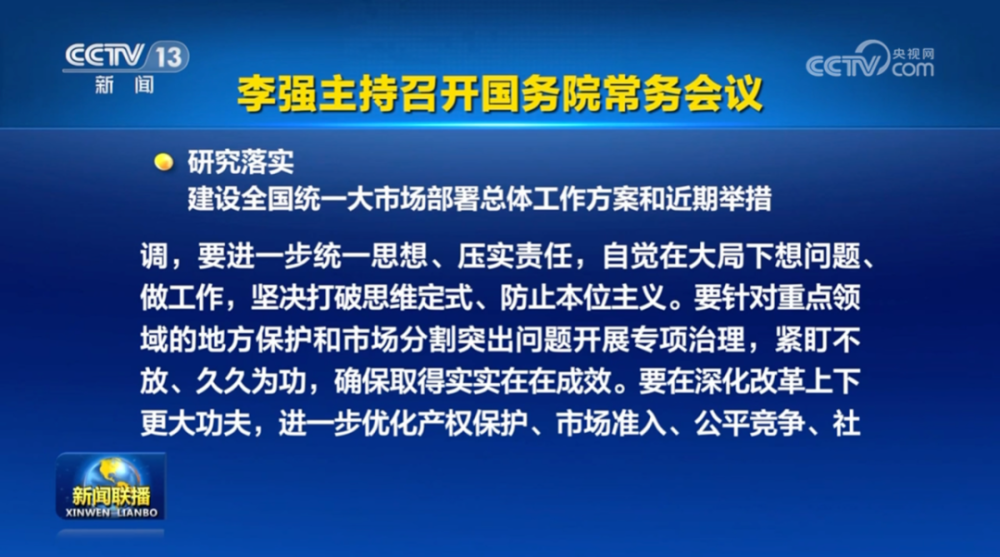

# 打破地方保护！《新闻联播》的一则报道，透露了一个新信号

**撰文 | 余晖**

据《新闻联播》报道，5月19日，国务院总理李强主持召开国务院常务会议。

这次会议的议程有两个：

**研究落实建设全国统一大市场部署总体工作方案和近期举措**

审议通过《关于加强医疗保障基金使用常态化监管的实施意见》

会议提到，“针对重点领域的地方保护和市场分割突出问题开展专项治理”。

**不能以“内循环”的名义搞地区封锁**

建设全国统一大市场，是中央的要求。

2021年12月17日，十九届中央全面深化改革委员会第二十三次会议召开。

这次会议提到，我国市场体系仍然存在制度规则不够统一、要素资源流动不畅、地方保护和市场分割等突出问题。

习近平强调，“构建新发展格局，迫切需要加快建设高效规范、公平竞争、充分开放的全国统一大市场，建立全国统一的市场制度规则，促进商品要素资源在更大范围内畅通流动”。

2022年4月10日，《中共中央、国务院关于加快建设全国统一大市场的意见》发布，此举意在“ **从全局和战略高度加快建设全国统一大市场** ”。

上述意见提到，打造统一的要素和资源市场、推进商品和服务市场高水平统一、推进市场监管公平统一、进一步规范不当市场竞争和市场干预行为等。

需要说明的是， **建设全国统一大市场，破除地方保护和市场分割是重中之重、难中之难，也是关键所在。**

中央在意见中特别提到，破除地方保护和区域壁垒。

**找准自身功能定位，力戒贪大求洋、低层次重复建设和过度同质竞争，不搞“小而全”的自我小循环，更不能以“内循环”的名义搞地区封锁。**

国家发展改革委体改司有关负责人此前曾对新华社表示，“破除地方保护和市场分割，关键是正确认识局部和全局的关系，做到全国一盘棋，统一大市场，畅通大循环。”

**“一些地方政府有自己的顾虑”**

建设全国统一大市场，有现实需要。

5月11日，新华社主办的《半月谈》杂志刊发了《各地互相挖墙脚，企业搬迁一次赚一笔：谨防基层招商无效“内卷”》一文。

文中提到，部分地方政府为争项目加码招商政策，互挖存量企业，“招商内卷”有抬头之势。

西部某区一位基层干部说，“大家都暗暗较着劲，比如，
**同一个新能源项目，我们得知邻省城市有引进意向后，马上组织专班，对照研究，给予更优惠政策和更周到服务。** ”

东部一家新能源装备领军企业的政府事务总监说，“天天有人来谈合作，
**有的位置偏远，甚至根本不具备设厂条件，我们明确拒绝了，还坚持要来拜访。可能对他们来说，拜访也是KPI** 。”

文中在结尾提到，加快建设高效规范、公平竞争、充分开放的全国统一大市场，资源要素才能更高效率地流动，区域内的产业建设方能协同规划，避免过度同质化。

但一个问题是，仍有一些地方政府缺乏大局意识。

今年4月，国家发改委在《求是》发表了《全力推动构建新发展格局取得新突破》一文。

文中提到，“全国统一大市场建设和循环畅通面临障碍。 **市场分割和地方保护主义仍然存在，** 要素自由流动存在隐性壁垒”。

国家发改委称，需要高度重视，必须坚持问题导向和系统观念，在实践中认真加以解决。

5月20日，清华大学国家战略研究院特约研究员刘旭在接受澎湃新闻采访时提到，“有些地方政府可能为了保就业或者保护本地企业利益，设置一定的限制，但这样就不利于全国统一大市场的形成。”

刘旭说，“地方政府有自己的顾虑，希望保证自己的税源，希望稳定就业，这些考虑是有道理的，但是更多需要靠发展自己的比较优势。另外，要能够接受市场要素的流动。不能够牺牲法治，牺牲统一大市场，来换取对个别企业的投资。”

**国务院：开展专项治理**

针对地方保护主义，官方已经采取了不少行动。

据《南方都市报》报道，锚定一个大市场目标，着力破除地方保护和行政性垄断是国家市场监管总局今年的一项重点工作。

多地市场监管部门发文明确，聚焦公用事业、教育、医疗卫生、交通运输、工程建设、保险、政府采购、招投标等重点行业和领域，重点整治地方保护和行政性垄断行为。

如今，专项治理将展开。

5月19日的国务院常务会议提到，要进一步统一思想、压实责任，自觉在大局下想问题、做工作，坚决打破思维定式、防止本位主义。

会议还特别提到：

**要针对重点领域的地方保护和市场分割突出问题开展专项治理，紧盯不放、久久为功，确保取得实实在在成效。**

要在深化改革上下更大功夫，进一步优化产权保护、市场准入、公平竞争、社会信用等市场经济基础性制度，健全激励约束和考核评价体系，完善适应全国统一大市场建设的体制机制。

**资料｜新华社 人民网 南方都市报 澎湃新闻 半月谈杂志等**

**【版权声明】本文著作权归政知新媒体独家所有，未经授权，不得转载。**

