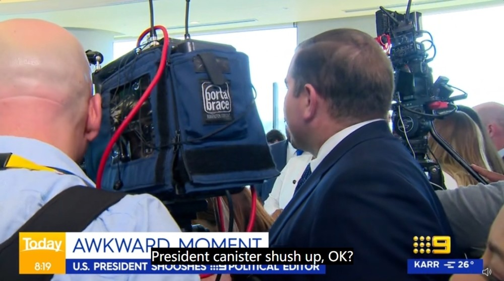
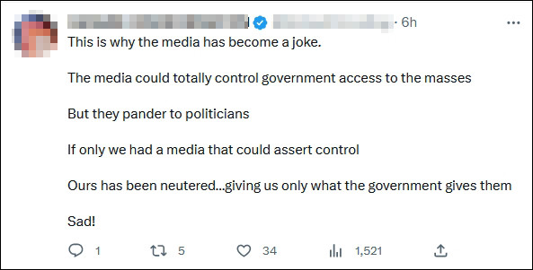

# 被问及美债危机，拜登对澳大利亚记者发怒：闭嘴好吗

（观察者网讯）国内债限问题烧眉，美国总统拜登本周还是踏上了缩水三分之二的亚洲行，赴日出席七国集团（G7）峰会。

当地时间20日的场边会上，拜登果然被媒体问及债务危机。福克斯新闻网和《纽约邮报》称，当拜登被另一名想提问的澳大利亚记者多次打断话头，他做出“恼怒”的回答：“闭嘴，好吗？”

关于债务上限问题，拜登据悉已指示团队安排自己21日与众议院议长、共和党人麦卡锡通话。麦卡锡此前一天表示，在拜登返美之前，相关谈判无法推进。

_福克斯新闻网报道截图_

据福克斯新闻网，这个“短暂而紧张”的场景发生在拜登当天在G7峰会与澳大利亚总理阿尔巴尼斯的一对一双边会谈上。报道介绍，在这种场边会，通常周围会有一群记者共同在场。

一名女记者率先找准机会发问：“总统先生，您对国内的债务谈判有多关注？”报道称，拜登一开始“表现得很亲切”，温和地给出一个简短的回答：“一点也不。”

紧接着，多名记者再度同时开口提问，但很快安静下来，让最开始那名记者继续说后续问题。她问起，众议院共和党人在与白宫的谈判中是否表现出“诚意”。

“（谈判）这要分阶段进行。我以前也参加过这种谈判，发生的情况是……”拜登没有直接回答，转而开始解释谈判的过程。与此同时，一名男记者在他说话的间隙中几次叫道“总统先生”，试图提问。

_澳大利亚记者试图提问_

福克斯新闻网称，被打断的拜登从椅子上坐起来，眯着眼睛看着记者，冷冷地说：“闭嘴（Shush
up），好吗？”随后，他咧开一个揶揄的笑容说：“谢谢。”旁边的阿尔巴尼斯似乎也被逗乐，发出一声轻笑。

拜登继续解释说：“（谈判）这要分阶段进行。发生的情况是，第一次会议往往不像第二次、第三次那样有进展。谈判人会回复负责人说，‘我们的想法是这样’，然后两边再提出新的诉求。”

另据《纽约邮报》报道，拜登当天还对媒体表示，他仍然相信美国能够避免联邦政府债务违约，称“我们将取得一些像样的成果”。

_拜登让插话的澳大利亚记者“闭嘴”_

据悉，这名被“怼”的记者是澳大利亚媒体第九新闻（9News）的首席政治编辑查尔斯·克劳彻（Charles
Croucher），他也因此在节目中受到了主持人同事的调侃：“查尔斯，你被训了！”“被总统直接说闭嘴，好不留情面（brutal）。”

克劳彻则尴尬微笑，说这桩插曲“挺有意思”（fun），也博得大家一笑（a good
laugh）。他解释说，有时候很难知道拜登的话头什么时候才算结束，因此自己没能把握好提问时机。

他还进一步称，自己也曾在美国工作生活，“我知道他们有第一修正案，有询问这些问题的新闻自由，也有给出回答的言论自由”。他的解释越说越长，男主持人也学着拜登打断他：“嘘，够了。”

_克劳彻（右）在节目中被同事调侃_

拜登这一做法很快引起了保守派人群的不满。福克斯新闻网称，不少推特用户抨击拜登的做法和语气太过居高临下，还有人指出，如果换做前总统特朗普这样对待一名“激情过度”的记者，他早被批评者的口水淹没了。

一名网友在推特上写道：“媒体完全可以控制公众对政府的了解，但他们选择迎合政客……我们的媒体被‘阉割’了，只给我们看政府提供给他们的事情。悲哀！”

还有人说：“他以为自己是国王，但他是为人民服务的。”

在澳大利亚第九新闻（9News）在网上发布的这段节目视频下方的评论中，也有人提出了类似的问题：“想象一下，如果特朗普对某人说闭嘴，新闻头条会是什么样。”

美国保守派政治博客RedState的作者邦奇（Bonchie）则写道：“拜登今天让记者‘闭嘴’，吉姆·阿科斯塔不会在意。”阿科斯塔是美国有线电视新闻网（CNN）的首席白宫记者，曾在2018年的白宫记者会上与特朗普发生冲突，一度被白宫取消记者通行证。

目前，美国联邦政府距离财长耶伦此前警告的违约日期只剩一周半的时间，但民主、共和两党仍在关键问题上无法达成一致。据美媒披露，19日的双方谈判过程可谓“跌宕起伏”，戏剧性地按下两次暂停键：先是众议院议长麦卡锡的代表突然离席，无奈宣布谈判暂停；重启后不久，谈判又因“真正的分歧”再次突然停滞。一名共和党人直言，他“没有”信心与拜登政府就预算问题达成协议。麦卡锡曾多次表明希望削减非国防开支，但民主党人认为，在通货膨胀下，保持拨款持平相当于有效削减。

谈判再次破裂的消息一经传出，立即引发华尔街股市动荡。彭博社称，标普500指数一度较上周五的高点下跌近0.8%，不过跌幅随后有所缓和，收盘下跌0.1%。路透社21日引述白宫官员称，拜登听取汇报得知国内债务上限谈判破裂、无任何进展迹象后，寻求在峰会结束后致电麦卡锡，二人预计最早会在华盛顿时间21日早上通话。

麦卡锡20日对媒体表示，在拜登返美之前，谈判不太可能向前迈进。针对当前的谈判僵局，他指责白宫代表“又变卦”，拒绝对削减开支做出让步，“他们实际上想花的钱比我们今年花的还多”。两名知情人士透露，共和党代表拒绝了白宫的一项提议，该提议将使2024年的非国防和国防可支配支出与2023财年持平。白宫当天发表声明回击麦卡锡，称他的团队“提出了一个倒退了一大步的提议，其中包含了一系列极端的党派要求，这些要求永远不会在国会两院获得通过”。

此前，耶伦已多次就此发出警告，债务违约将酿成“一场经济和金融灾难”，并损害美国的信用评级，对美元的储备货币地位产生不利影响。她表示，国会只要一天不采取行动，美国就会经历日益严重的经济问题。届时不仅联邦政府的基本运作可能会中断，而且造成的潜在经济衰退的严重程度可能与2008年的大衰退相当，失业人数将超过800万人，美国股市市值将缩水45%。根据美国债券评级机构穆迪公司最近预测，如果出现违约，美国GDP将下降4%，即使是短暂的违约也会导致200万个工作岗位流失。

**本文系观察者网独家稿件，未经授权，不得转载。**

