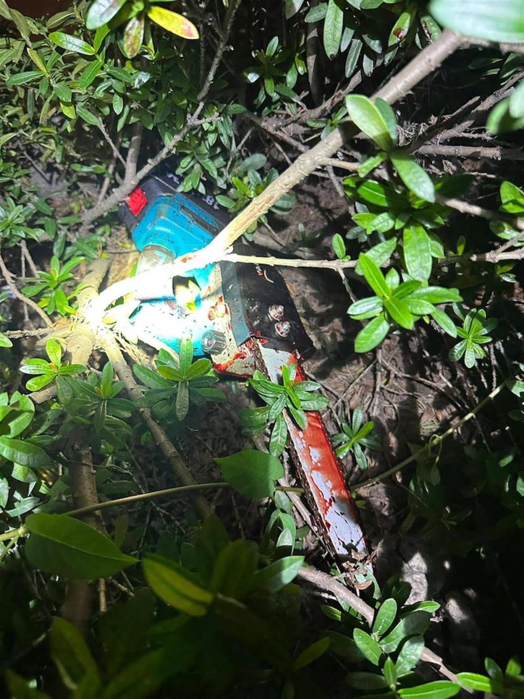

# 香港元朗现电锯凶杀案：54岁女子毁容身亡，染血电锯遗留在草丛中

香港特别行政区政府发布新闻公报，香港元朗5月20日晚发生一起谋杀案，案中一名54岁女子在路边死亡。香港警方在现场检获电锯、刀及手套，怀疑与案件有关。元朗警区重案组正积极调查案件。

新闻公报称，香港警方20日晚7时26分接获报案，称发现一名女子昏迷倒卧在元朗锦壆路东一人行路。警方赶赴现场，发现这名女子颈部及背部有刀伤并且身体多处受伤，该女子现场被证实死亡。经初步调查，案件列作谋杀。

_案发现场（来源：香港01）_

_警方封锁现场调查，死者遗体被帐篷覆盖。（来源：香港01
梁伟权摄）_

据香港01报道，据了解，经初步检查，死者身上多处受伤，包括颈部有明显创伤，肚部肿胀及有数处伤痕，脸容严重毁烂，身旁有数只牙、一顶黑色鸭舌帽及一部电话。

_警方人员在现场附近草丛发现了染血的电锯和利刀
（来源：香港01 梁伟权摄）_

另外警方于现场附近约20米草丛检获一把染血电锯、一把30厘米长的牛肉刀及一对手套，怀疑与本案有关。警方稍后将安排为死者进行尸检，以确定其死因。

_尸体旁发现一部手机及一顶黑色鸭舌帽。（来源：香港01
梁伟权摄）_

大约凌晨零时，在警方人员调查期间，女性死者身边的一部手机突然响起，警务人员捡起接听，并向来电者表示：“你姐姐现在出了事，不要再打她这个电话了，有什么事就跟我们说。”

（来源：极目新闻）

