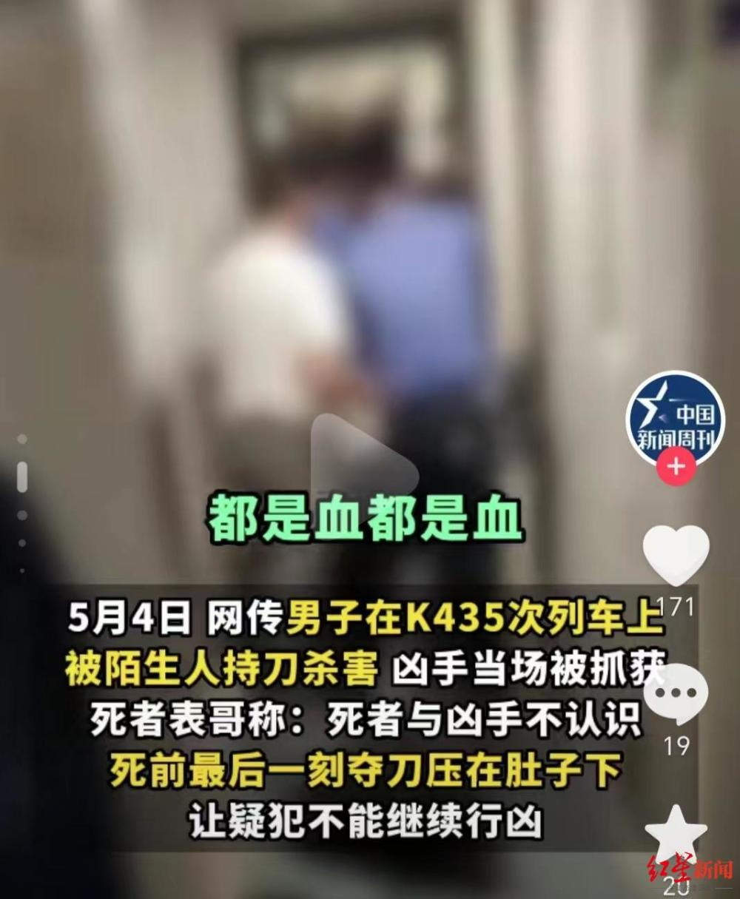
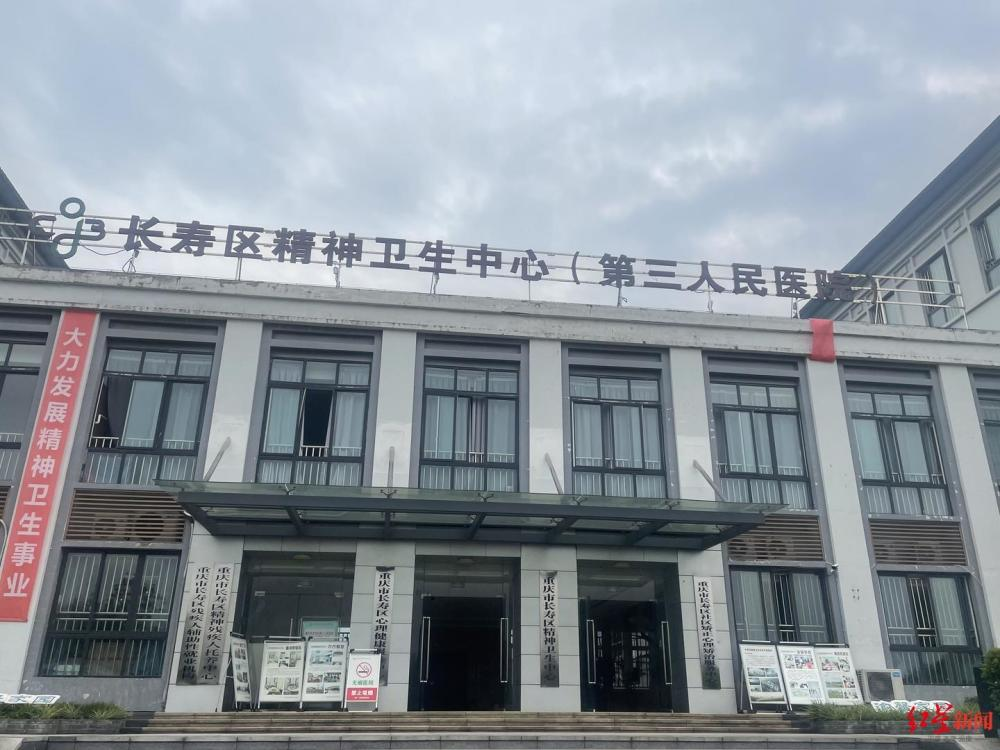
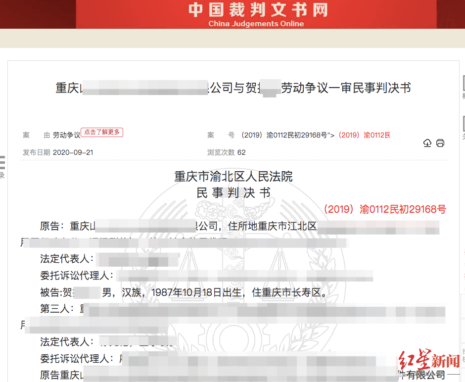

# K435列车命案背后：“游荡的精神病患者”管理之困

_↑网传视频截图_

南下行驶的K435列车上，年轻的舞蹈演员谷某被捅刺数刀，抢救无效后永远地离开了人世。事情发生在5月4日晚，犯罪嫌疑人贺某某随后被铁路警方刑拘。

36岁的贺某某来自重庆长寿区，相关裁判文书显示，他有吸毒史，神经病史。这不是贺某某第一次在外伤人，6年前他曾拿刀捅伤工友，雇主为其赔偿10余万元。贺某某老家邻居称，当地人都离他远远的，因为“他身上经常带着刀”。贺某某的母亲告诉记者，其10多年反复进精神病院，有时在家，有时回老家，平时打零工，“但是在哪里都待不长”。

近日，红星新闻记者走访了贺某某的老家、母亲居住地，采访了贺某某多处居住地的基层卫生机构和精神病院，聚焦流动中的精神病患者的管理难点，并试图还原精神病患者贺某某的真实生存现状。

**生活的村庄**

**邻居听到名字就害怕**

**“他身上经常带着刀”**

贺某某父亲的居住地——海棠镇土桥村，由重庆市长寿区下辖。这起列车杀人事件已传遍全村。

听到“贺某某”的名字，不少村民连连摆手，避讳谈及，一部分原因是害怕。“（贺某某患有）长期的神经病，碰到人就打，还打过他父亲。”认识贺某某的一位村民告诉红星新闻记者，她有一两年没在村里看到贺某某了，但只要一提到这个人，她脸上露出恐惧神色，“我怕他，听到我就怕。”

一处两层高的临街旧楼房，是贺某某的父亲和奶奶住了几十年的老宅。朱红色的木门疏于修缮已掉漆，屋内昏暗无光。贺某某的奶奶告诉记者，她已88岁，现在家里靠低保维持生活。当年贺某某父母离婚后，年纪尚小的贺某某就被母亲带走了，她不了解贺某某的情况，并多次表示“他在长寿（区）住”，其他不愿多谈。

隔壁邻居告诉记者，当地人都离贺某某远远的，因为“他身上经常带着刀”。据他了解，贺某某不常在此居住，“有时回家，有时不回家，没有正经工作，好多年前还吸过毒。”

当记者询问其父母是否能管住贺某某时，多名村民表示其父母监护能力不足。

“得了神经病的谁能天天管着呢？把他弄到医院去都恼火（困难）。”一位村民告诉记者，贺某某的父母离婚多年，爷爷去世后，只有贺某某的父亲和奶奶在家。“他家庭条件不好，奶奶很大年纪了，父亲又生病管不了他，只能被关到精神病医院去。”不过村民记得，贺某某的母亲“还能管一点”。

_↑重庆长寿区_

贺某某的户口后来迁到了重庆市长寿区。贺某某母亲卓女士居住在凤城街道关口社区的一处公租房小区。卓女士告诉记者，列车杀人事件发生后，已有警方赶来重庆做调查。她告诉记者，贺某某患有精神病十几年了，在精神病院治了十几年，每次住一段时间再出来，再进去住一段时间又出来。卓女士称之前有两次伤人的经历，“也是发病了”。

贺某某是怎么从重庆长寿区跑到湖南衡阳伤人的呢？卓女士表示对此毫不知情，就连儿子什么时候离家的也不清楚。她记得儿子上次从精神病院出来后，想要离开长寿是在5月2日。“他说他脑袋里面被人安了监控，他要出去在没人的地方把脑子清洗一下，他说手机也让别人安了监控，可以随时看到他的行踪。”卓女士说，至于最后儿子怎么去了衡阳，她表示“不知道”。

贺某某经常发病，卓女士记得他最近的一次住院时间最长，共1年零8个月，于今年1月中旬出院。在卓女士看来，贺某某的精神病不是遗传，一开始他吸毒，后又戒毒，戒毒两年后，“开始犯病了”。卓女士说贺某某患病之后找工作困难，平时打零工，“他在哪个地方都待不长，就待几天，刚开始人家感觉他是正常的，接触后就知道有病了。”贺某某每个月还能领取几百元的低保，母亲卓女士因患病无法工作，也是靠低保维持生活，现在还欠着亲戚朋友钱，刷信用卡都欠了十几万，“治精神病不花钱，是我治病欠下的钱。”卓女士一共两个孩子，贺某某是老二，卓女士前两年做过手术，现在每个月要到医院输液治疗。

卓女士表示，贺某某在医院的时间比较多，有时在家，有时在老家。对于受害者一家，卓女士表示想向他们道歉，“说实话，为这个儿子，我就想自己先死了。”早几年，贺某某病发时还打骂过她，“他根本上认不出我是他妈，他（发病）那时候把我当成仇人，他的心理就是觉得别人要整他，要打他，要害他。”

**隐蔽的病人**

**前雇主为其捅人赔过钱**

**事发后才知其有精神疾病**

精神病患者不发病时，看上去与常人无异。一旦离开熟悉的地方，流入其他区域，常常隐藏于正常人中间，尤其发动侵害时往往令人猝不及防。

“老实人，话少”，这是张斌（化名）见到贺某某的第一印象。2016年，张斌在重庆开了一家劳务派遣公司。2017年3月，正值春节后大规模招人，张斌看到了30岁的贺某某来应聘，“（打扮）不干净，一般普通打工仔的样子”，问贺某某什么，他就答什么，不问就默不作声。

张斌没有特别留意贺某某，将他派往当地一家汽修公司服务，“但入职不到一个月，他就拿刀捅了那家汽修公司的一名老员工敖某。”张斌表示，贺某某与敖某素不相识，后来警方告诉他，贺某某称伤人是因为精神病发作，出现了幻觉。

此事导致汽修公司支付敖某各类赔偿款合计100998元。随后，该汽修公司向张斌的派遣公司追讨这笔费用，并进行了起诉。张斌这才意识到，自己招来的贺某某患有精神疾病，可是没有哪一家公司会在入职前对员工进行精神鉴定，他觉得自己“很冤”。

“贺某某毕竟是我们公司派过去工作的。”张斌告诉红星新闻记者，“除了前述提及的这10万元赔偿款，公司还为敖某支付医药费，总共花了大概13万元。”张斌称，他曾想向贺某某讨回这笔损失，但与贺某某的母亲联系后，对方却称“贺某某已经是成年人了，我也管不了”。张斌称，后来他向法院起诉贺某某，但是查到他身无分文，银行卡也是父母开的，没办法冻结，他名下没有银行卡，没有房产，“我官司打赢了也没意义，打赢了一分钱也得不到。”他知道这笔钱追不回来了，只能自认倒霉。

“我当时就想，这是个危险的人，始终还会惹事。”张斌说，前两天看到K435次列车上有乘客被刺伤身亡的报道后，他心里“咯噔”一下，“因为警方披露的凶手信息，也对上了。”

贺某某这次的伤人经过也令旁人猝不及防。据报道，事发时坐在4车厢10号座位的王先生目睹了案发过程。他距两节车厢连接处的现场仅一两米距离。当时从瞌睡中醒来的他，看到被捅刺的男子已经倒地不起，凶手的手上拿着一把刀。车厢里有一名穿黄衣服的乘客向凶手喊话，要他住手，却一度遭到凶手的追赶恐吓。

“凶手又回到捅刺那男子的位置，对倒地的男子又补了4刀。”王先生说，凶手再度捅刺的那4刀，他全程看到，其中一刀刺向男子颈部。他看到凶手手持的是一把较长且锋利的刀。“当时他追黄衣服乘客的时候，那把刀从我眼前闪过，完全不像普通的水果刀。”王先生说，当时乘客们在没有工具的情况下不敢上前制止凶手，后来警察持盾牌和防暴叉赶到才将凶手控制。

_↑长寿区精神卫生中心（第三人民医院）_

**医院怎么治**

**急性期通常缓解最严重症状**

**恢复了回家后维持用药**

重庆长寿区精神卫生中心（第三人民医院）曾接收贺某某治疗精神病。

该医院院长告诉记者，像贺某某这类常年进出精神病院的患者，并非个例，因为精神疾病是一个复杂、长期的慢性疾病，因此大部分精神病患者的一生都会几进几出医院。而贺某某的间歇性精神病，院长透露，可能与他的性格有关。

对于间歇性精神病的出院标准，院长表示，依据患者疾病的缓解程度、自身的恢复，以及对患者社会功能的恢复来综合判断。对于精神病人流动在社会上，院长称：“急性期的治疗，通常是缓解患者最严重的大部分精神症状，若恢复了便可回家继续工作，在家人或者其他部门的监护下工作，定期来看病。”

院长告诉记者，作为精神卫生中心，承担着两个最主要的职能，一是治疗，二是出院后的随访，“将精神病患者纳入管理，实际上国家最早拿出600多万推动项目落地，使得大家越来越多地关心全国的精神障碍患者，所以我们是医疗机构，还是一个管理机构。”

据中国青年报2011年的一篇报道：我国第一个由中央财政直接支持的精神卫生项目，因启动资金为686万元，而被简称为“686项目”。该项目试图探索完善“医院社区一体化”的管理模式，把对重性精神病人的管理重点从医院转移到社区，在进行有效治疗、康复的过程中进行管理。而该项目的目标之一，就是建立综合预防和控制这些患者危险行为的有效机制，提高治疗率，降低危险行为发生率，完善社区对重性精神疾病的防治和管理能力。

院长透露，“现在，整个（长寿区）检出的是千分之五以上严重精神障碍（患者），举个例子，我们现在有几千个严重的（精神障碍患者），住院的有几百个，（剩余）大部分还是在社区维持用药、社区康复或者重返工作岗位等。”

如何监管重返社会的这部分精神病人呢？据其介绍，该地区建立的网络系统随访机制，是在重性精神障碍患者回到社区后，由常住地各乡镇医院、基层医院的精神障碍防治医生主持落地。“常住地是指长期居住6个月以上，在患者出院后，我们就会把（他的情况）推送给相关医生，三个月至少要随访患者一次，要见两次以上的面，还要给患者做一次免费体检。”该负责人表示，精神障碍患者的监管，说到底需要多部门合力，包括公安、民政、残联、司法等部门共同参与。

院长强调，出院后维持用药是减少复发的最重要因素，这也是最重要的手段。贺某某在接受警方问讯时也表示，他在患有精神障碍期间，吃药情况就要好些，不吃药就恼火些。

**社区怎么管**

**“他是空挂户”**

**基层卫生机构并不清楚情况**

贺某某出院后，其用药及监管问题落实情况如何？

贺某某母亲所住社区卫生服务中心一名负责精神病患者的工作人员告诉记者，贺某某不是其辖区的精神病患者，这里也不是贺某某的常住地，他向记者表示，贺某某母亲患病后，这几年贺某某和海棠镇老家的父亲生活在一起。该社区一名负责民政的工作人员表示，对贺某某的情况不清楚。而贺某某父亲居住地的土桥村卫生室村医告诉记者，贺某某长期不在家，户口迁到了长寿区，“应该是长寿区那边管，我们卫生院也没将他纳入精神病库。”

_↑重庆长寿区凤岭路_

红星新闻记者获悉，贺某某是重庆市长寿区人，户口在长寿区凤城街道凤岭路。凤岭路居委会一工作人员证实，“贺某某是空挂户”，记者询问是否归该社区监管，对方摇了摇头。该社区所属的凤城街道办则婉拒了记者的采访，表示相关问题需向长寿区宣传部门了解。

相关判决书则证实了贺某某流动的生活状态：无固定住所，多出现独自外出打工或者流浪的情况。

（2019）渝0112民初29168号判决书显示，贺某某在接受警方问询时表示，从厂里跑了之后就在重庆一直逛，逛了一两个月，当时身上有一些钱，平时吃点包子、面条这些，晚上就随便找个空地、草坪之类的地方睡觉。之后就坐“黑车”回了长寿，后来又因为打人被长寿警察送到长寿第三人民医院精神科住院。

_↑中国裁判文书网截图（部分）_

**流动患者存在管理难点**

**精神医生对此提出三点建议**

近年来，严重精神障碍患者综合管理一直在强化。2019年，时任国家卫健委疾控局副局长雷正龙解读《健康中国行动（2019～2030年）》中对心理健康促进行动的要求时表示，借鉴精神卫生综合管理试点工作经验，相关部门要建立完善精神卫生综合管理机制，联合开展严重精神障碍患者登记报告、救治救助、康复服务等工作。雷正龙指出，严重精神障碍患者管理是纳入基本公共卫生服务的，现在的管理状况越来越好，但确实也存在一些问题，社会对严重精神障碍的认识，包括家属、患者本身对疾病的认识还不够，导致有些患者和家属不遵医嘱，（患者）状况好一点就随便停药了，因此有些患者容易复发，所以要提高“三率”——登记报告率、治疗率、规范管理率。

流动中的精神病患者无疑为管理增加了难度。红星新闻记者在由中国医学科学院医学信息研究所/图书馆研制的中国生物医学文献服务系统中查询到，重庆市精神卫生中心的何兆宇医师于今年1月发表了一篇题为《重庆市流动人口精神分裂症患者的特征分析》的论文，文章选取2019年8月至2020年2月在管的精神分裂症患者216例（流动人口104例为研究组，户籍人口112例为对照组）进行分析研究。作者研究发现，流动人口精神分裂症患者由于自身特点，呈现出与户籍人口精神分裂症患者不同的特征，阳性症状和社会功能缺陷更明显，疾病负担更重，获得的社会支持较少，生存质量较差，危险性较高。精神分裂症患者暴力攻击行为具有突发性、无目的性等特点，威胁社会公共安全。

对于该类人群的管理，何兆宇医师提出三点建议：一是强化精神专科联盟的功能，落实三级防治网络。精神专科联盟除了在学术交流、进修学习以外，作为一个协会性质的组织，还具有专业技术指导的功能定位，指导基层机构落实精神疾病三级防治，“织牢”三级防治网络，网格化分级管理，从而减少精神分裂症患者肇事肇祸发生率。二是加强患者流动管理，构建“互联网+”管理模式。由于人员流动的不确定性，社区工作人员工作量较大，而且存在管理盲区，社区管理不能做到全覆盖。互联网的兴起，使用“互联网+人工智能”，通过情绪识别及分析、言语识别及分析、行为分析等，可以对患者进行症状分析、辅助诊断、行为预测等，从而实现流动精神分裂症患者全覆盖管理。三是加强对流动人口社会心理服务的覆盖率和频次。由于精神分裂症患者的发病与不良心理刺激和应对方式有相关性，所以在改善流动人口的工作生活环境以外，还要加强心理卫生知识的普及，以及心理危机干预和社会心理卫生服务，从而减少该类群体精神疾病的发生，早期干预减缓疾病进展，减少肇事肇祸的发生率。

红星新闻记者 罗丹妮

编辑 潘莉 责编 邓旆光

