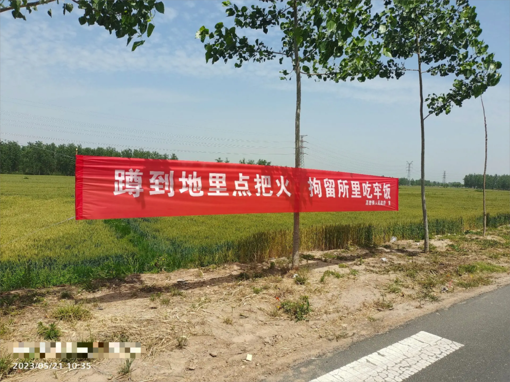

# “一家烧火全家坐牢”，江苏一镇政府防火宣传引争议，横幅已全部撤掉

5月21日，有江苏网友晒出一些拉在路边的防火宣传横幅，上面印有“一家烧火，全家坐牢”“蹲到地里点把火，拘留所里吃牢饭”“谁家地头谁看管，谁家着火谁罚款”等字样，横幅右下方宣传落款显示为高墟镇人民政府。

这些横幅引起不少网友质疑，“这是连坐？”“别人烟头扔我家地里也怪我？”

_△
网友发布照片_

5月22日上午，潇湘晨报记者就此事致电江苏省沐阳县高墟镇人民政府。工作人员称事情已经处理完毕，“我们全部已经意识到了，昨天晚上就已经把所有横幅全部拿掉了，当天挂当天就拿下来了。”

潇湘晨报记者 吴陈幸子

