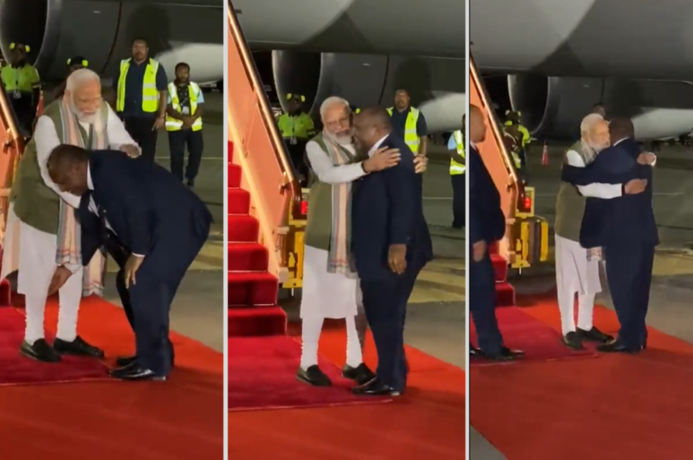
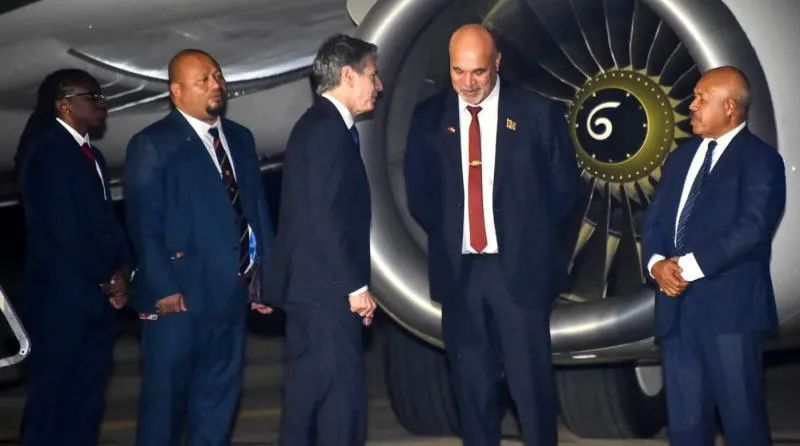
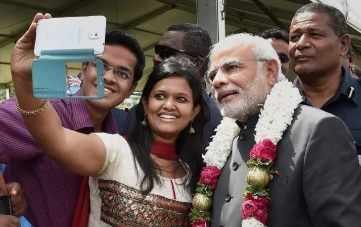

# 印度总理莫迪与美国国务卿布林肯同时造访巴新，绝非简单巧合

**“美国与印度在南太地区的行动绝非简单的巧合，两国是相互配合的。”**

在相聚广岛之后，印度总理莫迪与美国国务卿布林肯于同一天飞抵巴布亚新几内亚，并分别在22日与汇聚当地的太平洋岛国领导人举行会晤。

无论美印双方在巴新的活动是否有交集，时间与地点这般重合的旅程都很容易引发国际舆论的猜想。何况，布林肯是明确作为美国总统拜登的代表前来的。

但让美方略显尴尬的是，也许美印之间无意在当地一较影响力的高下，但从巴新领导人给予的礼遇来看，美国的傲慢和轻视显然令他们感到不满和怀疑。

**莫迪收获破格礼遇**

在广岛吸引大量的聚光灯后，印度总理莫迪飞抵巴布亚新几内亚（下简称“巴新”）首都莫尔兹比港。这个对于许多人感到陌生的地名，也是其历史上首次迎来印度总理。

当莫迪的飞机落地时，巴新总理马拉佩亲赴机场迎接，并“破例”献上当地特有的欢迎仪式。据印媒报道，根据外交传统，巴新不会在日落后为到访的客人安排欢迎仪式。但从照片看，尽管莫迪抵达时已是晚上，马拉佩还是亲自为莫迪举行欢迎仪式，不仅放礼炮、铺红毯，还弯下腰触碰莫迪的腿部，以示尊重。

_莫迪受到巴新政府热烈欢迎。图源：hindi.news24_

莫迪22日与马拉佩共同主持第三届印度-
太平洋岛国合作论坛峰会。该峰会已中断达8年之久。莫迪在会上对14位太平洋岛国领导人表示，印度将成为他们可靠的发展伙伴，致力于建设“自由、开放、包容的印太地区”。

值得注意的是，莫迪不仅在会上提及由印度与美国、澳大利亚和日本组成的所谓“四边机制”已同意加强与太平洋岛国的合作，还特别与所罗门群岛总理索加瓦雷举行了双边会谈。所罗门群岛去年4月与中国签署双边安全框架协议，“四边机制”对此极为关注。

不过，鉴于印度屡屡以发展中国家代表自居，马拉佩在开幕致辞中也借坡下驴，敦促印度考虑“因大国游戏而受苦”的岛屿国家，并举例说乌克兰危机已在太平洋岛屿国家引发能源价格普遍上涨和严重的通货膨胀。

**美国签署防务协议**

相较莫迪受到的礼遇，布林肯的待遇就寒碜得多。毕竟，无论美方再怎么强调他作为拜登代表的身份，但对于首位美国总统到访期盼已久、又一直对美方诚意有所怀疑的巴新来说，拜登的缺席自然令该国官员与民众感到失望。

_布林肯（左三）只受到了巴新副总理John
Rosso（右二）的简短欢迎。图源：AFP_

美日两国二战期间曾在巴新展开激烈交战，但自巴新独立以来，尚未有美国总统到访。拜登原计划将于22日访问巴新，与太平洋岛国领导人和印度总理莫迪举行“印太论坛”峰会，但由于国内债务危机发酵，拜登在G7广岛峰会结束后径直回国。

在回国前，拜登亲自致电马拉佩解释原因，并委派布林肯代表自己前往巴新。此外，美国印太司令部司令、海军上将约翰·阿奎利诺也同赴巴新。

**聊城大学太平洋岛国研究中心常务副主任、教授赵少峰**
表示，美国近年来着重通过以下三个方面强化其在太平洋岛国地区的影响力：在身份存在方面，美国不断有高级别官员访问太平洋岛国；外交方面，美国在该地区的大使馆数量正不断增加；军事方面，美国在该地区开始重新布局军事基地，签署军事合作协议。

布林肯22日表示，美国将在未来三年对巴新提供超过价值4500万美元的资金与装备援助，并与巴新签署双边防务合作协议。这份协议允许美国海岸警卫队的舰艇与巴新方面一起在巴新专属经济区内巡逻。

**当地民众不无反对**

对于美国与巴新签署的防务合作协议，中国外交部发言人毛宁22日回应称，中方对有关各方同巴新等太平洋岛国开展正常交往和平等互利合作不持异议，但需要警惕的是以合作之名搞地缘政治博弈，同时中方也认为任何合作都不应当针对第三方。

“美国与印度在南太地区的行动绝非简单的巧合，两国是相互配合的。”赵少峰认为，尽管中国并不是太平洋岛国地区的“新来者”，但美西方国家显然视中国为其在该地区的竞争对手。在美国推出其“印太战略”后，印度也积极参与到太平洋岛国事务中。

_印度裔在不少太平洋岛国存在感很强，甚至有人位居总理。图源：thekootneeti_

新加坡《海峡时报》认为，就影响力而言，印度在太平洋岛国地区仍有不少欠缺，如仅在巴新和斐济派有驻外使团，对太平洋岛国实际需求了解不足，承诺的援助总难以兑现等。但是，通过与“四边机制”的捆绑，印度能够弥补一些自己的短板。

同时，美国也可借助印度的发展中国家身份，以及与该地区大量印度裔人口的天然联系，去推进一些美国不便或难以操作的议题。

就在莫迪与布林肯到访当天，巴新多所大学的学生举行游行，抗议巴新与美国签署防务合作协议。学生们认为，该协议同巴新“广交友、不树敌”的外交政策不符。作为一个发展中国家，巴新需要的是经济合作协议，而不是在安全领域签署协议。

**出品 深海区工作室**

**撰稿 杨一帆 实习生 杨珈媛**

**编辑 深海獭**

