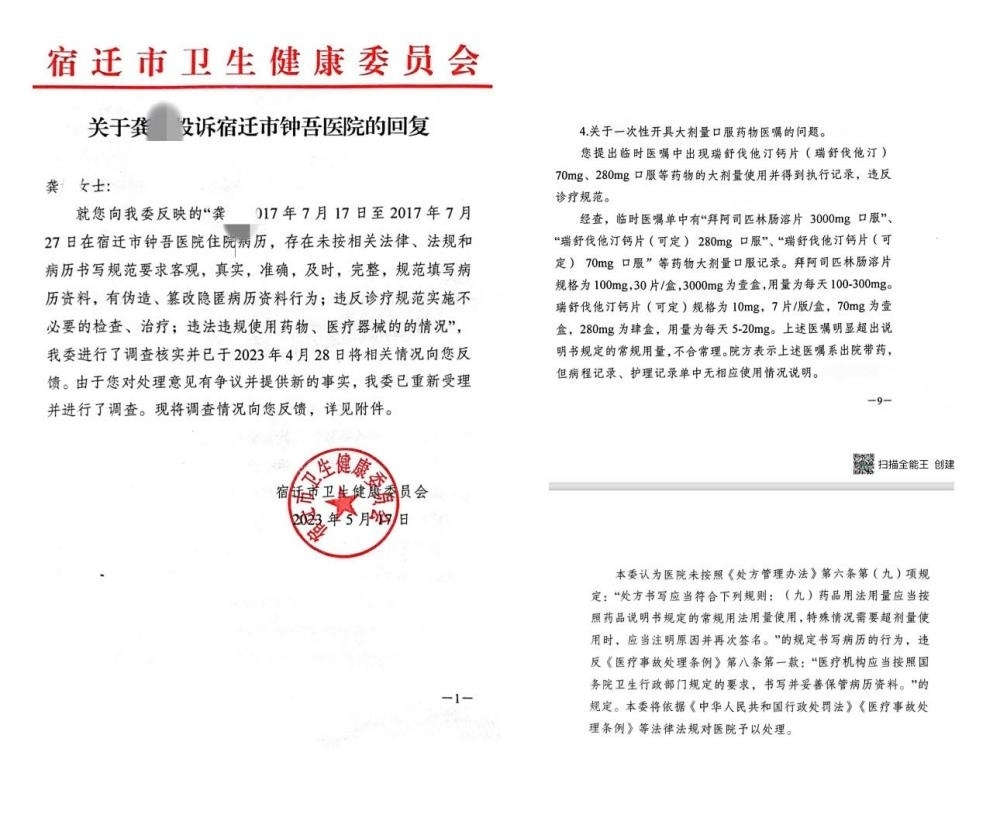
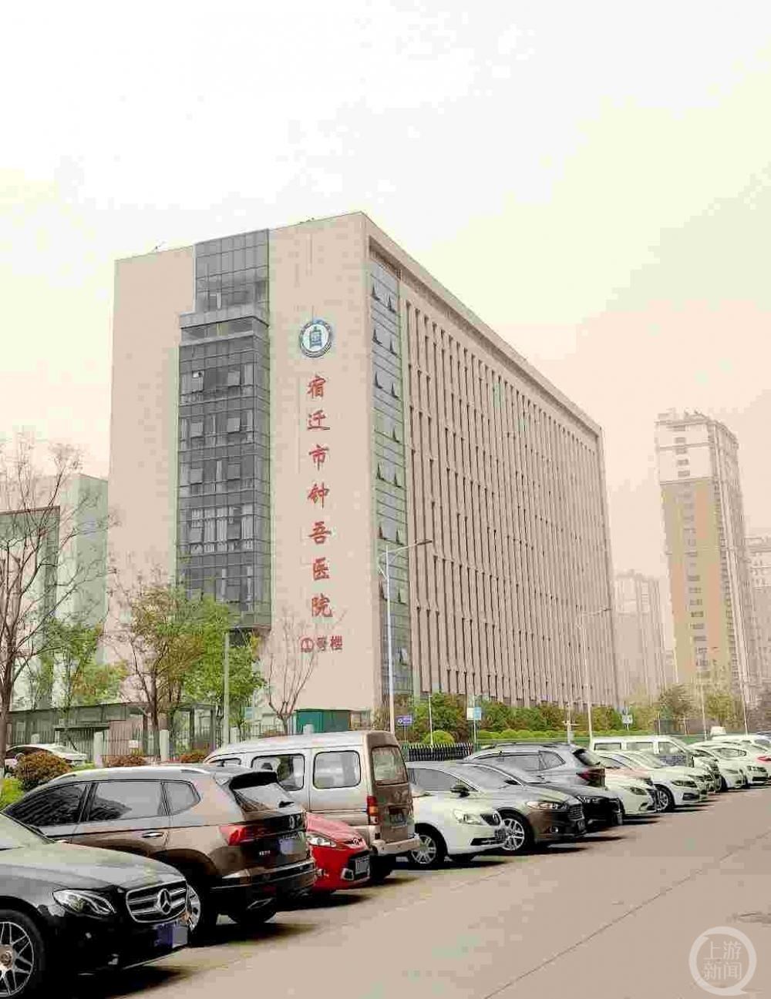

# 女医生就诊被开药量超30倍，质疑病例造假，卫健委调查称医院多项违规

时隔一个多月后，江苏宿迁女医生龚女士终于等到当地卫健委的回复。5月22日，上游新闻（报料邮箱：cnshangyou@163.com）记者了解到，对于龚女士的投诉，宿迁市卫健委经过调查后发现，宿迁市钟吾医院在病历记录和保存上均存在问题，卫健委将进行处理。

_▲宿迁市卫健委认为涉事医院在病历记录及妥善保管方面存在违规。图片来源/受访者供图_

据上游新闻此前《女医生就诊被开药量超30倍，治疗冠心病却现肌无力，医院只负轻微责任》报道显示，今年56岁的龚女士曾是宿迁市的一名妇产科医生。2017年，龚女士发现自己两次出现早餐期间短暂噎住食道的感觉，同年7月5日通过宿迁市钟吾医院门诊治疗初步确诊为冠心病。同年7月17日，龚女士到该院住院治疗，确诊为冠状动脉粥样硬化性心脏病，即冠心病。经过药物和手术治疗，龚女士发现虽然冠心病的症状有所好转，但身上时常有肌肉疼痛的症状出现，后被诊断为他汀相关肌病——坏死性肌炎。诊断中提到的瑞舒伐他汀钙片，是2017年7月5日起，宿迁钟吾医院为龚女士开具的治疗冠心病主要药物之一。

“简单来说，就是药物在溶解我的肌肉，目前只能通过手术配合药物治疗，很多药还不在医保范围内。”龚女士说，她查询在钟吾医院的病历发现很多不符合常理的地方，盐酸地尔硫卓、阿司匹林肠溶片、瑞舒伐他汀钙片等处方药，一次性服用、注射的数量超过最高限30倍，且其身高和体重也存在明显错误。龚女士怀疑病历造假。

因认为药物造成了不可逆伤害，龚女士申请了医疗事故鉴定，两次鉴定结果均认为医院负轻微责任。因鉴定机构认为病历是否造假无法认定，龚女士向宿迁市卫健委进行了举报。

_▲宿迁市钟吾医院。
图片来源/受访者供图_

5月17日，宿迁市卫健委针对龚女士的举报进行了回复。上游新闻记者注意到，上述回复中提到，对于盐酸地尔硫卓在病历中被连续大剂量使用的问题，经查，签名护士为办公室护士，负责统一处理医嘱，并不实际执行医嘱，因此出现多次医嘱一次执行的情况。医院存在病历书写不客观、不真实、不准确、不及时、不规范等情况。对于部分检查结果医院无法出具的情况，宿迁市卫健委调查认为，虽无法证明相关检查报告系医院故意藏匿，但医院未妥善保管病历的行为已经违反相关规定。

关于一次性开具大剂量口服药物医嘱的问题，经查，医嘱明显超出说明书规定的常规用量，不符合常理。院方虽表示系出院带药，但病程记录、护理记录单中无相应情况说明。因此，该行为已经违反《处方药管理办法》等相关规定。另外，对于患者身高体重标记错误的问题，系病历记录不客观、不真实、不准确。

对于钟吾医院存在的问题，宿迁市卫健委表示将根据相关法律法规予以处理。但对于龚女士提出的伪造病历及用药问题的质疑，宿迁市卫健委认为相关证据不足以证明。

对于这份回复，龚女士认为其中仍有问题未解释清楚，后期可能会通过诉讼解决相关问题。

上游新闻记者 时婷婷

编辑：朱亮

责编：郎清湘 王蓉

审核：冯飞

