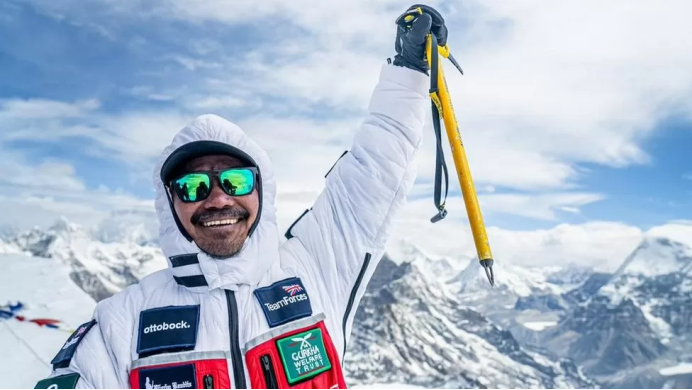
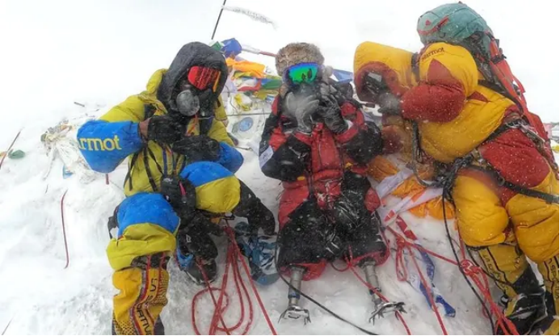
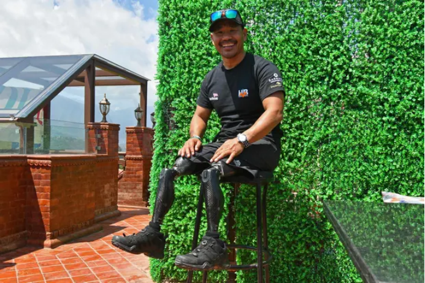

# 尼泊尔43岁男子成首位登顶珠峰的双膝以上截肢者

当地时间5月19日，尼泊尔男子马加尔（Hari Budha
Magar）成功登顶珠穆朗玛峰，成为首位双膝以上截肢登顶珠峰的人。在2017年，马加尔是首位登顶海拔超过6000米山峰的双膝以上截肢者。

据法新社报道，马加尔于4月17日穿戴着假肢，在尼泊尔登山队的带领下开始攀爬，并于尼泊尔时间19日下午3点左右到达萨加玛塔峰顶（即珠峰）。因为恶劣的天气使得护目镜和氧气面罩结冰，他最终只在山顶停留了几分钟。

现年43岁的马加尔在尼泊尔西部长大，19岁加入军队，通过严格的选拔，最终进入英国皇家廓尔喀步兵团(Royal Gurkha
Rifles)。2010年，马加尔在阿富汗巡逻时被简易爆炸装置炸伤，从此失去了双腿膝盖以下的部分。

自从受伤后，为了更好地康复，马加尔尝试了多种运动和冒险，其中包括高尔夫、滑雪、跳伞、皮划艇、攀岩，并且他还打过轮椅橄榄球和轮椅篮球。

2017年9月，马加尔成功登顶梅拉峰 (6476米)，成为首位登顶6000米以上山峰的双膝以上截肢者。

这次成功让他觉得挑战珠穆朗玛峰是可行的，并由此开始计划，他表示：“我想向世界表明，残疾并不是实现令人难以置信的事情的障碍。”事实上，当时登上世界最高峰的最大障碍的确不是他的残疾，而是尼泊尔的禁令。

尼泊尔政府在2017年决定停止向双腿截止、双目失明，甚至是独立登山者发放珠穆朗玛峰攀爬许可，他征服珠峰的计划因此被推迟。马加尔随后发起了一场废除该禁令的运动，并最终使得当局在2018年撤销该规定。

为了等待天气好转，马加尔在珠峰大本营呆了两周左右，期间他见证了两名登山者遇难，但这并没有劝退他。

马加尔表示，他攀登最大的目标是为了改变人们对残疾人的看法，并激励其他人去征服属于他们的山峰，“无论你的梦想有多大，无论你的残疾有多大的挑战性，只要有正确的心态，一切皆有可能。”

据报道，双腿截肢者登顶珠峰的总共只有3人，马加尔是首位登顶珠峰的双膝以上截肢者，新西兰的马克·英格里斯（Mark
Inglis）则是首位登顶珠峰的双腿膝下截肢者，于2006年5月完成这一记录。此外，来自中国的夏伯渝也在2018年5月14日，以69岁的高龄成功登顶。

九派新闻记者 梁霞

【来源：九派新闻】

版权归原作者所有，向原创致敬

