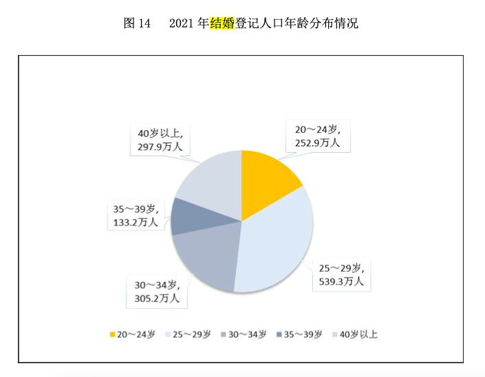
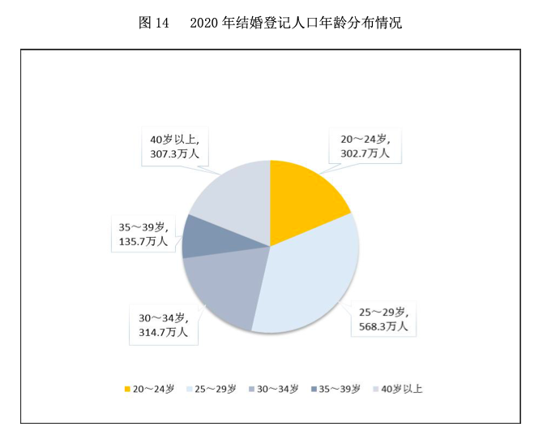

# 年轻人不想结婚？多地520婚姻登记数猛降，广东同比减少40%

本文来源：时代财经 作者：幸雯雯

有人说，以前的婚姻如果是一道填空题，现在的婚姻就是一道选择题。

像往年一样，在刚过去的“520”，各地迎来婚姻登记小高峰。不过，值得注意的是，今年多地“520”当天婚姻登记数较去年大幅下降。

时代财经根据各省民政部门进行不完全统计，贵州“520”结婚登记数减少幅度最大，对比去年“腰斩”，同比减少53.8%；广东、福建、四川同比减少幅度差距不大，分别减少40.41%、38.28%、36%，而江苏结婚登记数同比减少25.6%。

具体来看，5月20日，江苏省98个婚姻登记处共为11156对新人办理了结婚登记。而去年5月20日（截至当日下午5:30），江苏全省共有15003对新人完成领证。

广东省方面，今年5月20日当天共结婚登记12450对，“跨省通办”结婚登记1813对。而去年5月20日，广东全省当天共有20892对新人登记结婚。

在年结婚登记人数逐年走低的大趋势下，不仅是上述两省，如四川、福建、贵州等地“520”登记结婚人数也有不同比例的下降。

据四川省民政厅提供的数据，截至5月20日18点，四川当天办理结婚登记1.6万余对。而去年同日，四川省各婚姻登记机关共办理结婚登记2.5万余对。

据福建省民政厅统计，截至今年5月20日18时，全省共计结婚登记6270对，而在去年“520”福建省共有10159对新人登记结婚。

下降幅度最多的贵州省，“贵州民政”公众号显示，今年“520”共办理结婚登记6873对，去年同日截至当天18:00则共有14876对新人领取结婚证。

_图片来源：unsplash_

5月20日，因其谐音是“我爱你”，许多年轻人选在这个日子求婚、订婚甚至是结婚。

90后姚雪认为，今年“520”各地婚姻登记人数减少，一方面是结婚意愿下降了，也有可能是大家没以前那么喜欢扎堆，“之前新闻不是说520结婚那天人很多，排队排很久吗？可能大家都不想挤这个日子。如果是我，我会选对自己更有纪念意义的日子登记结婚。”

结婚第三年的王洋对此深有体会。他告诉时代财经，当年他也想预约“520”登记结婚，但知道机会渺茫，选择另一个好日子。“当年我抢10月10日都很难，得提前15天，0点放号时马上抢。”王洋表示，“但今年我朋友圈只看到一对新人在当天结婚”。

520当天结婚登记数减少，年轻人不热衷选择结婚了吗？

《2021年民政事业发展统计公报》（下称《公报》）2021年全年依法办理结婚登记764.3万对，比2020年下降6.1%。这也是36年来（民政部网站公布有1986年以来的数据）结婚人数首次低于800万对大关。

《公报》数据显示，近年来我国结婚率逐年下降，从2017年的7.7%降至2021年的5.4%。从具体人数来看，民政部统计年报公布的数据显示，中国依法登记结婚的人数从2017年的1063.1万对下降至2021年的764.3万对。

_数据来源：《2021年民政事业发展统计公报》_

值得一提的是，结婚人口年龄分布也发生变化。若以30岁为界限，2021年30岁以上结婚人数占比达48.2%，比2020年高1.7%。换句话说，结婚人口年龄在推迟。

_数据来源：《2021年民政事业发展统计公报》_

_数据来源：《2020年民政事业发展统计公报》_

今年26岁的小周打算今年或明年登记结婚，她和男朋友交往了3年，相处得不错，双方家庭都合适，“家人有推进，我自己也想结婚。”

小周认为，结婚需要一点冲动，更重要的是需要一定的经济基础，“我身边会结婚的朋友家庭条件都不错，基本上都是在国外读完硕士回来一两年订婚或者结婚。”

全国政协人口资源环境委员会副主任、中国计生协党组书记、常务副会长王培安在《加强新时代家庭建设倡导新型婚育文化》（《人口与健康》2023年第3期）文章中提到，年轻一代婚育观念正在发生改变，家庭规模小型化趋势日益明显。其中，全国适龄人口初婚年龄不断推迟，女性平均初婚年龄从20世纪80年代的22岁持续上升至2020年的26.3岁，初育年龄推迟到27.2岁。

中国人民大学人口与发展研究中心教授陈卫、中国人民大学社会与人口学院博士研究生张凤飞在《中国人口的初婚推迟趋势与特征》（《人口研究》（2022年第4期））一文中考察了中国1990-2020年的初婚推迟水平和趋势。

陈卫与张凤飞的研究表明，各类群体的初婚年龄均在推迟，且近年来推迟加速，但终身不婚率依然很低，中国婚姻正在步入晚婚普婚模式。随着现代化进程的不断推进，婚姻的可取性、可行性、可获得性对于婚姻的阻力会进一步增强，中国的初婚还存在继续推迟的空间，但短期内普婚的特征不会改变。

（应采访者需求，姚雪、王洋、小周为化名）

