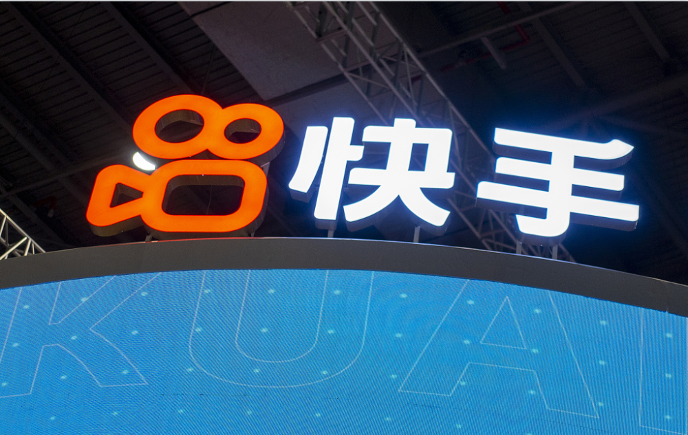

# 快手上市后首次实现整体盈利 经调整净利润达4200万元

_来源：视觉中国_

作者 ｜ 张睿

编辑 ｜ 康晓

出品｜深网·小满工作室

5月22日，快手科技发布2023年第一季度业绩，总营收同比增长19.7%至252.2亿元，超越彭博市场一致预期的245亿元。本季度，快手首次实现上市后的集团层面整体盈利，经调整净利润达4200万元。

需要指出的是，快手财报将“经调整利润╱（亏损）净额”定义为期内亏损经以股份为基础的薪酬开支及投资公允价值变动净额调整。也就是说，快手此次经调整净利润达4200万元是在剔除股权激励费用及投资公允价值变动净额的基础上达到的。

快手科技创始人兼首席执行官程一笑表示:
“我们在2023年第一季度取得了强劲的业绩，上市后集团层面调整后净利润首次转正，在盈利能力上取得重大突破。这主要得益于我们用户指标新高、收入增长和运营效率提升等方面的合力与推动。在2023年，我们将继续利用科技为用户带来优质体验和服务，并赋能内容创作者、广告主和商家，同时为我们庞大而又充满活力的生态系统释放变现潜力，为我们的股东和生态系统的参与者创造长期价值。”

在用户规模方面，快手应用的平均日活跃用户和平均月活跃用户分别达到3.743亿和6.544亿，同比增长8.3%和9.4%。

快手曾在内部定下冲击4亿DAU的中期目标。快手CFO金秉曾在业绩会上透露，“中期来看，我们对在2024年下半年实现单季度DAU均值破4亿的目标充满信心。”

从营收构成看，线上营销服务（广告）依然是快手第一大收入来源。这一季度，线上营销服务、直播和其他服务（含电商）对收入的贡献占比分别为51.8%、37.0%和11.2%。

在线上营销服务方面，这一季度，快手商业化广告收入同比增长15.1%达130.6亿元。今年2月，快手率先在短视频直播行业提出“全店ROI”这一新型经营理念，鼓励商业客户以更加全域的运营视角在快手提高经营效率，聚焦品牌心智的打造和人群资产的沉淀，保障投放效果。

在电商方面，这一季度，快手电商交易总额（GMV）同比增长28.4%至2248亿元。在电商经营场域方面，今年一季度，快手电商进一步补齐了货架场景，在快手小店买家首页开辟了新商城入口，用于更好的承接高活跃买家的确定性需求。数据显示，2023年一季度，快手泛货架场的流量同比增长58%，GMV同比增长76%。

在直播方面，快手直播收入同比增长18.8%至人民币93亿元。2023年第一季度，快手平均月付费用户同比增长6.4%至6010万，而月度付费用户平均收入呈两位数同比增长。

