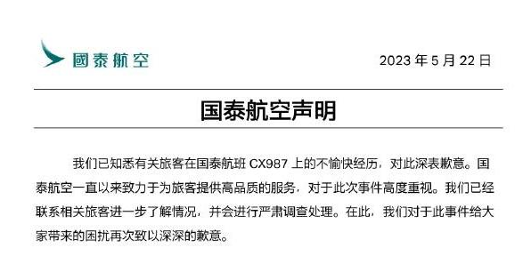
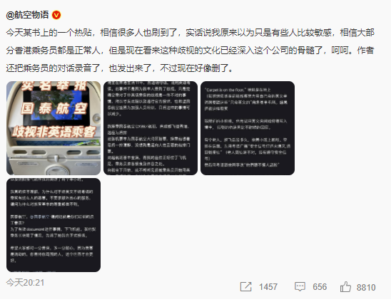
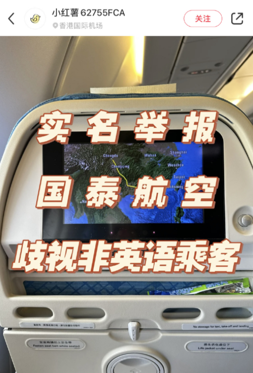

# 有空乘歧视非英语乘客？国泰航空深夜道歉：严肃调查处理

5月22日晚，国泰航空发布声明表示，已知悉有关旅客在国泰航班CX987上的不愉快经历，对此深表歉意。国泰航空一直以来致力于为旅客提供高品质的服务，对于此次事件高度重视。已经联系相关旅客进一步了解情况，并会进行严肃调查处理。在此，对于此事件给大家带来的困扰再次致以深深的歉意。

此前，有网友发帖举报国泰航空歧视非英语乘客，引起广泛关注。

举报人称，在搭乘国泰航班CX987时，听到了后舱乘务员抱怨不会英语和粤语的乘客，并使用了歧视性言辞。

