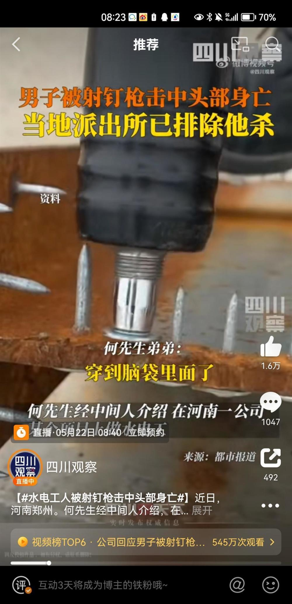

# 河南一工人被射钉枪射中头部死亡 涉事公司：员工操作失误不小心触发

5月19日，河南郑州一名工人被射钉枪击中头部，抢救无效不幸身亡。

_视频截图（来源：四川观察）_

据介绍，死者何先生经中间人介绍，在河南一公司某个项目上做水电工。5月8日被射钉枪击中头部，5月19日早上抢救无效死亡。

涉事公司负责人称，是工人自己操作失误，射钉枪遇到压力才会发射。

何先生的弟弟说，那个钉子穿进了脑袋里面。

_视频截图（来源：四川观察）_

事发后，当地派出所介入调查，目前已排除他杀。

施工单位河南某工程有限公司表示，目前正和何先生家属协商善后事宜。

（极目新闻综合四川观察、都市报道）

（来源：极目新闻）

