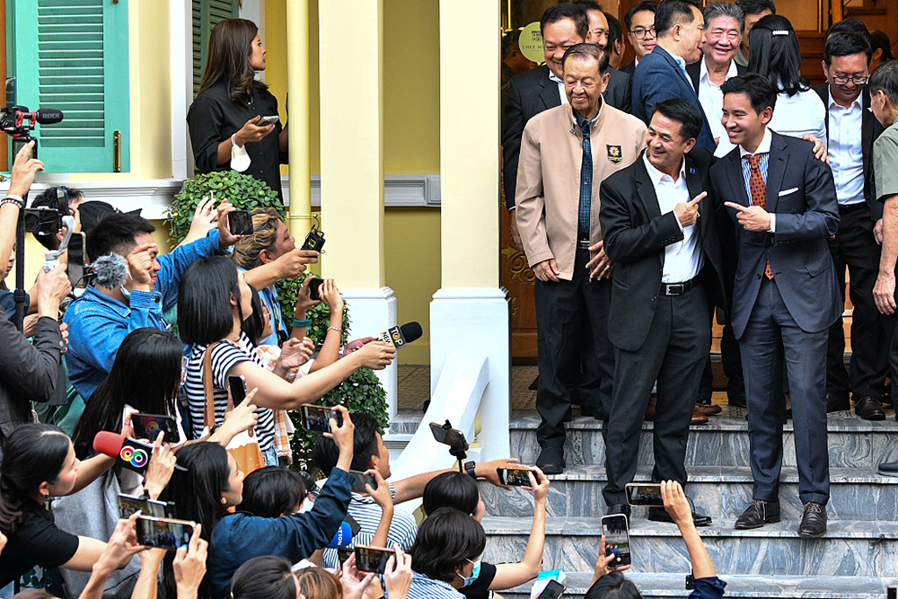

# 泰国组阁前景：远进党要过五关斩六将，为泰党有机会“捡漏”

5月14日，泰国举行全国大选，67个政党对众议院500个议席展开激烈角逐。次日，以1413万总得票数居于首位的远进党高调宣布，将与排名第二的为泰党等5个政党以310个议席联合组阁。随后又有两个小党宣布加盟，使远进党盟友议席达到313席。

然而，泰国政治制度复杂的运作规则决定了组阁并非如此轻易。相反，在笔者看来，远进党领衔组阁将遭遇重重难关，“非有志者绝不得至”。鉴于当前局势的复杂性，笔者在简要分析本次大选特点的基础上，尝试对未来组阁的可能性作一分析。

_当地时间2023年5月15日，泰国曼谷，泰国远进党党魁皮塔在庆祝游行中向支持者致意。本文图片 人民视觉_

**大选的基本特点**

5月15日凌晨，泰国选举委员会公布了初步的选举结果，主要政党得票情况如下：远进党一马当先，以152席拔得头筹；为泰党以141席不敌远进党，首次在大选中屈居第二；自豪泰党71席，较之2019年大选有了较大的提升，名列第三；军方背景的两大政党——现执政联盟领衔政党公民力量党和巴育总理所属政党合泰建国党分别以40席和36席分列第四、五名；民主党继2019年大选后再度遭遇滑铁卢，仅获得25个议席。

综合来看，本次大选结果呈现出以下基本特点：一是公民力量党与合泰建国党大比分落后于反对党联盟主要政党。两大军方背景政党合计仅获76席，远低于2019年大选时公民力量党得票数。巴威执掌的公民力量党绝大多数议席均为选区制议员，政党名单制议员数量极少，显示民众对公民力量党执政四年政绩并不认可。而巴育领军、高举“忠君崇教爱国”旗号的合泰建国党所获议席大多为政党名单制议员，选区制议员数量较少，表明该党尽管实力不济，但仍有相当数量持有传统价值观的民众支持该党。总体而言，此次大选结果在很大程度上反映了泰国民众“求变”“求新”的真实意愿。

二是远进党气势如虹，为泰党颓势明显。远进党再度成为黑马，在包括首都曼谷在内的20多个府以摧枯拉朽之势赢得压倒性胜利，超越同一战壕的大党为泰党，一跃成为泰国第一大党。远进党不仅一举拿下曼谷几乎所有33个选区，令首都一片“橙色”，而且攻陷为泰党大本营清迈府，在清迈府11个选区中，远进党胜选7区。出人意料的是，他信家族的发家之地、坚强堡垒——清迈府第3选区，也被远进党拿下。此外，远进党还令根深蒂固的“地方豪强门阀体系”在很大程度上被瓦解。以泰国东部罗勇府为例，该府近20年来一直为比杜德查家族所控，但此次大选，超过一半的选民将选票投给远进党，5个选区被远进党悉数纳入囊中，比杜德查家族竟然颗粒无收。

三是民主党滑坡严重，自豪泰党稳中有升。2019年大选，民主党虽然已经走下坡路，但依然保持了执政联盟第二大党的地位。而此次大选，民主党基本上沦为一个中小政党。由于内斗频仍，失血严重，施政乏力，泰南地区选民纷纷弃选民主党，转而选择合泰建国党或者其他党派。民主党党魁朱林在得知选举结果后，第一时间通过社交群组宣布辞去党魁职务。对比之下，上一届大选中执政联盟第三大党自豪泰党此次发挥较为稳定，尽管没有达到其所期望的100个席位，但71个席位无疑可以让其稳居第三大党，并且在组阁谈判中居于有利地位。

四是中小党派尽力搏杀，但收成有限。由于选举制度改革，中小党派在此次大选中生存难度倍增。不少重量级政客自组政党参选，却折戟沙场，收效甚微。比如原民主党阿披实政府时期的财政部长功所在的政党勇敢国家发展党仅获2个席位。而有着“曼谷教母”之称的为泰党元老素达拉所建政党泰建泰党，使出浑身解数也仅获得6个席位。上届议会中表现出色的反对党——自由合泰党，仅获得1个席位。

_当地时间2023年5月17日，泰国曼谷，在一家餐馆门口，泰国远进党党魁和总理候选人皮塔等待与潜在的联盟伙伴会面。_

**远进党领衔组阁难度极大**

远进党高调宣布成立“人民的民主政府”，党魁皮塔自称“准总理”，他毫不掩饰地表示：“远进党领衔组阁是全体民众之共识，各方均应顺应民意，支持远进党组阁。”然而，远进党的联盟只是获得超过半数的众议院席位（313席），但根据2017版宪法规定，倘若远进党总理候选人皮塔无法在参众两院联席投票时超过半数（376票），则无法出任总理，所谓的“成功组阁”亦无从谈起。也就是说，远进党必须要在参众两院中再争取63位议员的支持方可顺利组阁施政。

但是，这63票从何而来？理论上有三个途径。 **第一个途径是直接争取一个超过63席的原执政联盟政党参与组阁。**
巴育和巴威的政党尽管总席位超过63席，但早已被远进党排除在外，绝无可能携手合作。最为适合的合作政党便是拥有71个议席的自豪泰党。然而，远进党公开表示，绝对不会与推行“自由大麻”政策的自豪泰党开展合作。自豪泰党也毫不客气，立场鲜明地表明态度，绝不与试图取缔或修订刑法第112条（蔑视君主罪）的政党联手组阁。因此，远进党拉自豪泰党入盟的希望几乎为零。

**第二个途径是争取250名参议员中至少63位议员投票支持皮塔出任总理。** 为了达到这一目的，远进党多措并举，对参议员们实施 **心理攻势。一是**
召开新闻发布会，或者接受主流媒体采访，公开呼吁参议员们“识大势、顾大体”，为皮塔投上宝贵一票，助其登上总理宝座。一些支持远进党的媒体直接向参议员们喊话：“究竟要将泰国带上天堂，还是带下地狱，请参议员们三思后行！”
**二是**
充分发挥其在社交网络中的巨大影响力，不少远进党“准议员”们亲自发帖，或者通过支持本党的网友对参议员们施加压力。许多网友在社交平台上@参议员，强烈要求他们公开表态支持皮塔，不少言论充斥着网络暴力。极个别参议员表明支持远进党立场的，立刻在网络上被树为英雄，一旦有参议员表达反对意见，便遭受“网络群殴”。
**三是**
对参议员们进行私下游说，劝说其支持本党。鉴于远进党与参议员群体关系一直不睦，这一方式主要是依托与参议员们有良好关系的为泰党开展。据说，从公民力量党转投为泰党的“三友派”领袖颂萨向远进党承诺，将为其争取5名参议员。当然，远进党也在尝试与参议员们直接沟通，试图劝说他们软化立场。

然而，根据观察，截至目前，远进党对于参议员们的凌厉攻势并未奏效。或许有20-30位参议员本身便与巴育、巴威离心离德，愿意投票支持皮塔，但是绝大多数参议员仍然坚守保守主义阵营。
**参议员们不愿意与远进党妥协，有四大原因：**

**一是**
远进党剑指王室，要取缔（后调整为修订）刑法第112条。此条款是对王室核心成员个人尊严之保护，一旦取缔，王室核心成员便会走下神坛，与普通人无异。保守主义阵营认为，倘若走到那种境地，王室权威荡然无存，泰国沿袭数百年的核心价值体系也将随之崩溃。所以，出于对王室尊严的捍卫，参议员们有充足的理由不选远进党。

**二是**
远进党和皮塔所说的“参议员们应该顺应民意”，在大多数参议员眼中并不成立。远进党尽管是第一大党，但仅有152个席位，未超半数，并不能说明全体民众都希望远进党上台执政。而且参议员们的任期和权限，也是2017年通过民众公投的宪法所赋予，参议员们有权按照自己的意愿进行投票。

**三是**
远进党本身对参议员们的态度令其极为不满。在议会反对党中，远进党对参议员批评挖苦最为激烈，毫无掩饰，毫不留情。很多激进善辩的远进党议员在议会开会或者其他公众场合经常出言不逊，称他们为“老头子”，批评他们是“权贵阶层的马前卒”，大声呵斥他们“滚出议会，回家带孙子”，导致大多数参议员对远进党毫无好感。

**四是**
250名参议员均是由2014年政变上台后执政的“维和委”任命，在保守主义阵营遭受巨大挑战时，如果不能并肩战斗，反而支持敌对阵营，显然不符合泰式传统价值理念。出于知恩图报的心理，绝大多数参议员依然会坚定地站在保守主义阵营一方。如此，远进党试图攻破参议院堡垒的希望仍是较为渺茫。

当然，据笔者观察，远进党认为时与势在我，因此并不急于求成，而是使出“拖字诀”，希望堡垒从内部瓦解。
**还有一种现象不可忽视，那就是众多参议员出于家庭压力，尤其是来自于孙辈的劝说，内心其实也较为犹豫。**
未来说不定会有不少参议员因为无法抵抗家庭压力而被迫支持远进党。但是人数多寡，还有待进一步观察。

**第三个途径便是争取原执政联盟部分众议员和部分参议员，以帮助国家走出政治困局为由，体现大局意识和高尚精神，投票给远进党总理候选人皮塔。**
也就是说，这部分众议员不参加远进党领衔的执政联盟，但却又为远进党投票。当远进党公开表达了这一呼吁后，合泰建国党、民主党、泰国国家发展党等原执政联盟政党重量级人物均通过不同方式表达了拒绝。民主党耆宿、原议会主席川·立派建议远进党不要去干涉其他党派的投票自由。泰国国家发展党党魁顾问、前总理班汉之女甘乍娜·信拉巴阿查在个人社交平台上表示：“美丽的民主制度应该是，听从大部分人的声音，但是要尊重不同的声音。你们（指远进党）正挟社交网络之势这一你们所熟用的工具来对我们施压。你们这样的民主是真正的独裁！我们有脑子思考，有自己的立场，你们无法操控我们！”但是，巴威麾下的公民力量党目前尚未就此方案作出回应。

不得不说，远进党确实异于泰国政治发展史上所有政党，在大选当天票数统计刚刚过半时便宣布本党获得胜利，次日便宣布成功组阁，紧接着便是声势浩大的庆祝游行，组织执政联盟共进午餐，签订联盟成立的谅解备忘录，并且准备在5月22日这个特殊日子（即2014泰国军方发动政变夺权之日）正式宣布政府成立。这种快节奏的政治发展让人眼花缭乱，应接不暇，甚至一些不明就里的外媒认为泰国新政府已经成立，皮塔很快就要就任总理了。

但是，综合笔者上面的分析，不难看出，远进党目前的高调组阁并不是泰国政治的现实情形。新执政联盟尽管超过众议院半数席位，但是距离当选总理所要求的376票还有63票的差距。这63票从何而来？笔者列出的三种途径均很难突破。当然，眼下不能突破，或许两个月后参议院堡垒便告攻破，也未可知。

_当地时间2023年5月17日，泰国曼谷，泰国远进党党魁皮塔与泰国为泰党党魁春拉南在与联盟伙伴举行会议后合影。_

**为泰党的如意算盘**

大选中居于第二的为泰党在远进党发出联合组阁邀约后，立刻爽快接受，并且参加了远进党举行的新执政联盟午宴。从媒体公布的现场视频来看，为泰党党魁春拉南，刚刚跳槽到为泰党的“三友派”另一位领袖、塔纳通叔父素利亚，以及为泰党元老普姆坦等人均神情喜悦，与远进党党魁皮塔、原新未来党创始人塔纳通谈笑风生，氛围极其和谐，丝毫没有让人感到这个从来没有屈居人后的大党心中的落寞。尽管这一场景为泰党人早已预料，做足了心理准备，否则也不会在选战前极力呼吁选民们进行“策略性投票”。但是，真正走到连清迈第3选区都被远进党攻陷这一境地时，为泰党人内心必然充满失落。

那么，为泰党真的是发自内心与远进党联合执政吗？一旦为泰党真的加入远进党领衔的执政联盟，而远进党执意要修订刑法112条，作为执政联盟第二大党的为泰党该如何表态？

更为重要的是，鉴于两党的选民群体基本属于同一阵营，在未来的执政过程中，为泰党无疑将逐步被远进党蚕食。毕竟远进党更多地会强势推动他们竞选时所提出的政策纲领。正如2019年大选民主党加入公民力量党领衔的执政联盟，最终在泰南地区不断被公民力量党和后来成立的合泰建国党围剿，在此次大选中仅获得24个席位，可谓是史上未有之惨败。

所以， **理论上说，为泰党并不希望加入远进党领衔的执政联盟。** 之所以目前表态愿意合作，并且积极为远进党游说参议员，笔者认为，只是一种
**策略性表态，是一石多鸟的做法。**

**一是借此向民众表示，为泰党有君子之风，**
承认远进党作为第一大党，有权领衔组阁。他信在clubhouse的网络节目中也表达了这一点。他称赞为泰党总理候选人、他的女儿贝东丹从小就看曼彻斯特联队比赛，深具“运动员精神”，这种做法符合她的个性，而且他本人也非常支持和欣赏。

**二是远进党组阁的难度非同一般，成功概率并不高。**
为泰党明知远进党组阁艰难，便放手让其去做，而且表态给予全力支持。未来数月，等到远进党发现走进死胡同且无力回天之时，或许会主动放弃组阁，届时为泰党再“勉为其难”扛起组阁大旗。

**三是皮塔持有ITV媒体公司股票的案件，很有可能会让皮塔无法进入总理候选人投票环节，**
而远进党仅仅推荐了皮塔一位候选人，一旦皮塔无法参选总理，为泰党的总理候选人可以替补，说不定能捡漏。

**四是此前民众一直传言为泰党与公民力量党之间有密谋，大选后将联手组阁，**
如果为泰党不接受远进党的邀请，则必然会被坊间解读为为泰党怀有异心，确实与军方背景政党有媾和可能。

**未来的组阁可能**

基于上述分析，远进党领衔组阁难度极大，必须过五关斩六将才可登堂入室，入主总理府。当然，由于宪法并未明确规定总理选举必须在大选后多长时间内完成，理论上说，远进党争取63票的时间会相当充足，条件成熟前绝不举行总理选举。甚至还有人提出，远进党可以一直打持久战，待本届参议员五年任期满后，再在新规则下举行总理选举。不过，那样等于是让巴育看守内阁继续再干一年，相信除了保守主义阵营外，其他各方都不会愿意采取这一方案。在此，笔者就其他组阁可能性作一简要分析。

**最大的可能便是，远进党作为第一大党，让位于为泰党领衔组阁。**
为泰党仍然率领目前的8党联盟，积极发动攻势，争取63名议员支持，最终由为泰党总理候选人（大概率是贝东丹）出任总理。但是前提条件是，任期内不得提出修改甚至取缔刑法112条。这一点，如果远进党无法接受的话，则方案无法成立。

**第二种方案是远进党成为反对党，由为泰党再度组建执政联盟。**
远进党选前明确表示，不会与公民力量党、合泰建国党以及自豪泰党合作。也就是说，未来如果为泰党要求这三个政党之中的任何一个入盟，远进党都将弃盟而去。事实上，为泰党在竞选后期也明确表示，将不会与巴育、巴威、阿努挺的政党合作，但较之远进党“有我就没两巴、有两巴就没我”这种斩钉截铁的气势，为泰党还是留有余地，这也是自由民主派选民们更倾向于远进党的重要因素之一。而且鉴于为泰党浸淫政坛25年（从泰爱泰党起算），对于竞选前后不一致的情形司空见惯。正如民主党在2019年大选前表示绝不会和公民力量党合作，但最终组阁时食言而肥，唯一的代价便是阿披实辞去党魁职务，退出议会。因此为泰党改口与原执政联盟合作的可能性仍然存在。

如果为泰党有权领衔组阁，且远进党确定做反对党，笔者认为，最有可能的一种组阁方式，便是 **为泰党+自豪泰党+公民力量党三党（共253名众议员）合作。**
合泰建国党必须被排除在外，一是253议席超过众议院半数，三党执政可以有效进行政府各部的内部分配。二是本身合泰建国党票数较之公民力量党少4票，无法取代公民力量党。三是2014年巴育发动政变推翻为泰党，为泰党绝对不会与巴育合作，否则无法向选民们交待。而巴威在议会不信任辩论时曾公开表示，自己从来没有参与过政变，为两党合作清除了历史障碍。

而 **三党合作最大的好处在于，凭借公民力量党党魁巴威之实力，可以说服一半左右的参议员投票支持执政联盟，最终成功组阁。**
事实上，公民力量党此前便与为泰党开展合作，推动大选制度改革，由单一票制改为双票制。在这个问题上，公民力量党有恩于为泰党，毕竟2019年大选为泰党在政党名单制议员上颗粒无收。

公民力量党究竟在当时为何要极力推动此事，难道当真认为自己也是大党，会从制度改革中获得额外收益？笔者认为，这里需要细细思量。这种方案带来的最大问题是，总理最终出自何党？巴威说服参议员们投票，但如果总理候选人不是自己，而是为泰党候选人贝东丹，参议员们会不会提出疑义？一旦最终组阁是第二种方案，那么远进党与合泰建国党将会成为反对党中的两大政党，那样的话，政府的稳定性将大为加强，因为两大反对党很难展开针对政府的任何攻势合作。

**第三种模式则是原执政联盟在参议员们力挺之下，强行组建少数派政府。**
目前，原执政联盟共有182席，若加上未被远进党邀请的其他小党，最多也就187席，距离251席相去甚远。尽管合泰建国党党魁披拉潘已经公开表态，不会参与竞争组阁，但是如果远进党模式和为泰党模式均无法顺利组阁，则最终泰国政治将再出现“死局”，保守主义阵营会不会借此机会做殊死一搏，亦未可知。倘若出现这一情况，则泰国街头运动恐怕将难以避免。

以上均是基于当前政治现状的理论分析，究竟未来会出现何种情况，会不会出现一些“政治意外事件”，目前都无法预测与判断。最终泰国政治会呈现怎样的态势，相信泰国人民凭借泰式智慧终会圆满解决。

（虞群，国防科技大学国际关系学院东南亚研究中心主任、副教授、博士）

