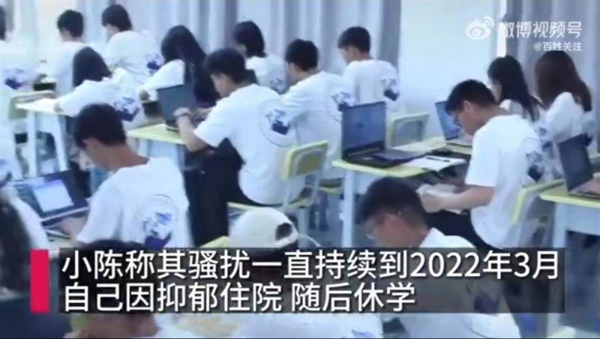

# 职校女生自曝遭班主任性骚扰致抑郁想轻生，学校：已成立调查小组

5月20日，一女生自曝在云南一职业学院上学期间遭班主任性骚扰，并被同学造黄谣致抑郁，有轻生举动。

_班主任和陈同学的聊天记录（来源：百姓关注）_

当事女生陈同学说，2020年8月，她才16岁，当时被班主任赵某某选为班长后，对方频繁给自己发送类似“我想你了”“你脸上火了，出来我给你去去火”“叫你出来约一下，还是你怕我不行”等骚扰信息，有微信聊天记录为证。

陈同学还称，赵某某在班级其他同学面前，表现出对自己明显“偏爱”，以至于逐渐有人造她的黄谣，称她系小三，破坏赵某某家庭。班主任的骚扰一直持续到2022年3月，自己因承受不住骚扰和谣言攻击抑郁住院，随后休学。住院期间，她还曾尝试过割腕自杀。

_陈同学称被性骚扰造黄谣抑郁到割腕自杀（来源：百姓关注）_

陈同学说，2022年底，她向学校以及相关部门举报赵某某，但自己并不满意校方对其的处罚，因此选择在网络上将其曝光。

2023年5月21日，记者联系上当事班主任赵某某，对方称与小陈未发生过任何肢体接触，从法律上来说，他的行为不构成性骚扰，但确实不应该发那些信息，正在检讨自己的行为。

_陈同学称因被性骚扰造黄谣抑郁休学（来源：百姓关注）_

21日涉事校方回应称，于2022年就已停止了赵某某的教学活动，目前已成立调查小组负责此事，多个相关部门已介入。

（极目新闻综合百姓关注报道）

（来源：极目新闻）

