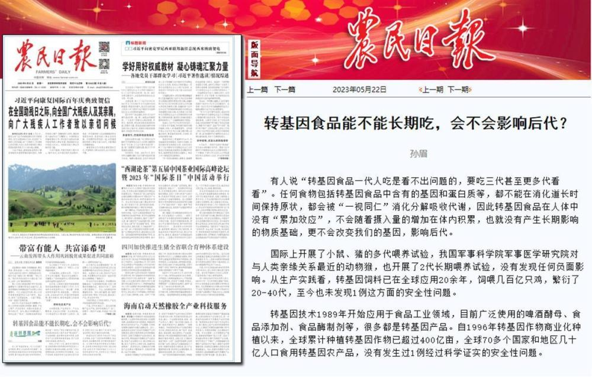
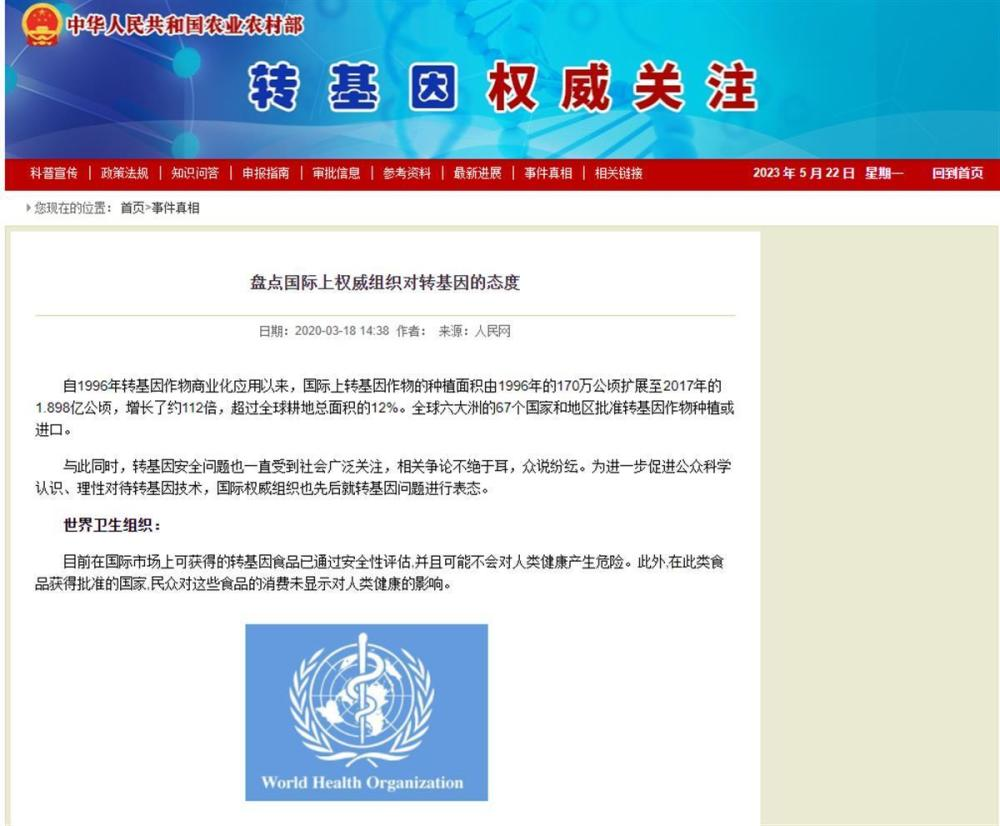

# 转基因食品能不能长期吃？会不会影响后代？农民日报头版刊文释疑

5月22日，《农民日报》头版“走近转基因”栏目发表了一篇科普文章，对公众关注的转基因食品“会不会影响后代”进行了释疑。文章称，自1996年转基因作物商业化种植以来，全球累计种植转基因作物已超过400亿亩，全球70多个国家和地区几十亿人口食用转基因农产品，没有发生过1例经过科学证实的安全性问题。

_相关截图_

文章称，有人说“转基因食品一代人吃是看不出问题的，要吃三代甚至更多代看看”。任何食物包括转基因食品中含有的基因和蛋白质等，都不能在消化道长时间保持原状，都会被“一视同仁”消化分解吸收代谢，因此转基因食品在人体中没有“累加效应”，不会随着摄入量的增加在体内积累，也就没有产生长期影响的物质基础，更不会改变我们的基因，影响后代。

文章称，国际上开展了小鼠、猪的多代喂养试验，我国军事科学院军事医学研究院对与人类亲缘关系最近的动物猴，也开展了2代长期喂养试验，没有发现任何负面影响。从生产实践看，转基因饲料已在全球应用20余年，饲喂几百亿只鸡，繁衍了20-40代，至今也未发现1例这方面的安全性问题。

文章称，转基因技术1989年开始应用于食品工业领域，目前广泛使用的啤酒酵母、食品添加剂、食品酶制剂等，很多都是转基因产品。自1996年转基因作物商业化种植以来，全球累计种植转基因作物已超过400亿亩，全球70多个国家和地区几十亿人口食用转基因农产品，没有发生过1例经过科学证实的安全性问题。

极目新闻记者查询发现，2020年3月，农业农村部官网转载了人民网“盘点国际上权威组织对转基因的态度”的一篇文章，列举了众多国际权威组织对转基因食品的态度。

_相关截图_

世界卫生组织称，目前在国际市场上可获得的转基因食品已通过安全性评估，并且可能不会对人类健康产生危险，此外，在此类食品获得批准的国家，民众对这些食品的消费未显示对人类健康的影响。

欧盟委员会认为，根据500多个独立科学团体历时25年开展的130多个科研项目，得出结论：“生物技术，特别是转基因技术，并不比传统育种技术更有风险。”

毒理学学会表示，科学分析表明，转基因食品的生产过程不大可能导致任何连毒理学家都不能预知的其他危害。对消费者而言，现有转基因食品的安全水平看来与传统食品的安全水平相当。

其中，美国科学促进会还对一些传言进行了说明：利用现代分子生物技术改良的农作物是安全的。有时会有人声称，给动物喂养转基因食品导致了从消化紊乱到不育、肿瘤和早死等异常。尽管此类说法通常都很耸人听闻，获得媒体的大量关注，但没有一个能经得起严格的科学审查。（极目新闻综合农民日报、人民网、农业农村部官网报道）

（来源：极目新闻）

