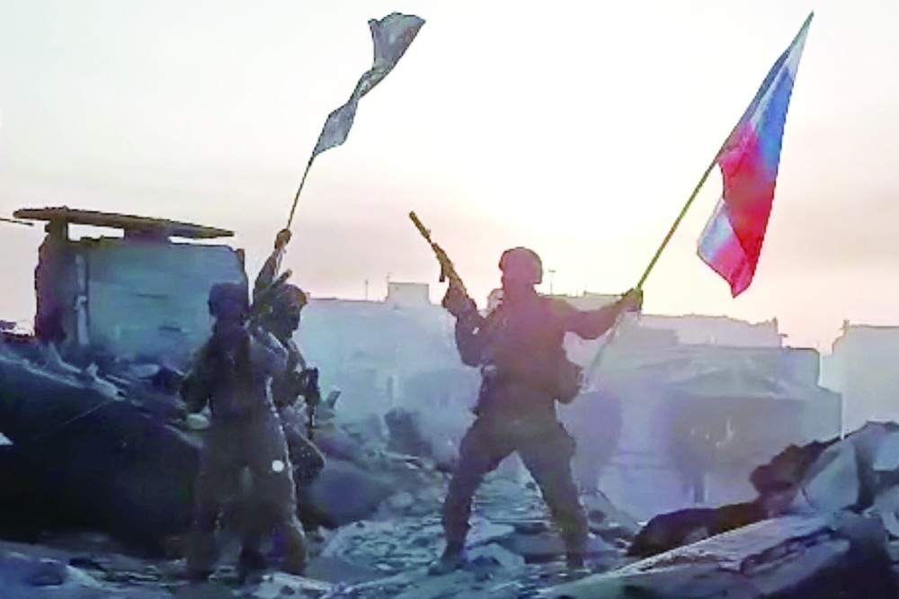

# 鏖战224天，巴赫穆特“绞肉机”之战终于结束，接下来是哪里？

【环球时报特约记者 柳玉鹏
陈山】俄罗斯方面20日宣布，已经完全拿下乌克兰东部城镇巴赫穆特，从而结束了俄乌冲突中持续时间最长、最血腥的争夺战。尽管乌克兰方面21日否认了俄方战报，但西方媒体也已经开始总结，俄乌双方在这场被称为巴赫穆特“绞肉机”之战中的得与失。

**从不知名小城到世界焦点**

巴赫穆特在苏联时代被称为阿尔乔莫夫斯克（俄罗斯至今仍以此称呼该城），以工业为主，周围拥有盐矿和石膏矿。该城总面积为41.6平方公里，战前居民人数超过7万人。就地理位置而言，巴赫穆特位于“顿涅茨克共和国”和“卢甘斯克共和国”主要道路的交汇处，有道路连接利西昌斯克和北顿涅茨克、谢韦尔斯克、斯拉维扬斯克、克拉马托尔斯克、康斯坦丁诺夫卡、戈洛夫卡和卢甘斯克等地。但总体而言，一直到俄乌冲突爆发后的数月内，巴赫穆特都属于默默无闻的小城。

美联社回顾称，俄军在俄乌冲突第一阶段的闪击战失败后开始调整部署，重点攻击顿巴斯等地，巴赫穆特就此卷入战火。2022年5月，乌军重点防御的顿巴斯地区补给中心波帕斯纳被俄军攻克，巴赫穆特暴露在俄军兵锋面前，数万当地市民紧急撤离。当年8月，俄军与“瓦格纳”私营军事公司首次在该市附近重创了一支乌军分队，标志着这场残酷“绞肉机”之战的开始。

最初，无论是俄罗斯，还是乌克兰以及背后的西方国家，都没有特别关注巴赫穆特之战。但去年9月乌军在哈尔科夫方向大举反攻，在南部赫尔松方向也已掌握主动权，在此情况下，俄军还占据优势的顿巴斯方向、尤其是巴赫穆特的命运就备受关注。按照“瓦格纳”创始人普里戈任的说法，去年10月他与时任俄军对乌特别行动总指挥谢尔盖·苏罗维金共同制订了“绞肉机”计划，即在巴赫穆特大举进攻，把乌军拖入一场血腥、但在战略上毫无意义的战事中，粉碎乌军在其他方向投入生力军的企图。

不论普里戈任的说法是否有所夸大，但从去年10月开始，俄军在强大炮火支援下，开始步步为营地向巴赫穆特逼近。10月9日，扎伊采沃居民点被俄军占领。几天后，奥佩特诺耶居民点被占领。到了当年秋季，“瓦格纳”持续攻占巴赫穆特附近的多个居民点。乌克兰总统泽连斯基承认整个城市的局势非常严峻。11月底，巴赫穆特即将被俄军包围，乌军表示“巴赫穆特是整个前线最困难的地段”。

但泽连斯基坚持要求乌军继续坚守这座城市。2022年12月20日，他突然抵达巴赫穆特，并冒着俄军炮火在一家金属加工厂车间里为乌军官兵授勋，成为西方媒体宣传乌克兰抵抗意志的典范。但这些并没有能扭转战局。俄军在巴赫穆特采用“炮火开路”、轮番攻击模式，无论火力还是兵力都处于劣势的乌军损失相当惨重。今年1月，俄军宣布摧毁了乌克兰第53机械化步兵旅一半以上的力量。当时乌军前线指挥官尤里·斯卡拉曾建议放弃巴赫穆特，因为“乌军被迫派出刚动员、没有战斗经验的军人保卫这座城市”。根据俄方前线记者的说法，为填补兵力不足，乌克兰还向巴赫穆特派出了大量外国雇佣兵。

今年3月，巴赫穆特通向后方的补给线逐步被切断，乌军形势日益吃紧。乌军高层要求从巴赫穆特撤离以尽量保存有生力量，乌军事专家斯杜帕克认为，即使乌军撤退也不会有助于俄军的突破，因为俄军在试图占领巴赫穆特的过程中已消耗大量人员、设备、武器和时间。英军前总参谋长理查德·丹纳特称，乌军撤退到更安全的防线是有意义的，因为在战略上这座城市对乌克兰并不重要。但泽连斯基为坚定西方盟友对乌克兰的信心、继续加大对乌军援，仍要求乌军固守该城。他接受美国有线电视新闻网采访时明确表示，失去这座城市将被视为乌克兰在政治上的失败，“我告诉总司令，全力寻找合适的部队来帮助巴赫穆特的士兵。乌克兰没有任何一部分可以被抛弃。”3月22日，泽连斯基再次亲临巴赫穆特为乌军打气。

泽连斯基的坚持几乎就要等到机会。5月初，俄军已占领了巴赫穆特约95%的面积。但“瓦格纳”与俄军正规军的矛盾也越来越深。普里戈任通过视频点名批评绍伊古和戈拉西莫夫等俄军高层“不作为”，抱怨俄国防部为“瓦格纳”提供的弹药不足，导致严重依靠炮火支援的“瓦格纳”人员伤亡惨重。他甚至警告称，如果“瓦格纳”的弹药无法得到充分保障，他将在5月10日零时率军撤离巴赫穆特前线。两天后，俄国防部承诺向“瓦格纳”提供弹药，普里戈任决定继续进攻。5月中旬，乌军在巴赫穆特只控制20栋建筑物，“这座城市的完全解放已经临近”。5月20日，普里戈任宣布“巴赫穆特全城解放”。

**是“斯大林格勒”，还是“凡尔登”？**

无论是俄罗斯、乌克兰还是西方国家，都有人将巴赫穆特之战与二战转折点之一的斯大林格勒战役相提并论。乌克兰的支持者认为，尽管乌军在巴赫穆特付出了惨痛代价，却为西方提供的大批先进武器装备运抵乌克兰，以及相应的人员培训赢得了宝贵的时间。更重要的是，此战展现了乌军抵抗决心，坚定了西方继续援助的信心。而在俄方看来，巴赫穆特之战耗尽了乌军为春季反攻准备的战争潜力，这就如同德军精锐部队在斯大林格勒战役的激烈战斗中大量“失血”，最终丧失战争主动权一样。

但更多国际观察家认为，巴赫穆特的血腥程度堪比一战的凡尔登战役。俄罗斯tsargrad电视台20日称，巴赫穆特“绞肉机”之战以俄军彻底的胜利而告终。俄军占领巴赫穆特的行动持续了224天。报道称，这对乌克兰的打击是双重的：“就在一年前的5月20日，俄军从乌军中解放了马里乌波尔”。但报道承认，巴赫穆特之战重复了一战凡尔登战役的计划，后者以“凡尔登绞肉机”而闻名——当时德军想通过此战“让法国人把血流尽”，结果德军也付出了“把血流干”的代价。

美联社描述称，在巴赫穆特之战中，俄乌双方以“几十年来任何武装冲突中都没有出现过的速度消耗弹药”，每天发射数千枚甚至更多的炮弹。长达8个月的炮火“洗地”，也让巴赫穆特彻底沦为废墟。乌军发言人谢尔希·切雷瓦蒂称，巴赫穆特是“迄今为止俄乌冲突中最血腥、最残酷的部分”。从战场上侥幸撤出的士兵则称之为“真正的地狱”。双方在巴赫穆特周边的大部分战斗变成近似一战时期的堑壕战。

对于俄乌在巴赫穆特之战的具体损失，双方说法不一。俄罗斯《莫斯科共青团员报》20日称，在巴赫穆特之战中，乌军遭受了巨大损失。俄军事专家弗拉季斯拉夫·舒里金称，乌军在这里战死约5万人，受伤和失踪12万人。此外，乌军还有100多辆坦克、200门火炮和多管火箭炮、1000多辆装甲车被摧毁。“乌克兰在人员和装备上遭受了重大损失，在这里丢掉了许多精英部队，从而降低春季反攻的可能”。

乌克兰方面则表示，俄军在巴赫穆特遭受了同样的严重损失，预计人员伤亡在10万以上，“瓦格纳”武装人员“是在自己士兵的尸体上行进”。美国政府5月初的评估认为，俄军在巴赫穆特有超过2万人阵亡，其中一半是“瓦格纳”成员。普里戈任去年底决定在俄边境地区设立训练中心，就与“瓦格纳”在巴赫穆特损失过大有关。俄军近日承认，在巴赫穆特前线损失了两名高级指挥官：俄陆军第4摩托化步兵旅旅长维亚切斯拉夫·马卡罗夫和俄陆军某部负责军事政治工作的副指挥官叶甫盖尼·布罗夫科，这也证明了俄军在巴赫穆特的惨重伤亡。

美国国际事务和安全分析师马克·斯莱博达解释说，巴赫穆特拥有非同寻常的地理位置：它被一条河流隔开，市里有多个水体，这使它更容易防御。同时巴赫穆特还有大量地下隧道，可能与北面的索列达尔大型盐矿汇合。这些是苏联在二战时期建造的、非常广泛的掩体系统和防御工事。其中一些隧道大到足以供坦克进出。这相当于在正在战斗的巴赫穆特城市下面还藏有另一座城市，使得它从防御角度来看更难被攻陷。

**巴赫穆特之后接下来是哪里？**

无论乌军当前是否还有少数部队在巴赫穆特坚守，但他们已经无法扭转大局，俄乌双方都将注意力投入下一阶段的爆发点。

俄罗斯国防部长绍伊古此前曾阐述了巴赫穆特战役胜利的意义，称控制巴赫穆特将为俄军开辟攻击道路。俄军事分析人士弗拉迪斯拉夫·舒里金认为，俄军控制巴赫穆特定居点将使乌武装部队在顿巴斯地区的防御减少一半。他还表示，巴赫穆特之战的结束可能对部署在阿夫季伊夫卡的乌武装部队的命运起到关键作用。

乌克兰方面则表示，基辅正在准备大规模反攻，在巴赫穆特之战的同时，乌军积蓄的力量正在不断增加。通过在巴赫穆特的长期战斗，乌军已迫使俄军从前线其他地方抽调兵力投入残酷的绞杀战。俄军为此付出惨重的伤亡，这意味着在乌军计划的重大反攻之前，俄军在其他地方的防线被严重削弱。“俄罗斯承认，由于乌军的反攻，俄军在巴赫穆特周围失去了部分阵地”。

美联社称，失去巴赫穆特将对乌克兰造成打击，给俄罗斯带来战术优势，但预计不会对冲突结果产生决定性影响。巴赫穆特提供了通往顿涅茨克其他地区的重要道路连接：向东到卢甘斯克边境，西北到斯拉维扬斯克，西南到康斯坦丁诺夫卡。俄军事专家叶夫根尼·诺林认为，随着巴赫穆特之战的结束，双方的战斗将转移到东部前线的另一部分。在“卢甘斯克共和国”的斯瓦托沃-
克雷门纳亚和利西昌斯克聚集区附近的前线战火或将重新“复苏”，俄武装部队也可能试图攻击南部扎波罗热地区的奥列霍夫市，因为这一地点对乌军的后勤保障意义重大。

