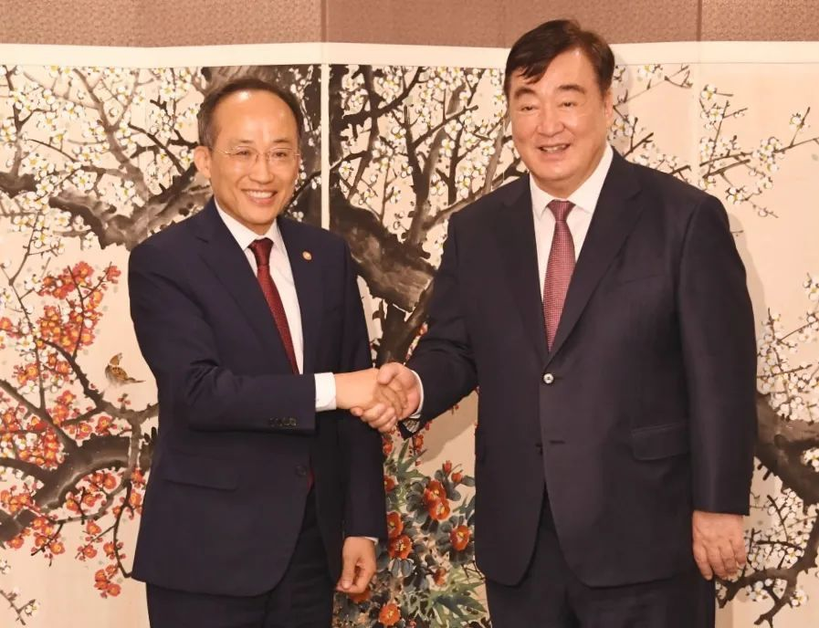

# 韩国财长：加强韩美关系不等于忽视对华关系

（观察者网讯）当地时间5月22日，韩国国会企划财政委员会在首尔召开全体会议。

据韩联社报道，韩国经济副总理兼企划财政部长官秋庆镐在出席会议时重申韩政府“不脱中”的立场。

秋庆镐称，中国是韩国第一大贸易伙伴国，也是最重要的经济合作伙伴。虽然韩国为加强与美国的关系努力着，但这不应被解读为忽视韩中关系。“我们从未宣布过与中国脱钩，我们也无意这么做。”

_5月22日，在首尔汝矣岛的韩国国会，副总理兼企划财政部长官秋庆镐（前排左）出席国会企划财政委员会全会并与与韩国银行（央行）行长李昌镛交谈。_

他表示，上周结束七国集团（G7）财长会议行程回国后，他另行会见中国驻韩大使邢海明，呼吁中方为年内成功举办韩中经济部长会议提供支持。

据中国驻韩国大使馆网站消息，邢海明大使同秋庆镐会面时表示，中韩是搬不走的近邻，更是利益交融、互利共赢的合作伙伴。在全球经济下行压力加大的情况下，两国经贸合作逆势上扬。2022年中韩相互投资快速增长，双边贸易再创新高，韩国已成为中国第二大贸易伙伴国，这充分彰显了中韩经贸合作的强大韧性和巨大潜力。当前，中国经济复苏势头强劲，消费投资回升加快，将为包括韩国在内的世界各国提供更为广阔的发展机遇。

但他强调，中方也注意到，近来个别国家人为构建“小院高墙”，推行“脱钩短链”。希韩方能坚持客观公正立场和市场经济原则，积极维护中韩产业链供应链稳定畅通。中方愿同韩方一道，携手推动中韩经贸关系再上新台阶。

_5月19日，邢海明大使会见韩国经济副总理兼企划财政部长官秋庆镐。
图源：外交部网站_

韩联社报道称，在韩国国会企划财政委员会全会上，韩政府官员还围绕巨额贸易逆差问题进行了讨论。

“直到最近，我们还在讨论150亿美元和250亿美元的逆差，但现在，我们的贸易逆差急剧增加，达到了294亿美元。”韩国共同民主党议员说道。

根据韩国关税厅周一（22日）公布的最新数据显示，韩国已连续14个月出现贸易收支逆差，尤其是一季度对华出口直接暴跌三成。

截至本月20日，韩国今年的贸易逆差已达295.48亿美元，是2022年全年贸易逆差（478亿美元）的62%，创下历史最高值。

韩政府认为，导致贸易逆差进一步扩大的原因是能源价格暴涨以及全球芯片行业长期低迷。

就近期对华贸易逆差规模扩大，秋庆镐表示，对华贸易收支于2013年实现超过600亿美元的顺差后，平均每隔两年缩小150亿至200亿美元。他认为，除了短期经济因素外，中国加强产业竞争力、消费者偏好国产品牌等因素也产生了不少影响。

**本文系观察者网独家稿件，未经授权，不得转载。**

