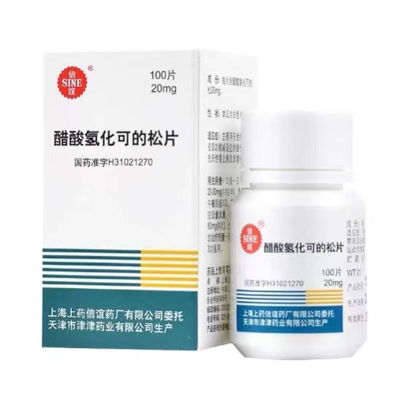
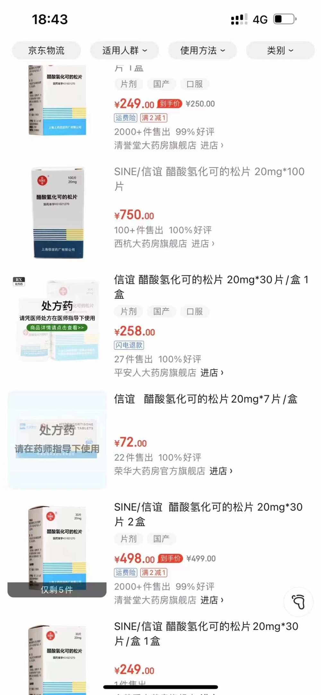
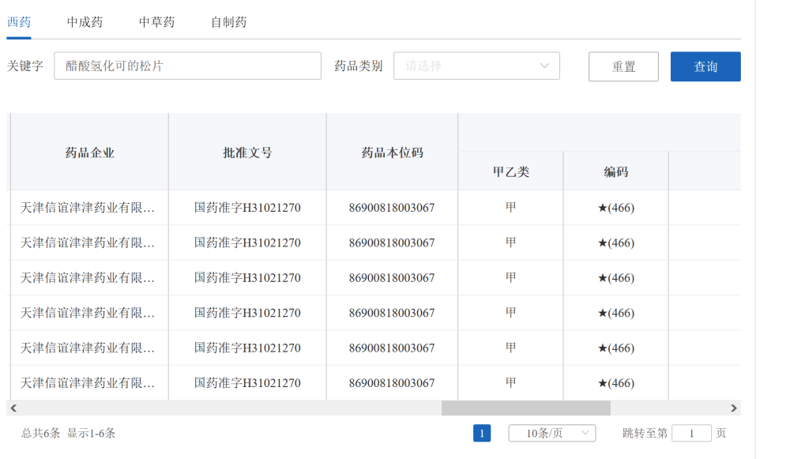

# “保命药”涨价10倍仍全网断货，药企：患者买不到药，我们卖不出去

  * _1_ “这是最需要普及的一种药物。”
  * _2_ “醋酸氢化可的松已经纳入了甲类医保目录，最近出现这么严重的问题，特别是这类紧缺药、基础用药，国家有关部门需要在第一时间介入给予一定的行政干预，特别是药品包装和价格有明显和较大调整问题，这背后更多是一个企业的社会责任问题。”

_醋酸氢化可的松片。_

近日，皮质醇增多症（又称“库欣综合征”）联盟负责人陈建敏发现，很多病友需要终生服用的“救命药”醋酸氢化可的松的价格翻了10倍。

库欣综合征（Cushing
syndrome，CS）是一种罕见病，欧洲数据显示，库欣综合征的发病率为2/100万人-3/100万人，中国尚无大规模流行病学研究统计。陈建敏也是一名库欣综合征患者，该病是由多种原因引起的肾上腺皮质长期分泌过多糖皮质激素所产生的临床症候群，手术成功后，患者需要长期服用醋酸氢化可的松，否则将危及生命。

除前述库欣综合征外，需要长期服用醋酸氢化可的松片的还有肾上腺皮质癌、肢端肥大症、垂体柄阻断综合征、21羟化酶缺乏症等十余个病种的患者群体。

陈建敏回忆，2022年7月29日，京东健康查询到的醋酸氢化可的松公开价格信息是100片/瓶，每瓶68元，最近，医院和药房的价格已经变成9.86元/片，且不再有100片/瓶和30片/瓶的包装。网上一些渠道的价格更是天花乱坠，有30片/瓶289元，100片/瓶750元等。

_2022年7月，京东售卖的醋酸氢化可的松片价格。受访者供图_

在澎湃科技记者和陈建敏联系的短短几天内，5月15日，陈建敏对澎湃科技记者说，网络途径已经无法购买醋酸氢化可的松片，澎湃科技记者搜索发现，京东、淘宝等电商平台均已无法搜索到这款药。

此外，该药是一种医保甲类药品，但全国多地的药房和医院均已无法购买醋酸氢化可的松片，少量可购买该药的医院却不可用医保报销。2009年，时任中国人力资源和社会保障部医疗保险司司长姚宏曾介绍：“甲类药品目录的确定原则是全国最贫困的县也能用得上。我们保证每一最小分类目录下都有药，但是选的是较为便宜的。”

5月16日，上海交通大学医学院附属瑞金医院内分泌科医生苏颋为告诉澎湃科技，“氢化可的松是一种由人肾上腺分泌出来的、有生物学活性的糖皮质激素，就像胰岛素一样，虽然是人工合成的，但它可以模拟人的生理状态。”

“这是最需要普及的一种药物。”苏颋为说，“如果一个人的肾上腺生病了，比如结核病破坏了肾上腺，或因肾上腺肿瘤等情况，不得不做肾上腺手术，或垂体出现问题，肾上腺皮质激素分泌减少，那么人体原先可合成糖皮质激素的能力就丧失了，需要补充糖皮质激素。严格意义上来说，这不是一种‘治疗’，就像人肚子饿了要吃饭一样，是一种生理行为。医学上称为‘替代治疗’。这也是一种救命的药。如果一个人的皮质功能完全减退而不补充，病人可能会死亡。”

低价“救命药”何以涨价且“一药难求”？5月16日，该药目前在国内唯一的生产商天津信谊津津药业有限公司（以下简称“天津信谊”）销售部工作人员回复澎湃科技称，作为药企，他们也很为难，“患者买不到药，我们卖不出去。”这位工作人员表示，天津信谊的这条原料药产线目前处于亏损状态。

苏颋为表示，如果不是暴利性质，涨价不是问题，关键在于可及性。

医院管理和医改政策研究专家、行业媒体“医改界”创始人魏子柠则向澎湃科技表示，纳入甲类医保目录的药品一般是临床必需、安全有效、价格合理、使用方便、市场能够保证供应的药品，“醋酸氢化可的松已经纳入了甲类医保目录，最近出现这么严重的问题，特别是这类紧缺药、基础用药，国家有关部门需要在第一时间介入给予一定的行政干预，特别是药品包装和价格有明显和较大调整问题，这背后更多是一个企业的社会责任问题。”

**“救命药”涨价十倍，百片大包装停产**

涨价的消息在2022年春天就出现了风声。据陈建敏回忆，当时，北京协和医院的一位内分泌科医生告诉她，他们的药房可能快没有100片装的醋酸氢化可的松了，药企给协和医院药房的理由是——他们将生产7片/瓶69元的新包装。这一消息在2022年7月成为了现实，两位常年服用此药的不同罕见病病种的患者去协和医院配药时获知，只有7片/瓶69元的醋酸氢化可的松了。

听闻这个消息，陈建敏在震惊之余，立刻向该药物当时的生产商上海医药集团股份有限公司（以下简称“上药集团”）求证，彼时第六批集采刚落地，陈建敏得到的回复是，上药集团有很多产品管线，平时高毛利的药物可以补贴醋酸氢化可的松这类亏本的药物，但集采之后，原先高毛利的药品价格下降，无法再补贴其他药品，所以上药集团旗下子公司上海信谊药厂有限公司（以下简称“上药信谊”）砍掉了这条产品线，移交给天津信谊。

2023年5月17日，澎湃科技记者致电上药信谊求证，上药信谊质量保证部门工作人员称，醋酸氢化可的松的产品线已于2021年移交给天津信谊，由天津信谊负责生产和销售，转移该产品线是因为天津信谊一直是原料的制造商，激素产品需要专用的厂房，上海信谊的场地决定不再做激素类产品。至于公司的战略，该工作人员表示不清楚，转到天津信谊后价格上涨的原因，也不在上海信谊的了解范畴内。

中国国家药品监督管理局官网显示，天津信谊是目前唯一拥有醋酸氢化可的松片生产批号的企业，而拥有醋酸氢化可的松原料药生产批号的企业有5家。天津信谊销售部工作人员解释称，“其他有相同疗效药品生产批号的药企均因原料药短缺、市场需求量小致原料药成本高的问题，放弃了其持有的文号药品的生产。”

_天津信谊津津药业有限公司是醋酸氢化可的松片目前在国内唯一的生产商。图片来源：国家药品监督管理局_

爱企查信息显示，天津信谊系上药集团旗下控股孙公司。天津信谊官网介绍，公司主要生产皮质甾类、激素类和类固醇类原料药，产品主要有氢化可的松、醋酸氢化可的松、地塞米松、醋酸可的松、泼尼松、醋酸泼尼松和泼尼松龙等。天津信谊是中国最大的氢化可的松和螺内酯的生产企业，氢化可的松年产量超过60吨，螺内酯年产量超过70吨。

“涨价的理由在哪里？”陈建敏说，上药集团的工作人员曾回复她，成本上涨是原因之一，“我是学化学的，我算了一下，原料药网上公开的报价大约为2700-3500元/千克，醋酸氢化可的松每片20毫克，一千克的原料药可以生产5万片醋酸氢化可的松，每片的原料成本仅0.07元。全球价格最贵的是美国，折合人民币2.24元。天津信谊的药一片10元，价格是在哪里涨的？”

陈建敏目前储备的是另外一种药，叫做醋酸可的松，100片98元，这是由上药信谊生产的最后一批药，保质期到2024年11月29日。“上药信谊把产品线转移给天津信谊之后，100片装的再也没有新产品出来了。我们为什么这么着急？就是担心这个药不生产了。”陈建敏很在乎药的规格，假设每天吃1.5片，7片一盒的话，不到5天就能吃完一盒。

据苏颋为介绍，醋酸可的松同样也是肾上腺分泌出来的糖皮质激素，区别在于它本身没有活性，需要在肝脏中代谢为氢化可的松才能起作用。对于健康的成年人来说，吃醋酸可的松和醋酸氢化可的松是一回事，二者可以相互替代。“有些病人觉得醋酸可的松片会导致肝损伤，这实际上是不科学的。逻辑是倒过来的，如果病人存在严重的肝损伤，就无法服用可的松。”

**医保甲类药有名无实？**

国家医保服务平台显示，醋酸氢化可的松片是医保甲类药品，即“由国家统一制定的、临床治疗必需，使用广泛，疗效好，同类药物中价格低的药物，使用这类药物所发生的费用纳入基本医疗保险基金给付范围，按基本医疗保险办法的规定支付费用”。

2009年，时任中国人力资源和社会保障部医疗保险司司长姚宏曾介绍：“甲类药品目录的确定原则是全国最贫困的县也能用得上。我们保证每一最小分类目录下都有药，但是选的是较为便宜的。”

_醋酸氢化可的松片已被列为医保甲类药品。图片来源：国家医保服务平台_

_醋酸氢化可的松片已被列为医保甲类药品。图片来源：国家医保服务平台_

然而，全国多地的药店和药房已无法购买醋酸氢化可的松，可以购买该药的医院是少数，并且需要自费。陈建敏不解，“这个药已经涨价了，患者还买不到。药企是又赚钱又不干活吗？”

陈云（化名）家住杭州，24岁的女儿在2019年罹患肾上腺皮质癌，需每天服用2片醋酸氢化可的松，如果停下，就会出现肾上腺危象，引发生命危险。陈云常帮女儿买药，一直通过医院购买，一开始100片/瓶的价格是54元，大约到2021年，涨到了100片/瓶98元，不过均可通过医保报销。

她记得很清楚，今年2月6日，她去浙江省第一人民医院配药，当时患者群里已经有很多人反映，100片/瓶的醋酸氢化可的松买不到了，幸运的是，浙江省第一人民医院的医生告诉她还有，确认过是每片20毫克的药后，陈云觉得准没错了。药和一大堆检查混在一起，她并没有注意，去药房拿到药，她才发现一盒只有7片，她买了4盒，共276元，全自费。药房的医生告诉她，没有100片/瓶的了。

69元7片对陈云来说太贵了，“吃不消”。陈云自己是子宫内膜癌患者，现在她和女儿的身体情况都不允许她们外出工作，家里只有丈夫一人有收入，目前每月用于二人看病的费用接近10000元。

陈云只能另寻渠道，去了上海交通大学医学院附属瑞金医院，这次，她特意和医生确认是100片/瓶装，又觉得准没错了。但拿到手后，她发现是醋酸可的松，而不是醋酸氢化可的松。尽管医生反复向她们强调，醋酸可的松可以代替醋酸氢化可的松，但她们仍然不敢吃，“百度了一下，说醋酸可的松对肝肾功能的损伤更大一点，而且之前一直吃醋酸氢化可的松，换一种不知道会怎么样。”

后来，患者群里有人不需要再服用醋酸氢化可的松，转手给了她们，目前的储备大约可以吃到今年11月，“以后不知道怎么办。”

**药企也诉苦：成本高、挂网难**

5月16日，天津信谊销售部工作人员向澎湃科技解释，上药信谊将醋酸氢化可的松产品转移给天津信谊后，天津信谊将产品的规格改成了7片/瓶和14片/瓶。关于制定该规格的考量，该工作人员称，其根据该药品的用药习惯和成本核算，制定了这两种包装规格。“有一部分患者是需要终生服用的，但大部分患者吃1-2周后就不吃了，剩下的就浪费了。而且药再好，也是激素，势必对人起副作用。”该工作人员说。

该工作人员还表示，该品种说明书规定每天1-1.5片，公司和很多专家沟通过，专家建议改成适合用药的包装。因此才有了上述两种调整后的包装规格。

苏颋为则告诉澎湃科技，7片/瓶和14片/瓶并不合适，绝大多数使用醋酸氢化可的松的病人都需要长期服用，100片包装并不会引起浪费。

前述天津信谊销售部工作人员向澎湃科技表示，作为药企，他们也很为难，“患者买不到药，我们卖不出去。”据其介绍，按照过去的销量来推算，醋酸氢化可的松在全国适用的患者人群大约只有2-3万人，只需几十公斤的原料药。目前，天津信谊的这条产线处于亏损状态，而天津信谊的其他产品都是普通药品，无高毛利产品。

对于涨价的原因，该工作人员表示是成本升高，除上述原料药外，摊入该药品生产成本的还包括前期投资费用和生产运营费用。“真正的原料成本没有多少。需要分摊的费用太大。激素类的产品需要单独的车间，一个车间做一种片剂，一年开工一个月，一个月的产量可以卖2-3年，其他的时间，车间都是闲置的，但仍需要维护费用、人工生产成本等。”

据该工作人员介绍，为了解决原料药的短缺问题，天津信谊保留了一条独立的原本计划改为合成工艺生产线的原酵生产线生产醋酸氢化可的松原料药，以满足该药品原料药的供应。

另一方面，该工作人员说，醋酸氢化可的松的工艺发生了改变，以前是发酵工艺，现在合成工艺成为了市场主流。天津信谊生产的醋酸氢化可的松主要出口欧美等地，但自2016年以后，国外的氢化可的松厂家大都以合成工艺替代了发酵工艺。据了解，目前除天津信谊保留的一条独立的发酵生产线外，几乎再无生产厂家继续沿用发酵工艺。而工艺更改后，原料需要重新向国家药品监督管理局申报，还要做稳定性临床试验，积累大量的数据，“没有3-5年是做不完的，同时，该产品前期转移研发费用较大，也需要摊入该产品的成本中。”

至于30片/瓶和100片/瓶的醋酸氢化可的松之所以价格混乱，该工作人员称，是因为社会库存不够，经销商不规范“炒作”。“我们的出厂价很低，到了经销商手上，A端卖给B端、C端，到C端可能才挂到电商平台，但实际上我们确实没卖这么高的价格。我们曾多次劝经销商保持合理利润。”目前，天津信谊收回了醋酸氢化可的松的线上供货，放在公司附近的一个连锁药店售卖。

5月16日，澎湃科技曾尝试连线该药房，药房工作人员拒绝回复关于其所售卖的醋酸氢化可的松的基本信息，并称：“不清楚，我们只是一家药房，你去问药企。”陈建敏获得的消息是，该药房售卖的规格为30片/瓶，有效期至2024年2月，2瓶140元，买二送一，药房通过顺丰快递邮寄药品，邮费另计。陈云告诉澎湃科技，患者联系多了以后，药店有涨价迹象。

苏颋为认为，醋酸氢化可的松为作为一种不可替代的处方药，不适宜在网上和药房售卖，更加适宜在医院售卖，“如果按照100片/瓶来算，病人拿一瓶药的使用速度大约为1-2个月，如果长期使用这种药物，应该定期做合适的检查，医生应当询问病史，看是否需要做药物调整等。”

天津信谊销售部工作人员表示，公司目前面临的另一个难题是挂网，即医保药品在政府采购平台上出售。“新的药品进入地方销售，需要先挂网，但挂网要一个省一个省地挂，而且要等‘窗口期’，每个地方政策不一样，目前我们已经在16个省市挂网或备案，之后还要做医院的工作，才能让药品入院。进院也有困难，这个药本身销售量小，一个医院一个月未必能开几十盒，好多医院也不愿意购入。这些我们都在努力商谈。”

该工作人员对澎湃科技记者说，目前社会舆论给了他们很大压力，对于确实困难的患者，公司在当地相关部门监督下进行了赠药活动。天津市发改委价格事务中心（天津市价格认证中心）、天津市市场监督管理委员会反垄断处等机构，已经对该药的生产成本进行了几轮调研，目前他们正在和上药集团、国家医保局协商，定一个各方都可以接受的价格。“我们在积极沟通协调价格问题。我们会努力拓展销售渠道，增加购药途径，同时努力降低成本和费用，让患者更加方便地买到安全合规的低价药品。”该工作人员说。

**企业的社会责任问题？**

苏颋为认为，像这类基础药物，价格不宜过高，但如果不是暴利的性质，涨价不是问题，“涉及厂家的成本升高，可以理解，有市场部门进行监管。氢化可的松药物的关键在于可及性，即医保可以报销，以及每个医院都要有，或者每个区域一定要有一家医院可以进这个药。”

作为临床医生，苏颋为在临床治疗中发现了另一个问题：其所在医院静脉注射的氢化可的松已经断货半年多了。药剂科医生告诉苏颋为，在上海的阳光医药采购平台上采购不到静脉注射的氢化可的松。

2014年，上海市人力资源和社会保障局发布《关于进一步做好本市医药机构药品“阳光采购”有关事项的通知》，要求全市公立医院和医保定点医药机构的所有药品（中药饮片以及医院自制制剂除外）都需要通过新建的市药采信息系统平台（即上海市阳光医药采购平台）进行采购，并以此开展药品采购、配送、支付结算等相关活动。

苏颋为表示，静脉注射的氢化可的松是急救的基础药物，和口服的氢化可的松不同，没有可的松注射液可供替代。“如果使用静脉注射的可的松，需要好几个循环才能进入肝脏，所以如果需要静脉注射，统一使用氢化可的松。”

在中国国家卫生健康委员会制定的最新版《国家基本药物目录（2018年版）》中，氢化可的松片剂（10mg、20mg）、注射液（2ml:10mg、5ml:25mg、20ml:100mg）均被列为基本药物，即“适应基本医疗卫生需求，剂型适宜，价格合理，能够保障供应，公众可公平获得的药品”。国家基本药物目录是各级医疗卫生机构配备使用药品的依据。

中国国家药品监督管理局信息显示，拥有氢化可的松注射液批号的企业有106家，其中拥有醋酸氢化可的松注射液批号的企业仅一家，为上海正大通用药业股份有限公司。

在苏颋为的印象里，两周之内，急诊至少有5-6位病人需要使用氢化可的松注射液，由于缺货，医生只能以甲基强的松龙替代。“这明显是不合理的，因为它（甲基强的松龙）不是用于‘替代治疗’，而是用于抗炎治疗。一定要有厂家承担社会责任，生产氢化可的松注射液，而且要命令所有带急诊的医院都必须采购。氢化可的松和生理盐水一样，是必需的。”

苏颋为认为，这类基础药物的短缺需要一些行政力量的干预。“现在药品完全进入市场，可控性太低。医保的目标就是保障药品供应和可及性。使用量较少的药物，或利润比较低的药物，医保需要覆盖。行政干预的方法多种多样，比如要求药企生产，要求有急诊的医院必须进（药）等。”

5月20日，曾长期在国务院医改办、国家卫生部、国家卫生健康委从事医改工作的魏子柠向澎湃科技表示，当用药的群体很小时，出现药品涨价和断供就成为大概率事件，其中有生产成本问题。就像企业说的，“企业之所以停止生产、更换包装，是因为利润低。”

在魏子柠看来，其中也有企业的社会责任问题。“上药信谊为什么把这个产品转给天津信谊？转到天津信谊后，天津信谊为什么要改工艺呢？原来是100片/瓶和30片/瓶的包装，为什么改成7片/瓶和14片/瓶的包装，而不是改成50片/瓶的包装？作为纳入医保甲类药品目录的药品，生产厂家为什么不在改工艺、改包装之前跟有关部门报告呢？能不能边生产老包装、边改进工艺呢？作为企业，应该履行好医保甲类药品的企业责任。”

魏子柠分析，企业之所以更换工艺和调高价格，这样企业的利润会更高，反之，如果不作改变，就没有理由重新挂标。而该药品本身已被纳入医保甲类目录，相当于在医药市场上拥有了一张“通行证”，是“畅通无阻”的。“现在企业涨价，国家医保局需要重新衡量药品的价格和医保自身的承受能力。既然纳入了医保甲类目录，企业不能说不生产就不生产了，说改价格就改价格，企业的责任到哪去了？”

