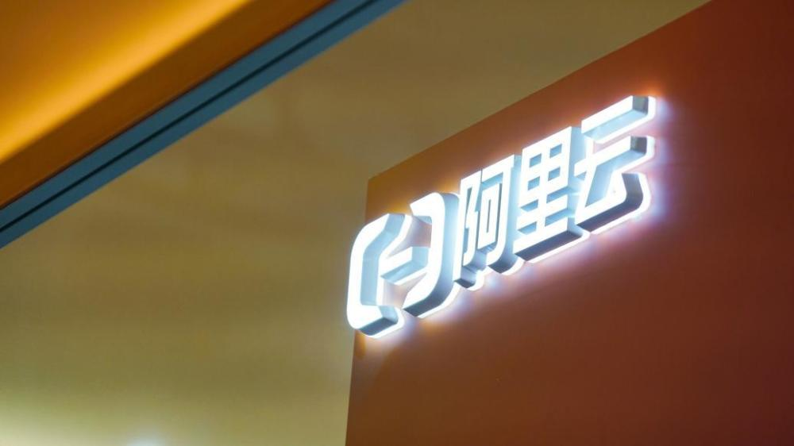

# 内部人士称阿里云人员优化7％，补偿标准为N＋1＋1

提出分拆独立上市一周后，阿里云被曝进行人员优化。

5月23日，阿里云内部人士告诉澎湃新闻记者，阿里云开始进行组织岗位和人员优化，整体比例约7%，补偿标准为N+1+1。

**该人士称，“每年公司会进行正常的组织岗位和人员优化。此次人员调整的时间为5月份，是在4月底发放完年终奖后启动的，整体优化比例约7%，补偿标准为N+1+1，未休的年假、陪伴假等均可折现。”**

就在上周，阿里云迎来了重磅变化，未来12个月里，阿里云从阿里巴巴集团完全分拆独立走向上市。对此，阿里巴巴集团董事会主席兼首席执行官张勇在全员信中表示，分拆是为了更好地发展，是阿里云面向未来二次创业的全新开始。

阿里集团的云业务分部由阿里云和钉钉组成，致力于云计算、大数据和人工智能（AI）核心技术的研发。此前，阿里云接连发布了一系列新举措，包括发布AI大模型通义千问、推出核心产品降价和免费试用计划、大幅提高合作伙伴佣金率等。

阿里云此前曾宣布史上最大规模降价，4月26日举行的2023阿里云合作伙伴大会上，阿里云称核心产品价格全线下调15％至50％，存储产品最高降幅达50%。阿里云当时表示，此次降价，将进一步扩大公共云的用户基数和规模，提升云计算的市场渗透率。

不过一季度阿里云业务表现平平，营收185.82亿元，同比下降2%，首次出现负增长，同比增速也创下自2020年以来季度新低。

目前，公有云整体市场规模的增速正在放缓。据IDC发布的《中国公有云服务市场（2022下半年）跟踪》报告显示，2022年下半年中国公有云服务整体市场规模（IaaS/PaaS/SaaS）达到188.4亿美元，其中IaaS+PaaS市场在2022下半年同比增长19.0%，与2021年下半年增速相比下滑幅度达到23.9%，与2022上半年相比下滑11.6%。

稳居国内云厂商第一位的阿里，在过去几年的营收增速不断降低，从2019财年到2022财年，阿里云的营收增速经历了84%、62%、50%、29%（抵消跨分部交易的影响后）的一路下滑。

不过，在张勇看来，整个云计算与IT发展史相比还处于早期，与全球领先的云厂商相比，利润率还是有很大的差距，但相信这个差距就是阿里云的机会。“随着云业务规模的壮大，特别是核心技术的提升，希望能够实现更好的规模化盈利，包括提升利润率，我们对此充满信心。”他说道。

