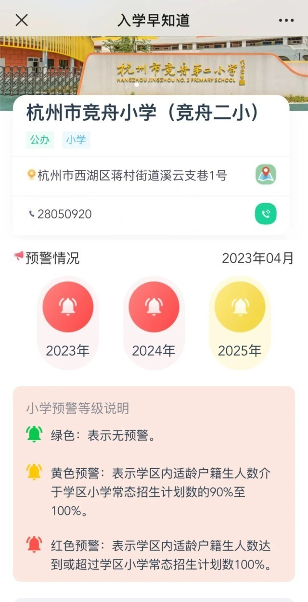

# 北京、广州、杭州等多地发布学位预警，今年或将成“最难入学年”

2016年1月1日起，我国“全面二孩”政策开始正式实施。在此背景下，2016年到2017年，全国各地陆续迎来了一个人口出生高峰。而今年，这批“二胎”儿童要上小学了，这也给各地的义务教育带来了前所未有的入学压力。

但更大的挑战在于，全国多地的“二胎”儿童在2018年之后又迅速减少，这就意味着，各地为了应对二胎入学潮新增的学位，又需要在两三年后面临快速收缩的压力。今年要愁学生太多，再过两年就要愁学生太少，这确实很让人犯愁。

**多地发布学位预警**

进入5月，全国各地的“幼升小”招生工作陆续开启。

“你家的对口小学变色了吗？”祁奚的女儿今年即将上小学，她告诉记者，这成为几乎所有今年面临幼升小的杭州家长的热门话题。

据了解，今年4月，杭州市教育局发布全市义务教育公办学校入学预警。杭州市教育局透露，杭州市2022年共招收一年级新生约12.5万名，但2023年目前摸底的潜在适龄生源在15万左右，创历史新高已成定局。

因此，杭州市为家长提供了各个学校的入学信息查询，对于学区内适龄户籍生人数达到或超过学区小学常态招生计划数的100%给予“红色预警”，学区内适龄户籍生人数介于学区小学常态招生计划数的90%至100%的给予“黄色预警”。

_学位紧张的杭州小学会“变色”_

不只是杭州。广州、长春、北京、青岛、成都、济南、大连等多地都发出了学位预警，甚至一些县级市也有多所学校发出“红色预警”。

据祁奚介绍，杭州小学的录取是有先后顺位的，俗称“一表生”“二表生”“三表生”“四表生”……所谓“一表生”就是学生与父母同户、同住在本小学学区内，“二表生”是指户口在本小学学区内的祖父母（或外祖父母）家，“三表生”是指有本市常住户口但不在本小学学区内，“四表生”则是无本市常住户口的借读生。

祁奚女儿要入学的学校已经显示“红色预警”，这就意味着顺位靠后的生源被录取的可能性很小。“我们的对口小学，之前是一表生、二表生都能进的，三表生有一部分会被分流。但今年说不定二表生都要被调剂的。”祁奚说。

北京的情况也类似。以海淀区为例，来自海淀区教委的数据显示，2023年，海淀区中小学面临学位供给的严峻挑战，特别是小学将迎来前所未有的入学高峰，预计达到4万人，初中入学预计达到2.75万人，义务教育阶段学生或将增加1.6万人。

“我们是‘四老房’（即学生户口在祖父母或外祖父母家），哥哥3年前顺利入学了，但今年因为入学孩子多，学位紧张，弟弟很可能要被调剂。”今年面临幼升小的北京家长王玲告诉记者，他们只能将老人的房子过户到自己名下，让孩子能够变成第一顺位。

“房产过户要交十几万的税费，但为了孩子也没办法。如果被调剂，学校不好不说，还可能离家很远。”王玲说。

**入学人数“过山车”**

**高涨之后马上暴跌？**

由于从人口出生数据可以预估出入园、入学高峰，因此各地都已经做好了充分的应对准备。

以北京为例，根据北京市政府工作报告，2022年，全市新增了2.9万个中小学学位。2023年，将继续新增中小学学位2万个。而以北京市教育资源强势区之一的海淀区为例，来自海淀区教委的数据显示，2022年，海淀区新增中小学学位超过1万个，2023年还将新增中小学学位5560个。

中国教育科学研究院研究员储朝晖告诉记者，据他的了解和观察，目前各地应对“二胎入学潮”虽然有压力，但整体上“问题不大”。

“因‘全面二孩’政策所形成的入学高峰是个小高峰，这个小高峰与若干年前学位的高峰相比，依然是一个相对低的状态。但各地的情况确实也有很大差异，大城市肯定更加严峻一些，而中小城市，尤其是农村，近年来一直处在生源外溢的状态下，所以并没有形成太大的入学压力。”储朝晖分析。

在储朝晖看来，即使是在学位紧张的大城市，整体应对能力也是不成问题的。“做到‘有学上’问题不大，但要做到‘上好学’，那问题就比较大了。所以，目前面临的难题不是增加多少个学位，而是如何进一步推动教育资源的均衡配置。”他说。

但另外一个问题更为严峻，因为“二胎”儿童在2018年之后迅速减少，如果入学高峰之后很快又出现学位“过剩”，该如何应对？以北京为例，可能会在几年之内就迎来入园、入学人数的“断崖式下跌”。

来自北京市疾病预防控制中心的数据显示，北京市户籍人口出生近10年来的最高峰出现在2017年，即“全面二孩”政策的第二年，当年户籍人口出生数为17.1万人，2018年为14.1万人，2019年为13.3万人，2020年为10万人，2021年则降到了9万人。

而到了2022年，虽然尚未有官方数据公布，但有机构根据各大医院的数据推测，2022年北京户籍的新生儿可能仅7.5万人左右。

根据2023年3月21日北京市统计局、国家统计局北京调查总队发布的《北京市2022年国民经济和社会发展统计公报》，2022年末，全市常住人口2184.3万人，常住人口出生率为5.67‰。而截至2016年末，北京市的常住人口出生率为9.32‰，2017年末为9.06‰。

储朝晖也强调，更应该关注的是接下来很快就会到来的入园、入学人数下滑。“这确实是一个需要各方认真考虑的问题，因为它涉及学校的效能安排，涉及要不要有人员的更迭，要不要招聘新的年轻教师。尤其是有很多地方，只有一个单一的办学主体，应对能力就会明显不够。”他说。

据记者了解，现在，全国多地的幼儿园已经开始出现生源不足的问题，预计很快会传导到义务教育阶段。储朝晖建议，应该尽快发展多种主体办学，尽可能实现教育均衡，尽可能实现公共服务的多样化。

“公共服务不应是单一标准的、刻板的，公共服务应该是有适度竞争的，这样才能够更好地满足大家的求学需要，才能够真正实现‘办人民满意的教育’的目标。”储朝晖表示。

（文中采访对象均为化名）

来源：中国新闻社

