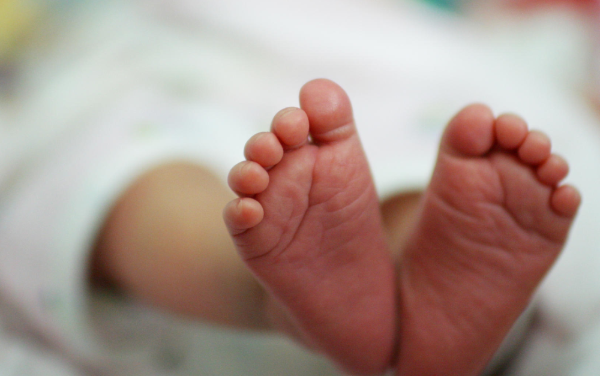
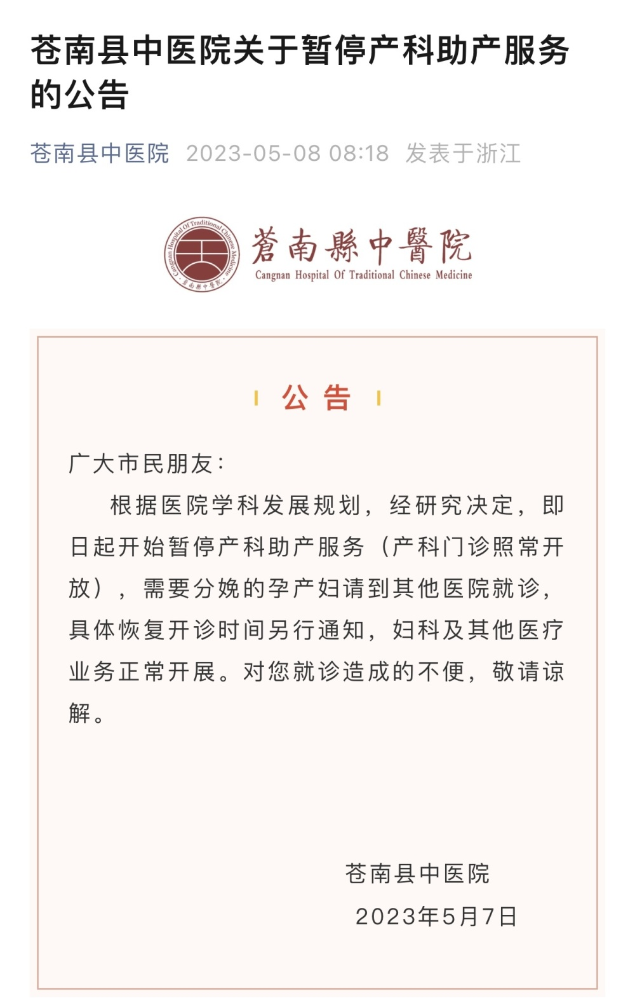

# 多地妇产医院今年来分娩量下降，有产科暂停助产，专家：鼓励生育政策还能优化

近日，红星资本局从全国多地妇幼保健院产科了解到，因生育热潮“降温”，今年以来不少医院分娩量下降，甚至有医院因此暂停产科助产服务。随着以“真金白银”为主的生育补贴政策渐成趋势，效果如何也备受关注。

专家指出，受到当前全国育龄妇女规模缩小和人们生育观念变化、婚育推迟等因素影响，未来一段时间中国出生人口下降趋势或许很难改变。鼓励生育政策还有优化空间，加强系统化的生育支持政策顶层设计，营造全社会生育友好的文化氛围，眼下非常重要。

_↑资料图
据IC photo_

**多地妇产医院分娩量下降**

**有医护薪资受影响**

国家统计局数据显示，2022年末，全国人口141175万人，比上年末减少85万人。据国家发改委发布的《2022年人口相关数据》，2022年全国人口总量略有下降主要是由于出生人口减少，一是因为育龄妇女持续减少，2022年全国15-49岁育龄妇女人数比上年减少400多万人，其中21-35岁生育旺盛期育龄妇女减少近500万人；二是受生育观念变化、婚育推迟等多方面因素影响，2022年育龄妇女生育水平继续下降。

近日，红星资本局从全国多地妇幼保健院产科了解到，比起具体的产妇建档数据，更直观的感受是，今年以来分娩量下降了。对于不少产房里的医生而言，新生儿的哭啼声变少，病床不再紧张，大家的工作也不像从前忙碌了。

贵州省某县妇幼保健院一名妇产科医生介绍，今年该院的分娩量较同期下降了近30%，县城内三家公立医院的新生儿出生率都在降低，医护的薪资也受到影响。湖南省某三甲妇幼保健院的一名医护人员介绍，产科是该院的品牌，分娩量一直排名全省前列，但最近，产妇多到加床的情况已经较为少见。

“过去（分娩量）可能一天七八个、十来个，现在几天一个，能一天一个就不错了。”黑龙江省哈尔滨市妇幼保健院的一名产科医生告诉红星资本局，医院今年的分娩量减少了一半以上，除生育观念和经济水平等因素，当地私立医院的分流也有影响。

不过，也有广东某大型三甲医院产科医生表示，分娩量与同期比没有太大变化。

对于部分医院分娩量下降的情况，有人口学者向红星资本局表示，现有数据或许无法体现今年全国人口增长情况，过去两年疫情等因素影响，今年的新生儿出生数据或许会有小幅度回升。不过，也有人口学者认为，虽然疫情影响下的推迟婚育有可能在未来几年反弹，但在很长一段时间里，中国出生人口下降趋势或许很难改变。

**有医院调整产科结构**

**不挤“独木桥”**

2016年，中国“全面二孩”政策正式实行，一波生育热潮掀起，产科一度“一床难求”。但随着生育热潮“降温”，有医院已经着手调整产科结构。

2023年5月7日，浙江省苍南县中医院的一则公告引发关注。公告称，根据医院学科发展规划，经研究决定，即日起暂停产科助产服务（产科门诊照常开放）。

“分娩的数量很少，（继续）干就没有意义了，我们去年10月份就彻底停掉了。”苍南县中医院妇产科一名医护人员向红星资本局介绍，最近几年因分娩量下降，结合人员外调、退休等情况，妇产科员工的结构组成已经发生很大变化，业务也由以产科为主转向中西医结合的妇科，转变后业务量在慢慢回升。

“我们没必要跟大家在‘独木桥’上走，这样也没有什么优势。”该医护人员还透露，去年暂停产科助产服务前，该院每月分娩量在20人左右，县城其他医院的数据也在下降。

前述哈尔滨市妇幼保健院的产科医生也在担忧产科被合并到妇科的情况。其认为，即使医院的特需病房已经非常便宜，但与私立医院相比竞争力不算大，有条件的产妇还是会选择到私立医院生产。

**育儿补贴已成趋势**

**效果如何？**

自2021年三孩生育政策实施以后，多地陆续出台鼓励生育政策，以“真金白银”的育儿补贴为主要类型。

2021年7月，四川省攀枝花市成为首个现金补贴二、三孩生育的城市。2022年3月底前，攀枝花已向全市兑现第一笔育儿补贴金，共计95万元，涉及650个家庭。2022年10月，攀枝花市副市长唐忠柱介绍，预计2022年享受育儿补贴金的家庭将超过2000户；政策实施一年来，全市出生人口数量增长了1.62％，二孩、三孩数量分别增长5.58％和168.40％。

如今攀枝花的育儿补贴政策实施近两年，成效如何备受关注。“每个月（分娩量）一百七八十吧。”5月22日，攀枝花市某三甲专科医院一名产科医护人员向红星资本局介绍，今年以来该院产检数量和分娩量与往年接近。但记者从该市各区（县）多家医院产科了解到，存在分娩量下降的情况。

“不知道为什么一下子就变少了。”攀枝花市某三甲综合医院一名产科医生向红星资本局介绍，往年该院月均分娩量十余个，但今年“骤减”至个位数。该医生无奈道：“不确定（产妇）是不在我们医院生，还是不想生。”

甘肃省临泽县紧随攀枝花之后，于2021年9月出台政策，对生育二、三孩的家庭每年发放育儿补贴直至孩子3岁。红星资本局注意到，2021年临泽县全年出生人口817人，人口出生率为5.41‰。2023年3月公布的《临泽县2022年国民经济和社会发展统计公报》数据显示，2022年出生人口844人，人口出生率为5.63‰。人口出生率上涨了0.22个千分点。

2022年11月，陕西省宁陕县对符合政策生育一孩、二孩、三孩的夫妻，一次性分别给予不同程度的生育补助，成为国内首个将现金补贴覆盖所有生育家庭的地方。5月22日，红星资本局从宁陕县卫健局获悉，当地正在陆续为育儿家庭兑现补贴金，不过目前政策公布时间较短，鼓励生育的效果暂未显现。

中国人民大学社会与人口学院人口学系主任杨凡此前接受澎湃新闻采访时指出，目前许多地方在探索各自生育支持政策，效果如何需要3年才能显现。

**专家：鼓励生育政策还有优化空间**

**应重视育龄女性公平就业权利**

今年5月12日，武汉东湖高新区发布方案，对2023年1月1日后满足相关条件生育三孩及以上子女的家庭，每年每孩可享受育儿补贴1万元，最长可享受至6周岁。生娃最高补贴6万，这被称为“史上最强”补贴政策。但在社交平台上，有网友问道：“6年以后怎么办？”

西南财经大学教授、中国人口学会副会长杨成钢向红星资本局表示，政府拿出“真金白银”补贴，尽可能降低生育夫妇的育儿成本，体现了鼓励生育的积极态度。但必须承认，这些补贴相对于家庭的育儿成本来说，虽然不能说是“杯水车薪”，但恐怕也难以调动生育的积极性。

“要想改变现在人口负增长的趋势，调动育龄人群的生育积极性，比起这些零碎的补贴，还是要加强系统化的生育支持政策顶层设计，出台一套全面支持生育的政策体系。”杨成钢指出，这不仅要加强生育女职工的就业保护，扫除女职工与用人单位的双向顾虑，还需结合实际关注家庭住房问题及未来孩子的入托、入学等情况，营造全社会生育友好的文化氛围。

杨成钢表示，随着社会的发展，目前中国女性受教育程度和劳动参与率均大幅提高，女性的生育观念发生改变、生育意愿明显下降，因此从政策的角度来说，应该更多地向女性倾斜，考虑减轻她们的生育负担。

人口学者何亚福向红星资本局表示，从目前各国的经验来看，提升生育率是一项综合的社会工程，对于双职工家庭而言，可以参考法国和瑞典这两个欧洲生育率最高的国家，发展普惠托育服务、多建托儿所，“让3岁以下的婴幼儿有人照料，解除双职工家庭的后顾之忧。”

何亚福还提到，构建一个对女性生育友好的社会，需要重视带薪生育假、保障女性公平就业的权利。例如，可以参考国外的经验，在父母育儿假制度中，融入家庭角色的性别平等观念，通过法律规定父亲的家庭责任，不但能促进男女两性职场中的机会平等和家务劳动中的责任分担，而且有利于消除就业市场中的性别歧视。

据界面新闻报道，2021年11月，中南财经政法大学统计与数学学院讲师陈梅、厦门大学经济学院博士研究生张梦皙等人发表的《国外生育支持理论与实践研究进展》一文指出，从瑞典、法国、英国等13国的分析数据来看，对于生育率远未达到更替水平的国家，各种形式的现金津贴，对生育行为的激励效果都很明显。现金津贴配合育儿假、日托中心建设等多类型政策组合效果更为显著。

南开大学周恩来政府管理学院副教授朱荟和北京大学社会学系教授陆杰华对英国、瑞士、捷克、匈牙利等15个国家的人口政策有过研究，他们发现，具有“去家庭化”性质的托幼服务对欧洲家庭生育决策存在显著的正向影响，而具有“家庭化”性质的现金补贴并未产生预期作用。

红星新闻记者 俞瑶 实习记者 蒋紫雯

编辑 余冬梅

