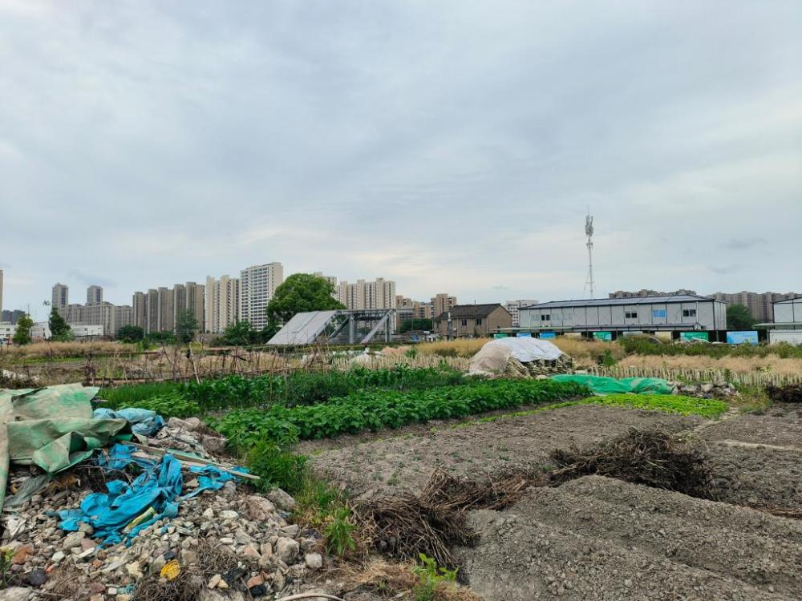

# 投资约2亿元建设的地铁站为何成“孤岛”？

新华社杭州5月23日电 **题：投资约2亿元建设的地铁站为何成“孤岛”？**

新华社“新华视点”记者李平、顾小立

近日，浙江省宁波市投资约2亿元建设的3号地铁线一地铁站乘客寥寥，利用率不高成“孤岛”，引发社会关注。是什么原因造成这一民生工程投资浪费、百姓不满？“新华视点”记者展开追踪调查。

**地铁站周边杂草丛生，附近居民绕道而行**

近日，记者在现场看到，宁波市3号线一期高塘桥地铁站孤零零地矗立在一大片刚收割完的油菜地里，周边约有农田60亩。其中A、B两个出口由一条便道联通远处的宁姜公路，目前可以通行；C、D两个出口被挡墙封闭，出口大门紧闭，周围杂草丛生有半人高。

_建在农田里的宁波地铁3号线高塘桥站C出口（新华社记者李平
5月16日摄）_

正在菜地里刨土豆的顾姓村民告诉记者，“这个地铁站建在农田中间，不上不下，平时没几个人坐，我可以在这里开荒种地补贴家用。”

居住在和顺家园小区的陈女士告诉记者，她住进小区3年多了，很少到高塘桥站坐地铁。因为这个地铁站与和顺家园小区中间隔了条河，没有道路通行，居民需要绕行近3公里，还不如坐公交车。

据了解，与高塘桥地铁站直线距离仅100多米的和顺家园小区，居住着2500多户3700多人。“门口有地铁站却坐不了，居民很不满意，反映三年多时间了。”和顺社区干部说。

宁波市轨道交通集团有限公司有关负责人表示，2015年7月高塘桥站选址获批，2017年车站出入口施工，2019年6月建成通车，整个工程花费约2亿元。

据《宁波市轨道交通3号线一期工程环境影响报告书》预测，3号线一期工程2018年开通后，日均客流量为1.13万人次/公里，2021年为1.5万人次/公里。但事实上，目前日均客流量为6000人次/公里至7000人次/公里，仅为规划预测的一半左右。

为什么投资巨大的地铁站乘客寥寥？“因为高塘桥站建在基本农田里，周边规划的商住项目没建起来。连接和顺小区的道路又涉及占用基本农田问题，迟迟动不了工，导致站点日均客流量偏少。”宁波市轨道交通集团有限公司有关负责人说。

记者进一步调查发现，在宁波市，高塘桥站面临的困局并非个例。例如，与高塘桥站临近的句章路站同样被农田“包围”，其C、D两个出口大门紧闭，建而未用。宁波市自然资源和规划局提供的数据显示，句章路站周边300米范围内，有永久基本农田约68亩。

_建而未用的宁波地铁3号线句章路站C出口（新华社记者李平 5月16日摄）_

**“超前引领”的规划，“先上车后买票”的心态**

根据《中华人民共和国土地管理法》第三十五条规定，永久基本农田经依法划定后，任何单位和个人不得擅自占用或者改变其用途。国家能源、交通、水利、军事设施等重点建设项目选址确实难以避让永久基本农田，涉及农用地转用或者土地征收的，必须经国务院批准。

为何明知该地为基本农田区域，仍将高塘桥地铁站点布设在这里？记者就此采访了宁波市有关部门和相关专家。

宁波市自然资源和规划局有关负责人称，将站点设在基本农田区域，主要是原城乡规划和土地利用规划有局部“不合一”的情况，存在规划先行问题。

在2013年“宁波市鄞州区‘陈婆渡（后改为高塘桥）—黄隘’地段控制性详细规划图”上，记者看到，10年前，高塘桥站周边的基本农田被规划为商住用地，而当时的宁波市土地利用规划还是将这片区域划为耕地和基本农田。

“为凸显轨道交通对城市发展的超前引领作用，原宁波市规划局核发了轨道交通3号线一期工程建设项目的选址。”宁波市自然资源和规划局有关负责人解释说。

对于这种说法，一些宁波市民并不认可。他们认为，根据相关国家标准，地铁应布设在城市客运量大的主要客运通道上。地铁线路间及地铁与其他交通系统间的衔接，应做到换乘安全、便捷。把地铁站建成“孤岛”，是否符合国家发展地铁的思路，值得商榷。

此外，地铁站投入使用至今已近四年，为何部分出口荒废、配套道路“断联”现象迟迟未有改观？

当地部分干部透露，先前的考虑是，想利用后续土地利用规划修编的窗口期，对永久基本农田布局进行适当调整，逐步推进站点周边道路及商品房的开发。但后续由于机构调整等原因，现有规划落地及配套设施建设情况难以推进。

高塘桥站附近居民反映，从现在的结果来看，规划和建设并没有起到“引领”作用，地铁站连出口都不能完全用起来，不仅造成国家投资浪费，也没有给周边群众带来交通便利。

_大门紧锁的高塘桥站D出口。站内公告牌上提示，“此出入口及通道暂未开放，请勿通行”（新华社记者顾小立
5月16日摄）_

记者采访的一些规划专家和基层干部表示，高塘桥站的遭遇，折射了一些地方“先上车后补票”的发展心态，总觉得可以先把事情“张罗”起来，事后再利用国家政策调整的机会“补合规手续”。

**耕地保护“红线”不能逾越**

宁波市相关部门向记者反馈了一些改进问题的措施。

“根据最新国土空间规划，高塘桥站周边已纳入城镇开发边界以内，联通和顺小区与高塘桥站的中惠路已具备建设条件，目前该公路已完成选址预审、可行性研究、初步设计等工作，争取在今年9月份完成土地报批、10月份开工建设，解决高塘桥站部分出口难以通行的问题。”宁波市自然资源和规划局副局长汪乐军说。

当地干部表示，他们正对全市127个已建好的地铁站口进行摸排，全面搞清楚哪些地铁站口存在建好后使用效率不高、周边群众出行不方便等问题，加强联动对接，分类分析，有效改进。

浙江师范大学地理与环境科学学院教授马远军认为，重大基础设施布局“超前引领”的“度”如何把握，是一个非常重要的问题，需要将耕地保护、城市开发综合考虑，一定要提高重大公共基础设施项目决策的科学性、预见性和合规性。

西南政法大学教授蔡斐建议，要继续深入推进土地规划、城市规划、交通规划、产业规划等多规合一、统筹兼顾，把“一张蓝图干到底”落到实处。

更重要的是，“无论出于什么样的建设考虑，无论地方城市发展到了什么阶段，耕地保护这一‘红线’始终不能逾越。”蔡斐说。

