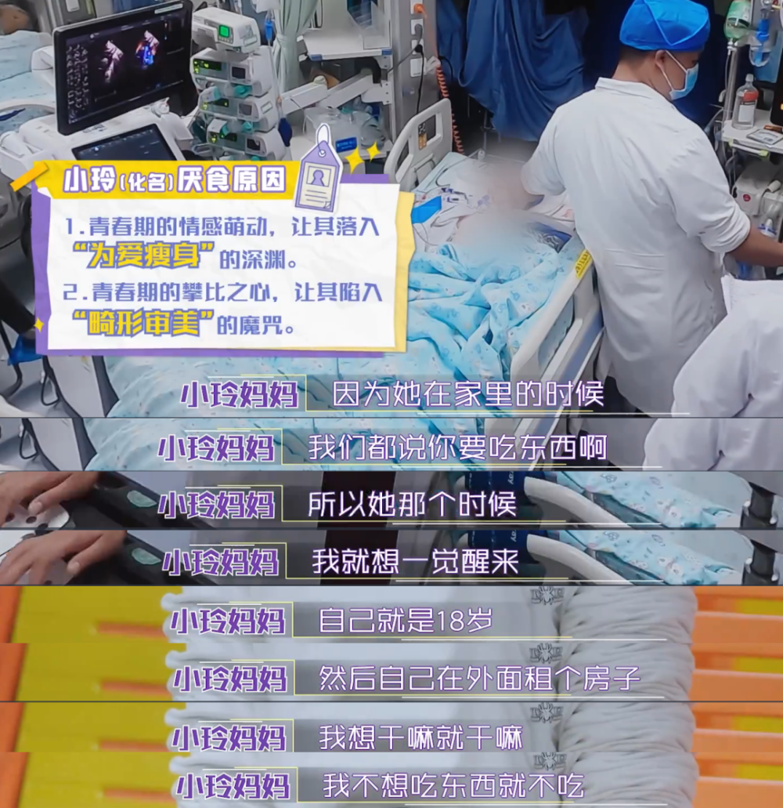

# 15岁“减肥少女”离世，冲上热搜第一！亲人心碎：这段经历太痛心

今天这个热搜 **“那个为爱减肥的少女走了”让很多网友看得唏嘘不已。**

3月的一天下午，深圳市儿童医院转运中心接到东莞某医院求助， **一个15岁女孩小玲（化名），重度营养不良，呼吸衰竭，已经失去意识** 。

经过医生20多天的抢救，依然没能唤醒那个活泼可爱的少女。

**思虑再三，父母还是决定给孩子自由，最终妈妈陪她走完最后一程...**

**这个15岁女孩小玲身上到底发生了什么？**

当时，随车转院的女孩爸爸对医生表示：女儿自大年初三以来，
**近50天，没吃过东西，只喝水。上周在家神志不清，紧急送院。她身高165厘米，而体重仅有24.8公斤。** 这体重甚至还不如一些低年级的孩子。

医生仔细查看女孩，一点自主呼吸也没有，嘴角一直在渗血。最大问题，瞳孔不等大，对光反射消失。“这是一个非常不好的信号”，瞳孔是由脑干控制的，瞳孔没了反应，意味着脑干已经受损，不一定能醒过来。女孩被转运到深圳市儿童医院后，立即推去照脑部CT，医生一过手就被震惊到了：
**好轻啊，感觉在抬一床被子。**

这么瘦，已经是名副其实的 **皮包骨。** 以至于过床时，医生再三叮嘱：小心一点，慢一点， **特别要小心骨折。** 女孩为何会这样？
**最初是为爱减肥。妈妈回忆，女儿小玲最胖的时候，是在六年级，大概104斤。上了初中，家人就发现她“有减肥的意识”。**

**“她跟我们讲，她吃东西不要放油，一点点油都不要。”之后，妈妈说据同学反映，她暗恋了一个男孩子，但是那个男孩，喜欢一个比她瘦的女孩。**

后来，减肥之路上，又多了一个“推手”： **攀比心理。**

一次，小玲看到班上另一个女孩光吃青菜，认定人家在减肥。她无法接受一个事实：我比那个同学漂亮，成绩比她好，但她比我瘦！慢慢地，她不吃米饭、主食，最后完全不进食，只喝水：节食变成了绝食。

在接下来的一年半时间里，小玲反复绝食，直到陷入昏迷、生命垂危。在东莞转院时，一手带大她的奶奶哭得双脚跺地，不让孙女上救护车：“不要把她送走了，不要让她死在外面了。”

此情此景，让很多人泪目。有网友“质疑”， **为什么父母没有提前干预？**

其实女孩父母曾强制多次带女孩去医院，但第一次去，她就试图跳车，开了四五次车门，到了医院，被强制拖进病房，她就用花洒砸脑袋，尝试跳窗……

**父母的无可奈何背后还有一个原因，是她得了一种自己完全失控的精神性疾病：神经性厌食。**
也就是我们常听到的“厌食症”。这个病，就连精神科医生都要闻之色变。

厌食症是死亡率最高的精神疾病之一。减肥对大多数人来说，3天也撑不下去。但当你“坚持”到一定阶段，“神奇”的事情就发生了：减肥，是会上瘾的。

这种上瘾会使大脑分泌多巴胺，产生强烈的愉悦感。

这就是神经性厌食，一种有意节食导致的进食障碍，多发于13-20岁的年轻女性。患者对待减肥，就像打了鸡血，除了绝食，还会催吐、抠喉、吃泻药、疯狂运动，

无所不用其极。一个神经性厌食患者，永远不会对“掉秤”的程度感到满意，如果过了一天，体重还跟昨天一样，简直就是灭顶之灾。

他们乐于看见自己被折磨得精疲力竭、骨瘦如柴。这种“失控”在小玲身上蔓延。

一开始，小玲的爸爸在网上找了很多厌食症的图片给她看，“再这样下去，你会得厌食症的。”

但小玲信誓旦旦：“爸爸你放心，我不会得厌食症的。”

打脸很快到来，减肥1年3个月后，她发现自己没来月经，被父母带去深圳市儿童医院检查，诊断为神经性厌食。

小玲妈妈说：“最开始，她想减到五十多斤，但等她到了五六十的时候，她就没有底线了，只有越来越瘦。”

神经性厌食如果不能及早干预，到了严重阶段，预后（治疗后的效果）就会很差。

因为患者：宁愿饿死，也不吃东西。

国外有两项长期随访研究显示，厌食症患者，在实施明确的治病计划后，10年死亡率达6.6%，30年随访死亡率达18%。

这在精神障碍疾病当中算是比较高的。

但患者通常等不到饿死，而是死于长期营养不良引起的全身并发症，比如心脏疾病、器官衰竭、肺炎、骨折，还有抑郁自杀。

当小玲被转送到深圳市儿童医院前，她身上已经出现了“14种疾病”，全身所有器官都受损甚至衰竭，大脑可能再也醒不过来。

小玲最终没有醒过来。当医生告诉家长“尽力了，要做个选择”时，爸爸哽咽道：“放弃于心不忍。”思虑再三，父母还是决定给孩子自由，最终妈妈陪她走完最后一程

**网友泪目：健康才是最重要的**

**有网友表示，很心疼孩子父母**

**更多网友觉得社会应该提倡健康的审美**

**畸形的“以瘦为美”不可取。不讲科学的“禁食”减肥，会慢慢吞噬掉“上瘾”的你。希望小玲的故事被所有想要减肥的人看到不要再重蹈覆辙，让心疼自己的家人朋友难过。**

来源：潮新闻·钱江晚报综合自深圳卫健委、哔哩哔哩、深圳广电、中广天择、深圳市儿童医院、陇原健康、网友评论等

