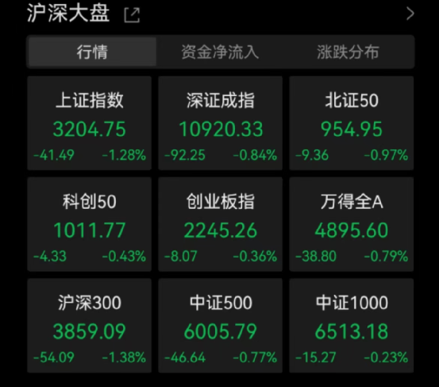
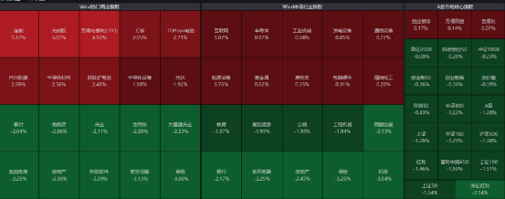

# A股又跌了，什么原因？多家基金解读：3200点一线有较强支撑

中国基金报记者 张燕北

5月24日，A股三大指数收盘集体下跌，沪指跌1.28%逼近3200点，深成指跌0.84%，创业板指跌0.36%。

从盘面上看，中特估概念加速下挫，申万房地产指数连跌9日，大消费尾盘不济；AI+反弹一波三折，科大讯飞一度闪崩逼近跌停；芯片股逆势走强，机器人概念头部个股接连狂飙。

记者盘后采访了招商、博时、永赢、光大保德信、中信保诚、恒生前海、创金合信等多家基金公司，进行第一时间解读。

对于A股延续震荡回调，尤其以前期涨幅较大的上证指数回撤较多的情况，公募普遍认为海外股市大跌，叠加外资流出，经济基本面较为低迷以及中字头板块回调等均影响大盘表现。

但总体而言，市场持续调整的空间有限，3200点一线大概率有较强支撑。新能源、军工、消费和医药等多数细分行业，基本面的景气趋势将延续，近期回调很充分，估值有相对明显优势，后市有望迎来反转机会。

**多重因素扰动市场**

5月中上旬开始，A股市场扰动因素开始增多。综合公募观点来看，经济数据低于市场预期、人民币汇率贬值压力大以及AI和中特估两大主线快速回调等都是引发市场调整的重要因素。

**创金合信基金金融地产研究员胡致柏**
介绍，今日三大指数持续调整，开盘市场延续昨日尾盘情绪，主要指数全线飘绿。随后指数震荡下行，沪深300逼近年内低点。创业板指在光模块板块强势的带动下相对抗跌。临近午盘指数有所回升，但午后再度震荡走低，跌幅超1%，创指盘中翻红后再度回落。全天地产、银行等权重板块持续不振，给指数带来了较大的压力。今日成交量仍维持在8000亿左右水平，市场交易热度相对一般。

针对A股表现不佳的原因， **恒生前海基金投资经理谢钧**
认为，今日A股延续震荡回调，各大指数近期都走出下跌趋势，主要原因有以下几点：其一近期人民币贬值引发资金撤离；其二，经济基本面较为低迷；其三，部分城投债出现风险信号；其四，中字头股票回调使指数整体承压。

在 **中信保诚基金**
看来，A股下跌的主要影响因素一方面是美国债务上限谈判再陷僵局，海外股市大跌，叠加外资流出，影响A股投资者风险偏好，另一方面是中字头板块大幅走低，影响大盘表现。

**光大保德信基金**
指出，今日市场比较明显下跌。首先，北向资金出现比较明显的流出，今日北向流出45亿元，近期美债利率持续上行，全球流动性有边际收紧，对于非美股市会有一定压力。另外，结构上“中特估”调整较多，主要前期涨幅较大，这些板块的业务和地产绑定较深，市场一定程度上也受到近期国内地产销售的影响。而新能源车、TMT等板块承接了部分资金，算是结构的再平衡。

5月以来，A股市场震荡回调。 **博时基金**
认为，市场调整主要是由于4月经济数据略偏弱、导致市场信心不足。在一季度经济快速修复后，4月经济的修复速度有所放缓，CPI同比涨幅下降，经济的内生动力还需进一步增强。

对于近期市场波动的原因， **永赢基金**
表示，近期市场成交额维持在8000亿左右水平，较此前万亿水平显著回落，资金存量博弈下，行业轮动较为迅速，难以形成长期趋势。受第二波新冠感染关注度升温影响，市场对于经济复苏担忧再次升温，经济复苏链条整体承压。

同时，与经济关联度较低的“中特估”以及AI两大主题方向前期均已有较高涨幅。因此，在缺乏增量资金以及明确主线，叠加二次感染担忧冲击下，市场出现一定回撤。

**华夏基金** 则称，4月底到5月上旬，随着资金面重新宽松，五一假期经济复苏的预期乐观，美联储最后一次加息见顶，A股风险偏好上升，市场迅速反弹。

5月中上旬开始，A股市场扰动因素开始增多，首先，4月份的经济数据低于市场预期；第二，伴随着10年期美债利率、美元指数反弹，人民币阶段性贬值压力加大，5月初人民币汇率再度向上“破7”，引发市场担忧；第三，前期强势的AI和中特估两大主线快速回调，市场短期赚钱效应不足。

**对A股未来走势保持乐观**

尽管近期A股在多重因素扰动下持续调整，公募基金对市场仍然保持乐观。在他们看来， **市场持续调整的空间有限，3200点一线大概率有较强支撑。**

针对A股走势向好的支撑因素， **永赢基金**
介绍到，一方面，二次感染影响程度通常较为缓和。二方面，随着居民收入逐步修复，市场增量资金可期。三方面，国内政策面维持宽松，风险主要集中在海外，且外溢风险不高。4月底中央政治局会议指出“当前我国经济运行好转主要是恢复性的，内生动力还不强”，预示政策端仍将维持宽松，市场流动性无需担忧。而对于市场风险，则主要仍集中在美国区域性中小银行，但其对于A股而言更多为情绪面冲击，基本面关联度较低。

总体而言，在二次感染影响有限、后续市场增量资金可期、流动性维持宽松以及无重大市场风险的背景下，对A股未来走势保持乐观。

**创金合信基金金融地产研究员胡致柏**
表示：“目前估值水平已经处于合理甚至偏低水平，估值和经济预期之前的差异较大，反映了市场存在一定的估值修复空间。海外权益市场今年以来表现良好，A股当前风险收益比处于较高水平，已经进入了较好的配置时点。”

展望后市， **中信保诚基金**
认为，国内经济自然温和复苏，强刺激政策预期消退。结构上，近期重磅会议均指向高质量发展，新增了一些关于AI的表述，同时继续强调科技创新、科技自立自强等围绕安全的内容。海外欧美银行业仍是流动性风险为主，不会演化成金融危机，整体金融环境趋势上偏宽松。美联储加息周期进入尾声。

**恒生前海基金投资经理谢钧**
认为当下市场的表现，已经基本计入了市场对于经济基本面的悲观预期，投资机遇期或正在到来。从基本面和宏观大环境看并未显著发生改观，更多还是技术上面临压力后的休整。短期来看市场有进一步震荡整固的需求属于正常现象，短线资金的分歧可能形成结构性行情的切换。目前市场成交额尚处萎靡阶段，短期大幅上攻的可能性不大，但中长期看，随着政策提振的持续加码，以及经济复苏的进程不断推进，胜率在提升。

从基本面来看， **华夏基金**
分析，4月份经济数据冲高回落，经济回归弱复苏的新常态，虽然短期偏弱，但领先指标以及政策态度较为支持，中期景气提升的趋势和方向不变，
1季度A股企业盈利已经呈现底部企稳的特征，新能源、公用事业、消费等行业实现了较快的盈利增速，TMT、医药、金融地产环比四季度大幅改善。

从政策面来看，二季度大概率政策会保持相对温和，货币政策继续保持中性宽松，资金面虽然难以推动市场走出全面牛市，但活跃资金游走在板块轮动的主题里，市场交易机会仍然有望保持活跃。

从汇率市场来看，美联储加息周期已趋于尾声、经济衰退的风险不断增强，下半年人民币汇率升值的空间可能更大，近期贬值对权益资产的影响时间和程度会非常有限。

**关注结构性机会**

具体到值得关注的投资机会，受访公募认为行业配置上，业绩确定性和持续性更重要，可关注结构性机会。

**博时基金**
表示，近期人民币对美元汇率破“7”，人民币贬值压力有所上升，但在海外经济逐步下行、我国经济持续修复的情况下，人民币汇率将继续呈现双向波动的走势，在合理均衡的区间运行。就A股市场面临的宏观环境来看，其中长期向好的趋势不变、但短期还会呈现波动走势，在稳增长的大背景下，仍可适当关注受益稳增长的行业板块的机会。

**光大保德信基金**
认为国内经济仍然在恢复的轨道中，今日调整并不改变国内经济继续恢复向好的趋势。今年很多板块业绩是有改善的，比如大消费、部分制造业，有些板块也存在产业上的趋势，比如TMT。所以在市场调整的时候，优质企业的投资机会值得关注，可以寻找基本面有改善且估值较低的板块。

整体看， **中信保诚基**
金也指出，A股目前看不到特别明显的单边下跌的风险，整体趋势或向上、结构性机会很多。可关注的投资主线有：长期持续关注国家安全和国产替代主线，半导体、高端制造、数据要素资本化等，持续关注泛AI的产业趋势和业绩兑现度；中期和短期，特别是二季度，关注大消费板块的优质公司，并关注顺周期板块；中特估的背景下，关注产业趋势共振的央国企，除半导体高端制造数字中国外，还有一带一路相关的投资机会。

在谢钧看来，经济的复苏进程正在向前推进，在相对宽松的货币环境下有利于股债的表现，但是受到价格回落，库存周转趋缓，以及企业利润滞后确认等因素影响，A股盈利底部仍然需要进一步夯实。在市场风格切换上，前期沉寂较久的新能源板块伴随业绩的披露出现反弹行情，但仍难以看清板块向上的持续性，而交易拥挤度较高的TMT行业则出现走势的分化，较为拥挤的交易方面风险进一步加剧。

他建议，关注具备管理效率提升潜质的国央企标的，并继续深入挖掘科技及高端制造领域的长期投资机会，包括高端制造、TMT、创新药、国防军工等。

**招商基金**
则称，将继续关注以下三大方向。其一，“泛复苏链”（包括消费、地产、能源等行业）的投资机会，其中相对更看好电力（包括火电、水电、动力煤等细分行业）和交运（包括高速公路、货运、航空、机场等细分行业）板块。

其二，“泛数字链”或继续演绎高位分化，关注其中具有收入锚（订单转化能力）、技术锚（芯片等）和受益产业政策支持的公司。其三，传统赛道股、周期股等或可关注其低吸机会，基于景气度和赔率分析，考虑重点关注生物医药、精细化工、半导体、基本金属等板块。

**华夏基金**
认为，年初以来，市场宽幅震荡,，从大势到结构，主要矛盾始终围绕经济复苏的方向与结构，当市场演绎复苏时，消费的场景复苏等方向表现强势，当市场演绎“弱”时，市场则相信流动性环境的持续宽松，抛弃短期景气，拥抱长期主题。

但随着宏观和微观更多数据的确认，市场仍需回到基本的企业盈利表现上来。从一季报和最近的行业景气度分析，新能源、军工、消费和医药等多数细分行业，基本面的景气趋势将延续，近期回调很充分，估值有相对明显优势，5月以后有望迎来反转机会。

编辑：黄梅

