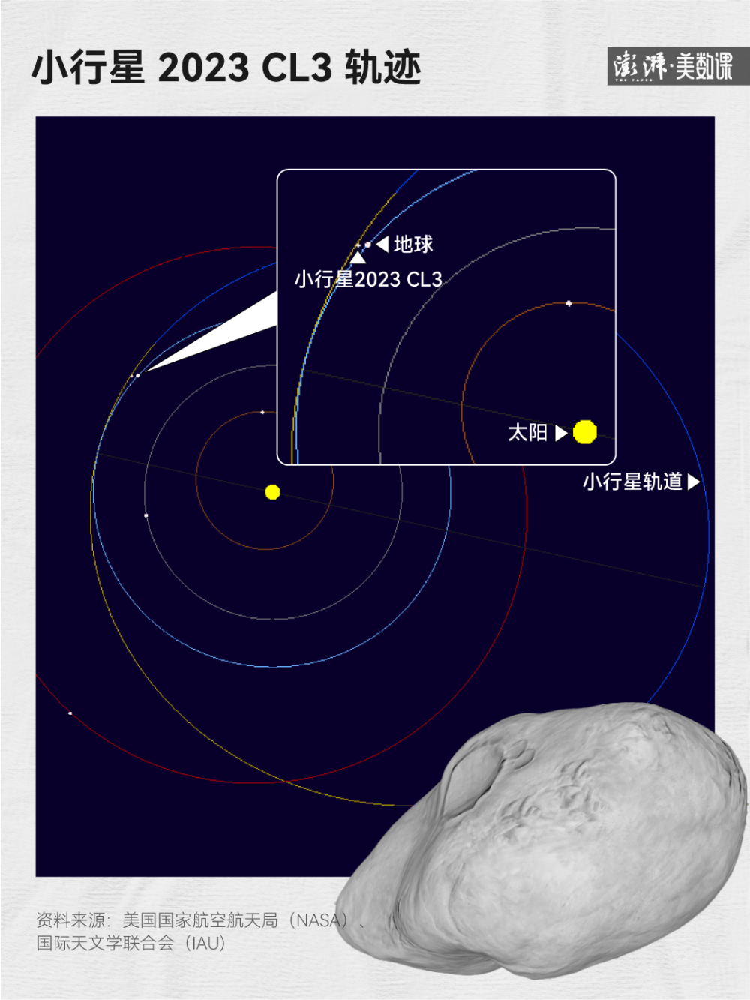

# NASA曾预警“潜在威胁”！今晚，小行星掠过地球上空

就在今晚，一颗名为 2023 CL3 的小行星从地球上空掠过。早先据美国国家航空航天局（NASA）的警告称，这是一颗“潜在威胁小行星”，它的直径 200
米，将于距离地球不到 724 万公里的地方掠过。

在很多人的印象中，小行星是浪漫的意象，是法国儿童文学短篇童话《小王子》中主人公生活的地方。不过真实宇宙中的小行星没那么浪漫，它们大多集中在火星和木星轨道之间，体积和质量都比行星小得多。

下图呈现了小行星 2023 CL3 在太阳系所在位置，或许能帮助你建立一点认知。

2023 CL3 是颗普通的“潜在威胁小行星”

提到小行星，人们比较关心的，是它会不会撞地球，以及如果撞击带来的危害会有多大。

其实，小行星是非常之多的，根据国际天文学联合会（IAU）的数据，仅人类观测到的近地小行星就有 32051 颗之多，2023 年至今已经发现了 1017
颗。但真正给人类带来巨大伤害的并不多见。天文界为了区分，用“潜在威胁小行星”（Potentially Hazardous
Asteroid）来定义真正需要人类关注，并具有威胁潜力的小行星星体。这次小行星 2023 CL3 受到关注，很大程度也是因为 NASA
将其判定为潜在威胁小行星。

**据悉，“潜在威胁小行星”需要满足两个条件：**

首先该小行星与地球的最小轨道交汇距离（MOID）为 0.05au（1au即 1 个天文单位，即日地距离，约1.5 亿公里）或更小；

其次绝对星等（H）为 22.0 或更小，绝对星等可以与星体的大小挂钩， **星等越小，星体越大** ，比如说：绝对星等 22 对应于 110-240
米的可能直径范围，绝对星等 21.5 对应于 130-300 米的可能直径范围。

但是“潜在威胁小行星”其实并不罕见，下图展示了 2023 年以来人类观测到的潜在威胁小行星情况，共计 31 颗。

根据 IAU 的换算，若 2023 CL3 直径在 200 米，对应星等为 22。在 5 月 24 日掠过地球时，它离地球还有 724 万公里，也就是
0.048au。普通人对这一距离仍是不太有概念的。但从上图来看，在潜在威胁小行星里，2023 CL3
是相对普通的一颗：其与地球的最小轨道交汇距离大，绝对星等大。简而言之，是颗距离远、个头小的潜在威胁小行星。

小行星大事件回顾，人类在未来会面临多大威胁？

不过地球也绝非风平浪静的港湾，马斯克就曾发推文表达自己的忧虑：“最终会有一块大石头撞击地球，我们目前没有任何防御措施”。下图展示了部分小行星大事件。

除了更精密地观测和记录小行星，人们还开始使用“行星防御”的方式，保护地球。

NASA 在 2022 年 9 月首次演示了这一技术，“双小行星重定向测试（DART）”航天器，成功撞击了小行星目标。该任务证明，NASA
可以使航天器故意与小行星相撞并使其轨道偏转，从而保护地球免受小行星或彗星撞击的风险。

