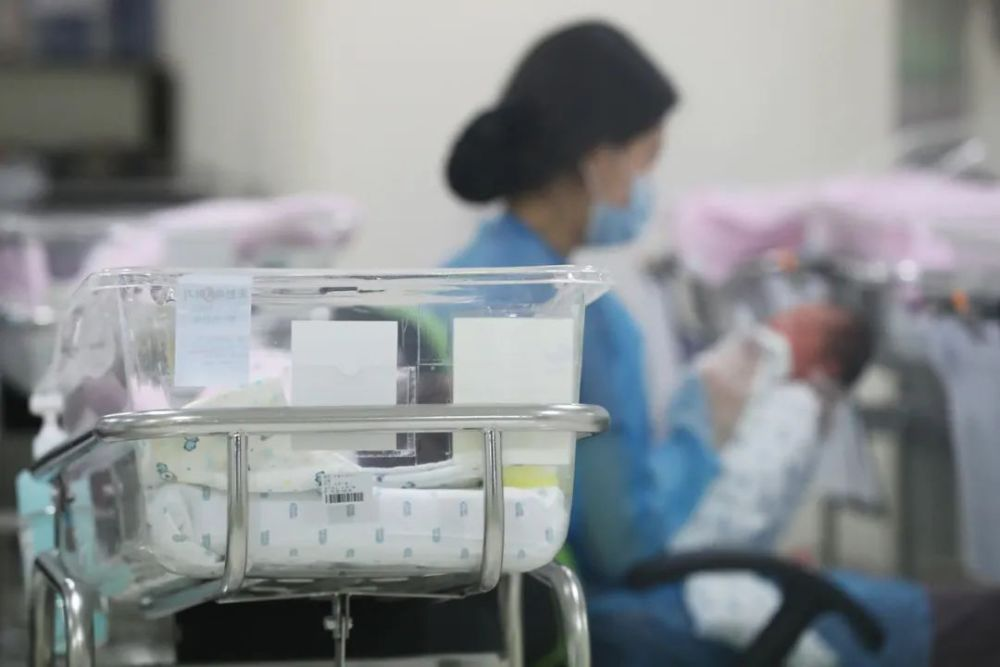

# 今年会有多少新生儿？产科一线：过去一天分娩七八个，现在几天一个

**根据今年已有的孕妇建档数据推算全年新出生人口不足800万？**

据《中国慈善家》报道，从多个基层医院了解到， **今年建档孕妇数量确实在下降，有医生表示建档数量减少了三分之一。**
为了争夺产妇资源，很多医院开始给产妇提供各种优惠服务。例如江西省一家知名妇幼医院特需病房床位打出5折优惠。

河南一家医院的妇产科医生表示，目前孕妇数量与前几年相比有了明显下降，
**“现在产检几乎不用排队，产科清静了很多。为了吸引更多孕妇，有的医院还提供免费接送。”**

对于低生育率，携程创始人、人口经济学家梁建章建议政府给有孩子尤其是多孩的家庭发钱，从而降低家庭的生育成本，帮助更多年轻人完成儿女双全的愿望。他建议补贴生育的财政支出至少应该占GDP的2%-5%，具体可能需要支出几万亿来补贴生育。

**有医院暂停产科助产服务**

**“过去一天分娩七八个，现在几天一个”**

据红星新闻报道，近日，红星资本局从全国多地妇幼保健院产科了解到，比起具体的产妇建档数据，更直观的感受是， **今年以来分娩量下降了。**
对于不少产房里的医生而言，新生儿的哭啼声变少，病床不再紧张，大家的工作也不像从前忙碌了。

_图片来源：视觉中国_

贵州省某县妇幼保健院一名妇产科医生介绍，今年该院的分娩量较同期下降了近30%，县城内三家公立医院的新生儿出生率都在降低，医护的薪资也受到影响。湖南省某三甲妇幼保健院的一名医护人员介绍，产科是该院的品牌，分娩量一直排名全省前列，但最近，产妇多到加床的情况已经较为少见。

**“过去（分娩量）可能一天七八个、十来个，现在几天一个，能一天一个就不错了。”**
黑龙江省哈尔滨市妇幼保健院的一名产科医生表示，医院今年的分娩量减少了一半以上，除生育观念和经济水平等因素，当地私立医院的分流也有影响。

此外，2023年5月7日，浙江省苍南县中医院的一则公告引发关注。公告称，根据医院学科发展规划，经研究决定，即日起暂停产科助产服务（产科门诊照常开放）。

**“分娩的数量很少，（继续）干就没有意义了，我们去年10月份就彻底停掉了。”**
苍南县中医院妇产科一名医护人员介绍，最近几年因分娩量下降，结合人员外调、退休等情况，妇产科员工的结构组成已经发生很大变化，业务也由以产科为主转向中西医结合的妇科，转变后业务量在慢慢回升。

**产妇年龄不断走高**

**“15个里只有3个是30岁以下”**

据《中国慈善家》，最近， **有消息称今年的产妇建档基本已经完成，大致可以根据建档情况估算出全年出生人数，结论是今年新出生人口不足800万。**

记者从多个基层医院了解到，今年建档孕妇数量确实在下降，广东某综合医院妇产科一位不愿意透露姓名的主任在接受采访时介绍说，这几年孕妇的数量明显减少，今年更为明显，“我所在的医院至少减少了三分之一”。

“疫情之前，时常能看到生三胎四胎家庭，现在就很少有生二胎三胎的，大部分来医院的都是生第一胎。”这位医生说，“实际上，不管一孩还是多孩的孕妇，都在减少。”

**除了孕妇的数量减少，孕妇年龄也在不断走高。**
据澎湃新闻，从业近30年，产科医生顾蔚蓉注意到近年来临床上的一个现象：伴随低生育率的出现，临床上高龄产妇（备注：年龄35岁以上）比例在明显增加，合并症的风险也在不断地增加，“这也是国内诸多大型产科医院面临的主要问题，对我们的接诊能力提出了更高的要求。”

顾蔚蓉是复旦大学附属妇产科医院产儿部主任，这家医院也是上海三家三甲产科专科医院之一。5月中旬的一天上午，在产科专家门诊中，顾蔚蓉总共服务了15名孕产妇，其中30岁以下的仅有3个，高龄产妇却有8个，最高年龄者达到40岁。

_图片来源：视觉中国_

“2016年为了应对生育高峰，我们医院临时增加了100张产科床位，但如今随着分娩人数的下降，床位不少空出来了，如今需要统筹合理安排，这种情况下就促使我们更好地去提高医疗服务，尽可能满足当前孕产妇的需求，为她们营造一个安全可靠的医疗环境。”顾蔚蓉说，而目前该院孕产妇中，除了初产妇外，约有近40%为经产妇，这部分人群以生二孩为主，真正生三孩的比例仍然很低。

顾蔚蓉进一步表示，在该院高龄产妇占比20-25%。而在2011年，这一比例大概在11%，这意味着10年来这个比例几乎翻了一番。

**首个发钱的城市依旧“生不动”**

**梁建章：补贴至少得几万亿**

为了鼓励生育，地方政府纷纷放出“大招”。2021年7月，四川省攀枝花市成为首个现金补贴二、三孩生育的城市。2022年3月底前，攀枝花已向全市兑现第一笔育儿补贴金，共计95万元，涉及650个家庭。

如今攀枝花的育儿补贴政策实施近两年，成效如何备受关注。“每个月（分娩量）一百七八十吧。”5月22日，攀枝花市某三甲专科医院一名产科医护人员向红星资本局介绍，今年以来该院产检数量和分娩量与往年接近。但红星新闻记者
**从该市各区（县）多家医院产科了解到，存在分娩量下降的情况。**

_图片来源：视觉中国_

西南财经大学教授、中国人口学会副会长杨成钢表示，政府拿出“真金白银”补贴，尽可能降低生育夫妇的育儿成本，体现了鼓励生育的积极态度。但必须承认，这些补贴相对于家庭的育儿成本来说，虽然不能说是“杯水车薪”，但恐怕也难以调动生育的积极性。

近日，携程创始人、人口经济学家梁建章在新书中建议补贴生育的财政支出至少应该占GDP的2%-5%，具体可能需要支出几万亿来补贴生育。

他表示具体的补贴生育措施应包括：一、现金补贴：对于二孩家庭的每个孩子，给予每月1000元的现金补贴；三孩以上（包括三孩）家庭的每个孩子，给予每月2000元的现金补贴，
**直至孩子到18岁或20岁。**
二、个税和社保减免：对于二孩家庭，实行个人所得税和社保减半，三孩以上家庭个人的所得税和社保全免。三、购房补贴，具体方式可以通过按揭利息返还或房价打折进行补贴。比如说补贴二孩家庭的房贷利息的50%，三孩以上家庭的房贷利息可全部补贴。

他表示， **向生育孩子的家庭发钱，既有利于降低青年人失业率，也有利于提升生育率。**
如果人口大幅度减少，竞争工作机会的人数固然会变少，可市场上的就业机会也会随之缩减，而且会因为更难实现匹配而加重就业困难，东北地区就是例子。

**编辑|** 王月龙杜恒峰

**校对|** 刘小英

每日经济新闻综合自红星新闻、中国慈善家、澎湃新闻、大河财立方

每日经济新闻

