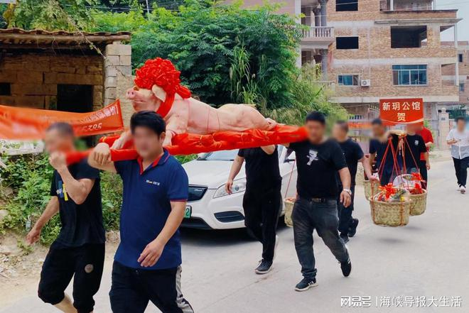

# 厦门楼市奇观：开发商买房送两头猪，打响拆迁户房票争夺战

本文来源：时代财经 作者：陈泽旋

_图片来源：图虫创意_

“恭喜郭先生，喜提特房新玥公馆”，在鞭炮声中，一支由12个人组成的贺喜队伍，抬着两头戴着大红花的猪，挑着扁担，浩浩荡荡地走进位于厦门市同安区的郭山村。

近日，厦门本土国企特房集团“买房送猪”的视频在当地走红，视频中，贺喜队伍将两头猪抬到了村民的家门口，大红板桌左右两侧的桌脚边，各摆着2个装满贺礼的箩筐，工作人员向村民道贺一声“恭喜发财”，随即拉响礼花炮，场面十分喜庆。

《海峡导报》援引现场一位工作人员的说法称，郭山村的村民最近在特房新玥公馆购买了16套商品房，而这是楼盘为了回馈客户而进行的一个活动。

_图片来源：海峡导报_

村民俨然成为支撑同安楼市的一股重要力量。5月中旬，同安的多个楼盘陆续传出成交喜报，卖得最好的楼盘一周成交了一个多亿，拆迁客户累计成交45套。

郭山村是同安第一个使用房票进行房屋征收补偿的整村搬迁项目，也是目前厦门房票规模最大的一个。4月底，厦门的第一张房票在翔安区开出，正式开启厦门拆迁户使用房票购房的时代，随后，各地的被征收人陆续拿到房票，郭山村的房票也在近期到位后开始进入楼市。

为了争夺客户，开发商们纷纷进村，各种营销手段轮番上阵，一场拆迁户争夺战正在打响。

**开发商进村抢房票**

“总价19X万，市属校旁，必买红盘”、“专属购房渠道，购房优势，直接低价”、“低密住境，学府洋房，环东大城”……在郭山村的街头巷尾，随处可见购房广告，一位村民告诉时代财经，开发商为了宣传自家楼盘，还租下了部分村民的楼房高处张贴墙体广告，甚至将购房咨询点开进了村里。

郭山村内三个拿到了房票的自然村，不大的面积却挤满了知名开发商，据时代财经不完全统计，目前，已有建发、远洋、保利、首开、中铁、厦门特发集团和火炬集团进村抢票，房产中介机构和房票中介也已闻风而来。

根据厦门市人民政府办公厅在去年12月发布的《集体土地上住宅房屋征收推行房票补偿的意见（试行）》，所谓房票补偿，是指在征收集体土地上的住宅房屋时，将房屋征收货币补偿金额、政策性奖励金额计入房票面值发放给被征收人，被征收人持房票购买房屋以实现补偿安置的方式，是货币补偿的一种补充方式。

郭山村是目前厦门被征收人数最多的地方，涉及郭山村后狮尾里、新厝里、前院里等3个自然村，一共1217人。

不仅人数多，补偿金额也十分可观。5月上旬，一张关于房票补偿计算细则的图片在网络上流传，细则显示，拥有房屋产权面积270平方米的被征收人，如果选择全房票补偿，可获得的房票补偿金额和房票政策性奖励金额（二者合称“房票补偿金额”）一共610.5万元，在满足条件的情况下，被征收人还可拿到将近150.9万元的现金补偿金额，总补偿金额合计761.4万元。一位村民向时代财经确认了该细则的真实性，并表示，“这次补偿款（的金额）实际上是有房户761.4万元，无房户500多万元”。

房票的使用期限是24个月，自房票核发之日起12个月内使用房票购房，持票者可获得使用面值5%的奖励，在第13个月至24个月使用的，则可获得使用面值2%的奖励，而未在期限内使用房票的，在扣除房票奖励后可兑换成现金。

“开发商挨家挨户地上门推销”，为了在有限的时间内把村民吸引到售楼处，开发商各种营销手段轮番上阵，除了免费专车接送、送礼、抽奖和购房折扣等常规方法，“甚至有银行跟开发商合作，说是买某家开发商的房子且在这家银行存款的话，可以享受高的存款利率，一些开发商还利用老人喜欢热闹的抱团心理，用组团买房更优惠（的方法）来说服一些关系比较好的老人”，村民说道。

村民不仅是开发商争夺的对象，由于房票允许分割金额转让给他人（注：已转让的房票不得再次转让），房票中介也涌向了郭山村，一个关于房票的转让市场正在厦门萌芽。时代财经以购票人的名义咨询了不同的房票中介，目前100万元面值的房票市场价格大多为101万元，购买人同时需要支付大约1个点的中介费用，即便如此，购买人在12个月内持房票买房时，100万元的面值依然可以享受3%的奖励。

在房票的推动下，5月中旬，同安的多个楼盘陆续传出成交喜报。其中，中铁诺德逸都单周卖了一个多亿，拆迁客户累计成交45套，拆迁客户还买了21套特房樾鸣湾、7套保利天汇和6套首开九珑岸，以及一天之内，在建发文澜春晓下单了5套房。

**拆迁户拯救岛外楼市？**

“同安现在的楼盘都是拆迁户在排队砸金蛋”，一位中介如是表示，她继而补充道，由于现在是房票购房的起步阶段，数量有限，并未明显感觉到房票带火了楼市。

中原地产厦门研究院的数据显示，截至2023年3月底，厦门一手住宅可售存量面积达到287.7万平方米，根据近一年月均销量16.5万平方米计算，库存量需要17个月才可消化完毕。如果算上待推存量和地块存量，全市一手住宅总存量高达602.2万平方米，按照近3年均267.3万平方米的去化速度计算，去化周期约2.3年。

在所有区域之中，尤属同安的库存量最高，其可售存量面积为100.6万平方米，去化周期为25个月，总存量高达238.2万平方米，去化周期长达4.1年。

为了尽快卖掉房子，开发商已经将目光锁定到潜在的拆迁户身上。近期，同安多个楼盘纷纷推出无理由退换房政策，以中铁诺德逸都为例，该楼盘向潜在拆迁户承诺，只要缴纳定金，除了可以享受拆迁户的各种优惠政策，还可将房源锁定至9月30日，如果政策明确不拆迁，潜在拆迁户可选择无理由退定金或特殊延期。

根据《集体土地上住宅房屋征收推行房票补偿的意见（试行）》，房票补偿政策的实施范围是厦门岛外，包括集美、海沧、同安和翔安四区，持票者只可在征收项目辖区范围内买房，也就是同安的房票只适用于同安，而翔安的房票只适用于翔安。

由于岛外四区正处于开发阶段，这里也将涉及体量庞大的土地征收规模。根据克而瑞福建区域的统计，近期，厦门市自然资源和规划局发布了岛外四区的土地征收公告，涉及超过40个村社，而随着征收的推进，未来将会有更多的房票涌向楼市。

“近年来，厦门楼市处于岛内外冷热分化的局面，岛内新房吸金能力依然强劲，岛外楼市则普遍走量艰难，对于岛外四区楼市是非常有效的去库存手段，流动性的增加，对于整体楼市的活跃度提升也有一定程度的助益”，克而瑞福建区域研究经理莫端分析道。

在厦门，房地产行业习惯将厦门分为岛内、岛外两个市场，岛内包含湖里和思明二区，其中，思明是厦门的老城区，而湖里则是厦门特区的发祥地，这里既是厦门经济最好，也是最早发展起来的地方。

截至3月底，厦门岛内一手住宅可售存量面积为51.1万平方米，去化周期为12个月，若扣除去化较慢的两大顶豪项目帝景苑和云顶至尊的影响，厦门岛内的去化周期仅需9个月，而厦门岛外四区可售存量面积合计236.6万平方米，各区的去化周期介于11个月至25个月之间。

不过，莫端继而指出，对同安房票购房客户分析的结果显示，这类客户的购房喜爱比较明显，即偏爱地段、资源、配套及产品优势突出的项目，“在房票只能在本区域内消化的前提下，房票将会保证岛外部分板块的有效库存去化，且会愈发偏向综合资源集中的楼盘项目，现点状回暖，但是对于整体楼市形势的提振或者扭转仍非根本举措”。

根据克而瑞福建区域，5月1日至21日，厦门一手住宅成交15.16万平方米，周均成交面积为5.36万平方米，对比4月周均下跌5.78%。4月，厦门一手住宅成交22.99万平方米，环比下跌27.39%。

“当前厦门楼市的主要问题仍在刚需客户信心上的不足，出手更为谨慎，再加上市场以价换量盛行，‘买涨不买跌’的心态也拉长了购房周期，预计未来厦门楼市仍将有一段盘整期”，莫端表示。

