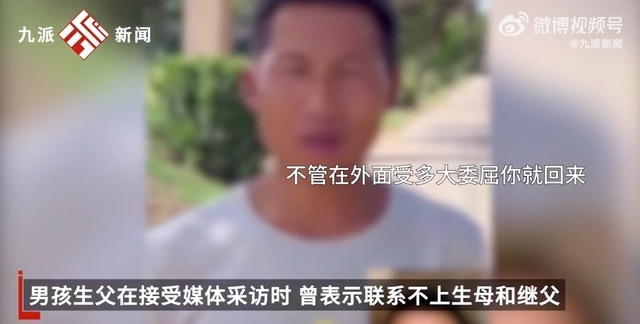
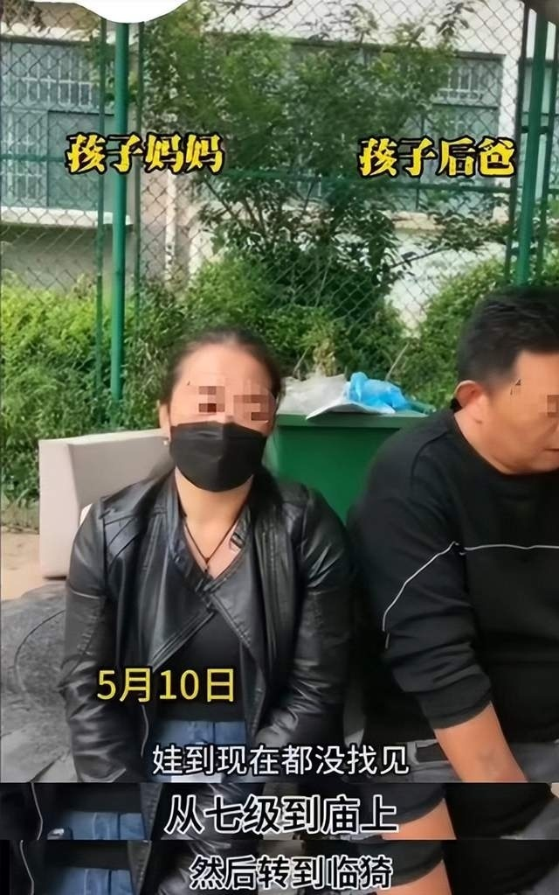
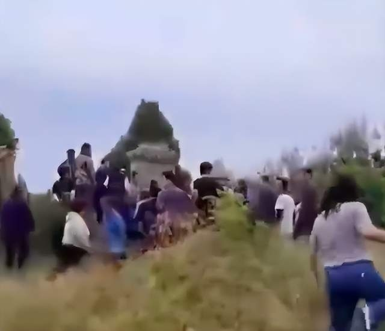
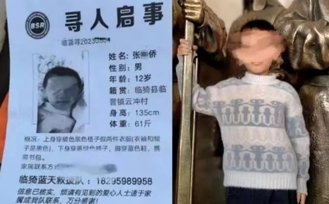
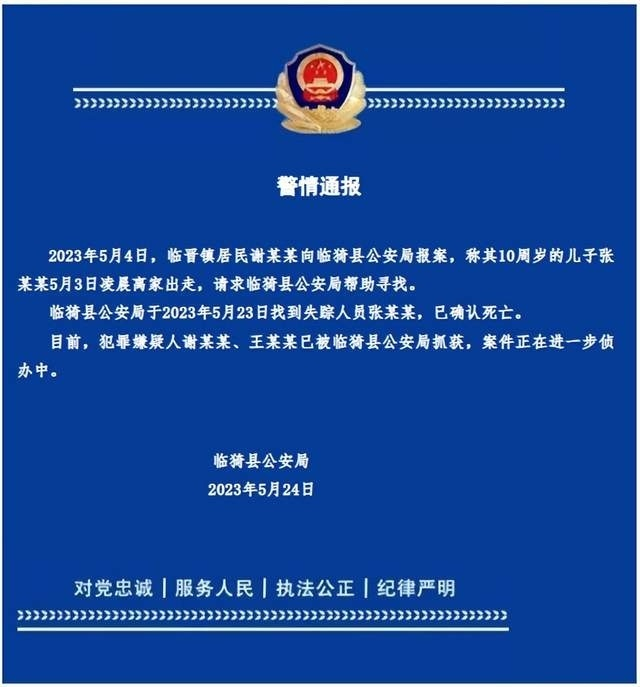

# 山西10岁男孩疑被生母和继父杀害，两人曾在网上流泪拍摄寻子视频

5月24日，山西运城临猗县公安局通报失踪20天男孩张某某已确认身亡。据新京报报道，谢某某、王某某分别是身亡男孩的生母、继父。

男孩生父在接受媒体采访时，曾表示联系不上生母和继父。他在视频中曾对孩子喊话：“不管在外面受多大委屈，你就回来。爸爸再也不会让你去人家屋里了，就回咱屋了。”

有网传视频显示，孩子生母及继父曾经在网上发视频哭诉着寻找孩子。

继父在视频中还表示，“我是后爸，澄清不了。现在只有把娃找出来，这是对我最大的澄清。”

另据知情者介绍，男孩被生母和继父埋在他人坟墓里。“在陵园把孩子埋了，他们是把孩子埋在了别人的坟里。”

据封面新闻报道，孩子生父张先生介绍，自己前几年与谢某某离婚后，小儿子张某某一直跟随她生活，户口也迁到了前妻的户籍所在地临晋镇云冲村，“孩子失踪的那个村子，是他妈妈现任老公的家，家里平时好像也只有他们三个人居住。”

张先生从当地公安部门调取的监控中了解到，4月28日下午，张某某在临晋镇上与谢某某分开后，独自打车回到下豆氏村，“村口的监控记录下了孩子下车并往家里走的画面，这也是孩子到目前为止最后的影像。”

5月24日，山西临猗县公安局通报：5月4日，临晋镇居民谢某某向临猗县公安局报案，称其10周岁的儿子张某某5月3日凌晨离家出走，请求临猗县公安局帮助寻找。临猗县公安局于2023年5月23日找到失踪人员张某某，已确认死亡。目前，犯罪嫌疑人谢某某、王某某已被临猗县公安局抓获，案件正在进一步侦办中。

**【来源：九派新闻综合九派新闻视频、时间视频、新京报、橙柿新闻、封面新闻、临猗县公安局】**

