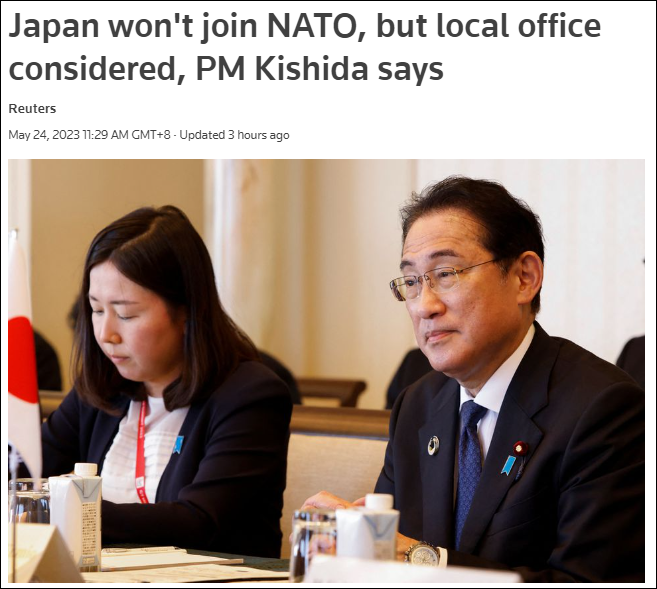
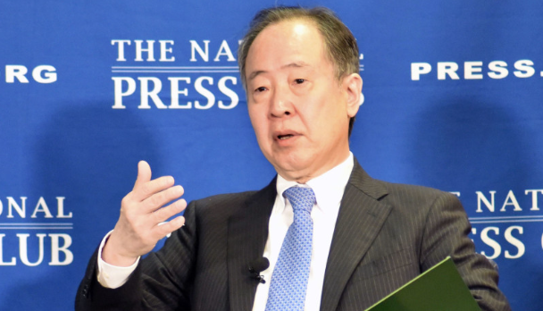

# 日本首相岸田文雄：不计划加入北约，但北约有意在日开设联络处

（观察者网讯）据路透社报道，日本首相岸田文雄5月24日表示，日本没有成为北约成员国的计划，但他承认北约计划在日本开设联络处。

_路透社：日本首相岸田承认北约计划开设联络处，但否认将加入北约_

岸田当天在日本国会会议上被问及相关话题时说：“我不知道北约就设立该联络处做出了任何决定。”他补充道，日本不计划以正式成员或半正式成员的身份加入北约。

近段时间，北约和日本官员频繁就设立联络处一事发声。

在岸田文雄发表上述言论之前，日本驻美大使富田浩司9日在华盛顿召开记者会透露，北约正在讨论在日本开设联络处。富田说，“尚未听说此事得到最后确认”，但“正朝着这一方向展开工作”。富田没有透露开设的时间和地点。若计划落地，这将是北约在亚洲设立的首个办事处。

日本外相林芳正10日在接受美媒专访时确认，日本正在与北约就设立亚洲首个联络处进行磋商。“我们已经在讨论，但是细节尚未完善......这不是针对某些国家。”

据共同社报道，北约前秘书长拉斯穆森15日同样表示，北约正考虑在日本设立联络办事处，并称这是“自然发展”的结果。他称虽然此事并非自己的工作，但确实“接触到这一消息”。

_5月9日，日本驻美大使富田在华盛顿接受记者提问/共同社图_

另据塔斯社报道，俄罗斯外交部发言人扎哈罗娃10日在记者会上表示，北约谋划在日本开设联络处，表明北约打算继续加剧亚太地区的军事化，并加剧集团对峙。

“北约在日本首都开设联络处的意图，是北约的全球野心和计划在亚太地区认真巩固其地位的又一个证明，目的是散布以北约为中心的反俄和反华模式。”她说，“我们相信，北约在亚洲的扩张将加剧该地区的军事化，并加剧集团之间的对峙。”

中国外交部发言人汪文斌在12日的例行记者会上表示，北约多次公开表示，北约作为区域性联盟的定位没有变化，不寻求地理突破，亚太地区不是北大西洋地理范畴，也不需要建立“亚太版北约”，但北约却不断强化同亚太国家关系，执着东进亚太干预地区事务，挑动阵营对抗，到底意欲何为？这已经引起国际社会，特别是亚太地区国家的高度警觉，希望有关方面不要因谋求所谓地缘利益而破坏地区的和平稳定。

汪文斌指出，外界也很关注，日本是否真的要充当“北约亚太化”的“急先锋”。亚洲是和平稳定的高地，合作发展的热土，不应成为地缘争夺的决斗场。由于近代军国主义侵略那段历史，日本的军事安全动向一直备受亚洲邻国和国际社会关注。我们敦促日方认真汲取历史教训，坚持走和平发展道路，不要做破坏地区国家间相互信任，损害地区和平稳定的事。

**本文系观察者网独家稿件，未经授权，不得转载。**

