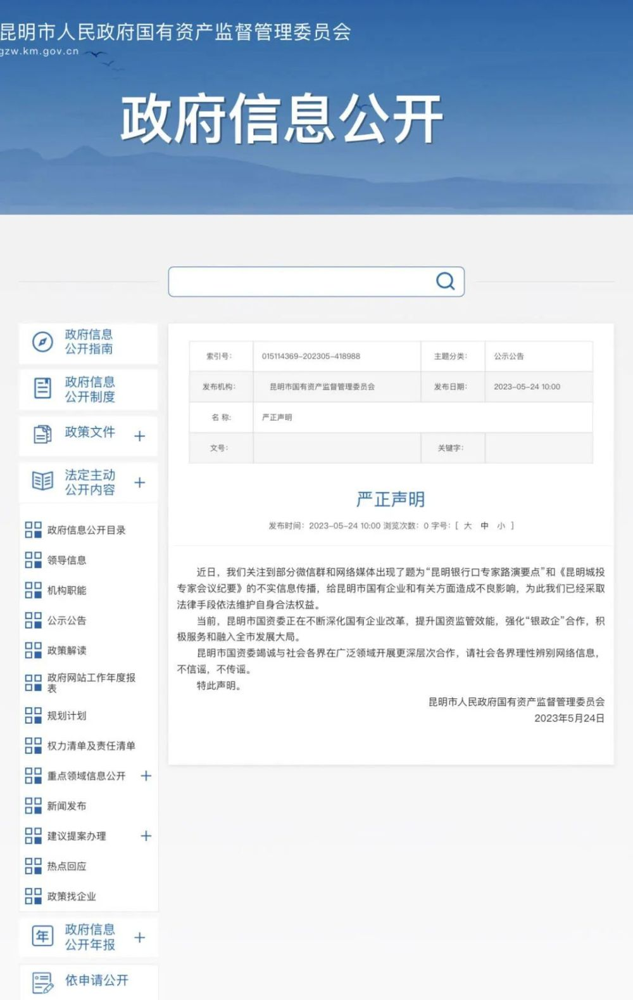

# 昆明国资委辟谣“城投专家会议纪要”：已采取法律手段维护权益

_昆明国资官方微博截图↑_

**严正声明**

近日，我们关注到部分微信群和网络媒体出现了题为“昆明银行口专家路演要点”和《昆明城投专家会议纪要》的不实信息传播，给昆明市国有企业和有关方面造成不良影响，为此我们已经采取法律手段依法维护自身合法权益。

当前，昆明市国资委正在不断深化国有企业改革，提升国资监管效能，强化“银政企”合作，积极服务和融入全市发展大局。

昆明市国资委竭诚与社会各界在广泛领域开展更深层次合作，请社会各界理性辨别网络信息，不信谣，不传谣。

特此声明。

昆明市人民政府国有资产监督管理委员会

2023年5月24日

_昆明市人民政府国有资产监督管理委员会网站截图↑_

来源：昆明市人民政府国有资产监督管理委员会

编辑：毕群

编审：符亚丽

终审：周健军

相关阅读

“昆明城投专家纪要”：市级资金非常紧张，平台贷款展期非标逾期

