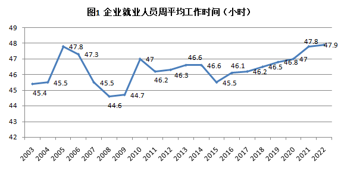
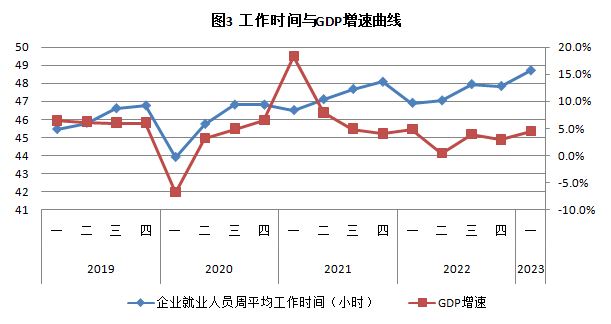

# 每周工作时间有多长？统计：近两月正刷新二十年历史记录

近日，国家统计局公布4月全国企业就业人员周平均工作时间为48.8小时，较3月的48.7小时增加0.1小时。至此，2023年4月刷新该指标自统计以来的最高记录。

工作与生活需存有一定的张力，工作时间长短会影响个人和家庭生活。同时，单从经济学角度看，工作时间也并非越长越好，毕竟劳动者的劳动能力也需要时间进行恢复和更新。

因此，工作时间是反映人们工作状态、“体面劳动”（decent
work）的重要指征。澎湃研究所研究员收集、整理近20年全国企业就业人员周平均工作时间数据，并结合就业指标、经济指标展开分析，发现以下特征：

**（1）2022年周平均工作时间为20年最长**

可查的企业就业人员周平均工作时间的年度数据，最早可至2003年。20年来，人们每周平均工作时间有所波动，具体可分为以下三个阶段。

第一阶段是2007年以前。彼时经济增长强劲，且劳动环境待规范，常有超时劳动的情况。2005年、2006年的就业人员周平均工作时间均超过47小时。

第二阶段是2007年至2016年。2007年，《劳动合同法》颁布，并于2008年开始实施。这一法律有助于规范劳动关系与劳动时间、加班管理，抑制过劳等。

如图1所示，2007年至2009年，工作时间较此前高位迅速下降。2008年企业就业人员周平均工作时间为44.6小时，为历史最低。但其后，市场上开始产生规避劳动法律的方法，《劳动合同法》的效益边际递减，工作时间回升到较高水平。

第三阶段是2017年至今。从2017年、2018年开始，城镇劳动力调查方法和统计口径得以优化，逐步建立了定期统计、发布机制。其中包括企业就业人员周平均工作时间。

近20年来，相关部门对工作时间的统计不断优化。尽管统计标准不全然一致，但总体对比看，2022年的就业人员周平均工作时间是20年中最长的，超过2008年《劳动合同法》实施之前时期工作时间的最高值。

如图1所示，2015年以来，就业人员周平均工作时间呈逐步增长的态势，从45.5小时增至2019年的47.9小时。2021年、2022年，在岗劳动者的周平均工作时间依旧呈持续增长的态势。2023年3月、4月连续刷新统计记录，很大程度上是以往数年增长趋势的延续。

**（2）工作时间长已成常态，2021年至今多位于历史高位**

我国《劳动合同法》第三十六条规定，“平均每周工作时间不超过四十四小时”。按此规定，我国劳动者超时工作已成常态。特别是2021年、2022年至今，工作时间处于历史高位，超时长、高强度工作更为普遍，这与近年“内卷”成为热词的现象有所呼应。

如图2所示，过去4年间，除了2020年初因全国性的疫情防控原因，工作时间大幅缩短外，其他时段的周平均工作时间都位于较高水平。

值得注意的是，工作时长与就业市场景气程度相关度并不高。

按照常理，工作时间一定程度与失业率正相关。从劳资市场博弈角度看，如果失业率高，说明就业市场劳方力量弱，工作时间可能较长；失业率低，说明就业市场劳方更占优势，会适度减少超量工作时间。但从近五年看，无论调查失业率如何波动、或高或低，工作时间仍位于高位。

可能的原因或有两点：

一是在此期间失业率暂时降低，并不意味失业风险减少，就业市场整体仍处于不利于劳方的情势。

二是资方更占优势的劳动关系格局已较为稳固，对员工工作时长的主导权力较强。在此情况下，如果资方盈利能力或盈利预期下降，将更加倾向于利用劳资关系中的主导权力，拉长现有员工的工作时间以开展生产，而非扩充员工规模、增加人工投入。

**（3）工作时间投入与GDP增速不完全相关**

有观点认为，工作时间长是经济回暖的表征，特别是在经济复苏时期。从数据上看，两者不完全有相关性。

如图3显示，2019、2020年工作时间与GDP增速（经济活跃度）曲线基本同频变动。这说明，劳动力付出越多，经济越活跃，劳动者付出对经济的带动作用是存在的。

但2021年以后，两者的变动相关性变弱。2021年下半年，劳动者工作时间一路攀升，但经济增长却放缓。说明工作时间投入对经济的带动作用减弱，经济的活跃、增长更有赖于其他因素。

对微观市场主体企业来说，其人员工作时间长，并不一定是业务营收高，也有可能增加人力投入拓展新业务，而成效则是另一回事。

事实上，官方统计的“企业就业人员周平均工作时间”尚不能完全反映现实。毕竟，上述指标统计的是平均值，不能体现一些极端情形。

比如一些行业有超长时间工作的惯制，如“996”乃至“007”；一些加工制造业员工往往基础工资较低、加班工资为收入主要来源；以及灵活就业者在计件制下的“主动”过劳工作等等。这些领域从业者的超长时间现象，亟需更多关注。

当下，“过劳”报道并不鲜见，对“内卷”、加班的讨论在社交媒体上可谓滔滔不绝。工作时间，既是经济，也关涉民生。无论站在宏观经济角度、还是从微观企业看，工作时间（工作投入）与经济效益其实并不冲突，其中关键在于经济运转效率。如何提高效率，从而使工作时间维持在更宜人的区间，将有助于塑造更为健康、持久的经济。

——————

城市因集聚而诞生。

一座城市的公共政策、人居环境、习俗风气塑造了市民生活的底色。

**澎湃城市观察** ，聚焦公共政策，回应大众关切，探讨城市议题。

