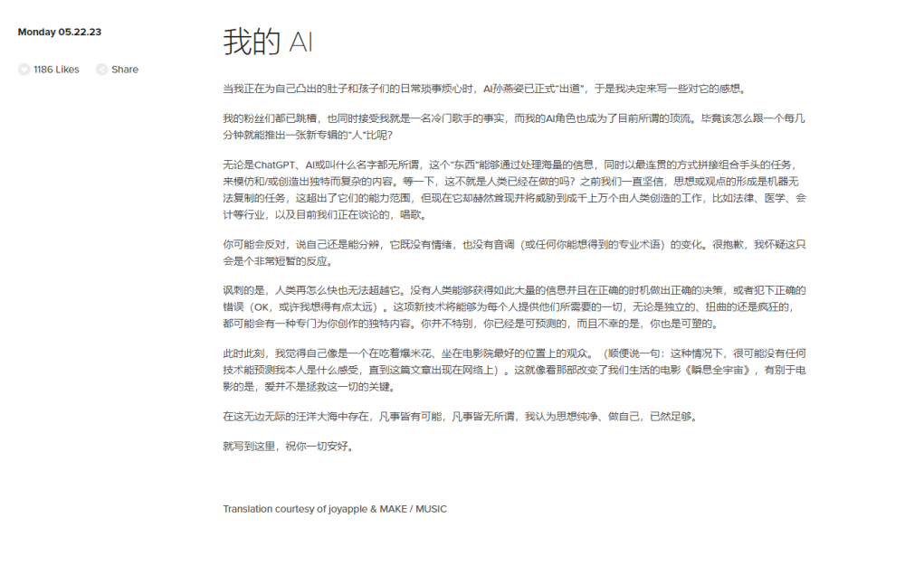

# 第一个被AI替代的，居然是孙燕姿｜深网

_来源：视觉中国_

作者｜叶蓁

编辑｜康晓

出品｜深网·小满工作室

很多年后，当我们回顾“AI孙燕姿”事件时，或许会将其作为AIGC社会伦理问题大争论的开端。

近期，在B站、抖音等网络平台，“AI孙燕姿”被推上热搜成为新晋顶流。“AI孙燕姿”就是用孙燕姿的声音合成的AI歌曲。今年，众多用户使用一款基于AI的学唱软件Sovits4.0模型，生成了大量孙燕姿音色的歌曲，包括《发如雪》《好汉歌》等，使得“AI孙燕姿”火遍全网。

“我一个冷门歌手，争不过AI。你跟一个每几分钟就推出一张新专辑的‘人’还有什么好争的。”5月22日晚，孙燕姿发文公开回应“AI孙燕姿”。该回应引发了大量网友和孙燕姿歌迷对AI技术及声音合成工具的质疑。

争议之下，一些百万播放的UP主已经删除了合成的歌曲。

“AI孙燕姿涉嫌侵权。”北京市中闻律师事务所合伙人刘彬告诉《深网》，包括姓名权和肖像权的侵权，而以营利为目的、擅自使用他人歌曲做训练的行为，涉嫌侵犯著作权。

侵权之外，更值得担忧的问题是，人类的艺术创造力未来会不会逐渐被AI取代？

“艺术是人类情感和思想的一种表达方式，由AI来创作，就失去了作品中人性的元素，这会引发关于什么是艺术以及艺术的价值和意义的深层次讨论。”DCCI互联网研究院院长刘兴亮对《深网》指出。

火花音悦音乐总监、联合创始人yocho告诉《深网》，AI不会威胁到歌手的职业，“AI孙燕姿”让孙燕姿失业的担忧毫无可能。

“如果孙燕姿不存在，‘AI孙燕姿’就不存在。目前的音乐生成模型，无论是AIGC，还是MusicLM，都是基于已有的音乐段落去进行分析和整理的。”yocho表示。

**“AI孙燕姿”火了 孙燕姿怎么办**

孙燕姿，出道已有20多年，凭借《天黑黑》《我怀念的》《遇见》等歌曲成为90后的“青春记忆”。去年，孙燕姿成为2022年抖音第一场隆重推出的“线上演唱会”的合作歌手，这场演唱会吸引了2.4亿人次观看。

近两个多月，不仅仅是“AI孙燕姿”，借由AI，“AI周杰伦”、“AI陈奕迅”和“AI伍佰”等歌手纷纷在网络上“复出”。孙燕姿因其独特的音质成为佼佼者，每天都有十多首歌曲“出炉”。也有粉丝调侃，“孙燕姿不营业，粉丝就替孙燕姿营业。”

B站上一位“AI孙燕姿”作品的创作者介绍，他们的作品使用的是AI音色替换技术(Sovits4.0），其来源为so-vits-
svc模型，一款由中国歌声合成爱好者开发的AI语音转换项目，可从面向开源及私有软件项目的托管平台GitHub上获得。

据悉，相较于以往VITS、soft-vc、VISinger2等项目，So-
vits的使用大大简化，仅凭数段音频，就可用一个生成式模型来合成目标音色的音频，训练出用户想要的声学模型。这个模型可以保留音高和音调，也可以用不同的语言来翻唱。

该创作者介绍，“‘AI孙燕姿’需要提前处理好孙燕姿的唱歌素材，而后提取声音、音频切断，形成音频数据集，而后就可以训练出一个相对完善的模型。”因此，“AI孙燕姿”的门槛并不高。

**训练一个“AI孙燕姿”声音模型，再加上算力的成本，起步是两百元左右。**

此外，平台也在为“AI歌手”推波助澜。4月28日至6月24日，B站音乐区推出“虚拟之声创作计划”，up主可选择话题“AI虚拟之声实验室”投稿，平台将给予优质稿件提供流量扶持和活动奖励。目前，该活动已经有1亿浏览，超34万次讨论。

值得关注的是，在AI孙燕姿走红之前，So-vits-
svc已经停止更新，该模型的开发者已将该项目从源代码托管服务平台Github上删库。该开发者团队声明：项目是一个开源、离线的项目，所有基于项目训练的AI模型和合成的音频，与项目的成员和贡献者无关。

早在2007年，虚拟歌手初音未来诞生，后来“二次元形象+语音合成引擎”的虚拟歌手层出不穷，包括B站的洛天依、乐华的虚拟艺人女团EOE和虚拟艺人男团量子少年。

目前AI对于音乐行业的介入除了AI翻唱外，还有AI音乐制作。

今年3月，台湾歌手陈珊妮发布新歌《教我如何做你的爱人》，一周后，陈珊妮发表长文阐述，她的新歌是由“AI模型”演唱的，单曲封面也是
AIGC生成。在歌曲制作过程中，陈珊妮为调教AI演唱做投入的工作量远高于她亲自演唱。

Yocho认为，“AI会解放音乐行业一部分反复拧螺丝的工种，但对歌手来说，不会威胁到歌手本身的职业，对他们来说反而是一件好事，会解放他们的劳动力，使得他们更加专注于创作。”

一位音乐公司的中层管理人士表示，AIGC已经对他所在公司的运营产生了很大影响，他们功能音乐制作的团队成员，被要求集体学习使用AI，因不会使用AI而无法提高效率的成员，失业的风险比较大。

“AI帮助音乐工业制作解决了很多问题，第一，当歌手的声音不符合预期，或者歌手没有档期，就可以用AI生成；还有配唱制作人要去编配一些和声，也可以通过AI去解决，提高了效率也降低了成本。”yocho告诉《深网》。yocho是一位跨界Hip-
hop、电子与华语流行的音乐人，也是中国多档综艺合作音乐人和初音未来指定合作音乐人。

中国传媒大学音乐与录音艺术学院教授佟雪娜表示，AI技术的出现，就像当年出现的数字音乐一样，确实对音乐产业造成了一定的冲击，其是对传统唱片工业造成了很大的影响。音乐产业走到今天，都是技术引领着向前发展的，虽然给传统的唱片工业带来冲击，但是应该以包容的态度来看待技术的发展，它既带来挑战，但更多的是机遇。

不可忽视的一点是，音乐不仅仅是声音，还包含了人的情感、创造力、个性特征，甚至是歌手自身的人生经历等，这些都是目前的AI技术难以完全复制的。

**AI创作引发的法律和伦理问题**

新晋顶流“AI孙燕姿”火爆出圈的背后，也惹来诸多争议。

《著作权法》第24条对版权“合理使用”进行了规定，免费表演已经发表的作品，且该表演未向公众收取费用，也未向表演者支付报酬，且不以营利为目的，构成合理使用，无需取得著作权人许可及支付报酬。

北京市中闻律师事务所合伙人刘彬认为，尽管如此，借助于AI技术模拟孙燕姿的声音，演唱其他歌手的歌曲，并发布在网络上，很难说明其不以营利为目的，难以构成合理使用。同样，也不属于《著作权法》第23条规定的法定许可范畴。因此，该行为涉嫌侵犯了演唱者和词曲作者的著作权。

刘彬还指出，《民法典》第1023条规定，对自然人声音的保护，参照适用肖像权保护的有关规定。声音是人身属性，特定人的、有辨识度的声音具有相应的商业价值。孙燕姿的声音具有一定特点，未经其许可擅自使用其声音，涉嫌侵害了孙燕姿的声音权益。

此外，在刘彬看来，“AI孙燕姿”在网络上发布其“翻唱”的歌曲，使其不当获取了本不应属于其的点击量（流量），涉嫌构成不正当竞争。

DCCI互联网研究院院长刘兴亮认为，AI伦理问题主要有以下四个方面：第一个是创作权的问题，AI模拟孙燕姿创作了一首歌，那么这首歌的版权是孙燕姿还是AI的开发者；第二，AI模仿了孙燕姿的声音和风格，是否侵犯了孙燕姿的知识产权；第三,责任问题。如果AI创作的音乐导致了法律问题，例如诽谤或者侮辱，责任应当由谁来承担；第四、艺术由AI来创作，就失去了作品中人性的元素。

值得注意的是，AI技术引发的社会问题正在不断加剧。

今日，国内AI企业科大讯飞股价午后意外下跌8.82%，对此，科大讯飞回应表示，“股价下跌系某生成式AI写作虚假小作文导致，谣传风险为不实消息。”据悉，有人利用AI工具写了一篇“科大讯飞出现重大风险的警示文”，该消息流出后引发广泛关注。

中国互联网协会官微发文称，今年以来，ChatGPT等技术的应用，成为了信息科技领域的热点，引起公众对AI技术的广泛关注和热情，但伴随着深度合成技术的开放开源，深度合成产品和服务逐渐增多，利用“AI换脸”“AI换声”等虚假音视频，进行诈骗、诽谤的违法行为屡见不鲜。

“ChatGPT大火后，AI进入到了人们的日常工作生活中，但很多新问题值得探讨。在法律还没有定性之前，我建议在使用AI技术时应注意边界，避免侵害他人的合法权益，坚守道德的底线。”律师刘彬认为。

_孙燕姿回应全文，图源：孙燕姿个人博客_

