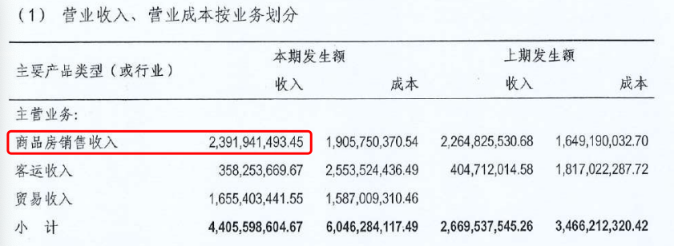
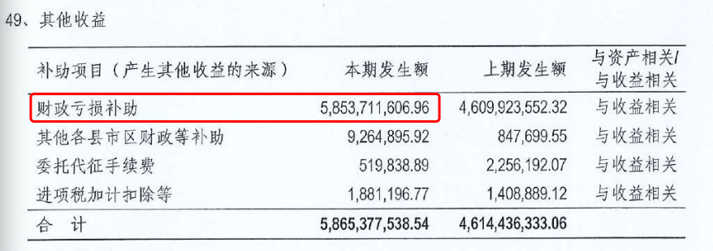

# “孤岛”地铁站背后：宁波轨交靠卖房一年收入近24亿

中新经纬5月25日电 (薛宇飞)近日，宁波市投资约2亿元建设的3号地铁线一地铁站乘客寥寥，利用率不高成“孤岛”的事件，引起外界关注。

宁波市轨道交通集团有限公司(下称宁波轨道交通)有关负责人称，由于地铁站建在基本农田里，周边规划的商住项目没建起来，而且，连接住宅小区的道路也涉及占有农田，导致客流量偏少。

建设轨道交通或者地铁，由于投资大、回报周期长，一些城市的轨道交通或地铁公司面临亏损运营。那些能够盈利的公司，多数都是依靠地铁沿线商品房销售赚取不菲收入，宁波轨道交通便是如此，去年该公司商品房销售达到了近24亿元。

**8条线路在建投资成本超8亿元/公里**

中国城市轨道交通协会发布的《城市轨道交通2022年度统计和分析报告》(下称报告)显示，2022年中国内地城轨交通运营线路规模迈进1万公里大关，达10287.45公里，运营线路308条，运营城市达到55个。轨道交通在已开通城市的作用越来越大，报告显示，去年城轨交通客运量占公共交通客运总量的分担比率为45.82%。

公开资料显示，宁波市已开通1号、2号、3号、4号、5号轨道交通或地铁线路，运营总里程186公里，排在上述55个城市中的第18位。根据建设计划，2023年，宁波轨道交通将加快推进6、7、8号线及市域铁路象山线、慈溪线，3号线二期，1、4号线延伸段等建设，迎来“八线并进”的建设新局面。

报告称，2022年宁波轨交客运量为25656.28万人次，日均客运量70.29万人次，线网最高日客运量33.85万人次。对比其他城市，杭州去年日均客运量为272.99万人次，南宁、合肥分别为74.89万人次、72.76万人次。

修建地铁可以说是“烧钱”的工程，每公里的费用都在数亿元甚至更高。根据《宁波市城市快速轨道交通建设规划(2013—2020年)》，当时计划修建5条线路，总里程100.1公里，总投资640.4亿元。照此计算，当时轨道交通的平均投资成本约6.40亿元/公里。

_来源：《宁波市城市轨道交通第三期建设规划(2021—2026年)》_

根据国家发改委2020年12月批复的《宁波市城市轨道交通第三期建设规划(2021—2026年)》，该市在这5年间，规划建设6号线一期、7号线、8号线一期、1号线西延、4号线延伸等5个项目，总里程约106.5公里，估算总投资875.9亿元。
**照此计算，宁波近几年轨道交通的平均投资成本约为8.22亿元/公里，较6.40亿元/公里增长28.44%。**

对比杭州，根据《杭州市城市轨道交通第三期建设规划(2017—2022
年)》，当时计划建设10个项目，总长度196.1公里，项目总投资为1426.36亿元。以此计算，杭州轨道交通的平均投资成本约为7.27亿元/公里。之后，国家发改委又同意上述规划中部分线路的建设及投资进行调整。

**名下多家地产公司去年商品房销售收入24亿**

根据前述报告，2022年，全国城轨交通平均每车公里运营收入11.24元，平均每人次公里运营收入0.73元；平均每车公里运营成本23.49元，平均每人次公里运营成本1.49元。也就是说，轨交或地铁公司的运营收入难以覆盖运营成本，因此，国内一些城市的轨交或地铁公司处于亏损运营状态。

能够盈利的轨交或地铁公司，较为依赖另外两种收入：一是政府财政补贴，二是开发地铁沿线土地获得卖房收入。比如，2022年，北京市基础设施投资有限公司实现营业总收入150.85亿元，营业总收入中，“票款收入”只有46.24亿元，“房地产开发”是规模最大的，为55.53亿元，另外，“土地一级开发”为7.73亿元。

2022年，北京市基础设施投资有限公司的营业总成本为425.56亿元，不过，该公司并未出现亏损，去年的净利润为24.14亿元。出现这种情况，是因为去年该公司的“其他收益”达到了262.85亿元，这里面以政府各类补贴为主。

深圳地铁房地产相关收入的规模更大，去年该公司实现营收239.76亿元，其中，“站城一体化开发”就达到160.48亿元。相较于北京，深圳地铁“其他收益”仅为5.31亿元，财政补贴较少。

_来源：宁波轨道交通2022年度报告_

据宁波轨道交通2022年度报告，该公司去年实现营收48.08亿元，营业成本为62.16亿元，净利润为2.23亿元。
**营收中，“客运收入”仅为3.58亿元，而“商品房销售收入”占比接近一半，达到23.92亿元。**

根据2022年年报披露，宁波轨道交通名下有多家地产公司，还与华润置地、绿城等设有合资公司。宁波轨道交通华润置地有限公司由华润置地、宁波轨道交通各持股51%、49%，去年该公司的营收为23.88亿元，净利润为3.02亿元。

_来源：宁波轨道交通2022年度报告_

宁波轨道交通也收到大量的政府补助。2022年，该公司“其他收益”为58.65亿元，高于2021年的46.10亿元，其中，“财政亏损补助”“其他各县市区财政等补助”分别为58.54亿元、926.49万元。

**地铁公司爱上房地产**

“地铁修到哪里，就建到哪”，在很多城市的发展过程中都得到应验，随着TOD(以公共交通为导向的开发)模式受到重视，地铁公司成为香饽饽。目前，地铁公司与房地产企业的合作比较紧密，最为典型的就是深圳地铁入股万科、广州地铁入股越秀地产。

中指院数据显示，2022年前9个月，权益拿地金额TOP100的企业中，有8家地铁公司上榜，拿地金额达585亿元。上榜的地铁企业分别是：广州地铁、厦门轨道交通、深圳地铁、杭铁集团、沈阳地铁集团、合肥轨道交通集团、苏州轨交集团、南京地铁集团。

易居研究院数据显示，
**2022年，地铁公司拿地面积占全市成交面积比重较高的有深圳地铁、沈阳地铁和厦门地铁，分别是38.8%、25.3%和22.5%，在全国范围内遥遥领先**
；另外昆明、广州、苏州、南宁4城地铁公司积极参与拍地，成交土地面积占全市的7%以上。数据显示，宁波轨道交通去年拿下5幅土地，成交面积为148570平方米，占全市成交面积的1.8%。

广东住房政策研究中心首席研究员李宇嘉分析，地铁公司拿地，一方面，是由于区域综合开发越来越成为土地出让的重点；另一方面，热点城市地铁进入大规模开发阶段，房地产给地铁建设输血，已经成为地铁开发的主要支撑。此外，国企或政府平台中，地铁的实力相对雄厚，生地拿下，地铁开通后卖房子，溢价也比较高。(更多报道线索，请联系本文作者薛宇飞：xueyufei@chinanews.com.cn)(中新经纬APP)

**(文中观点仅供参考，不构成投资建议，投资有风险，入市需谨慎。)**

**中新经纬版权所有，未经书面授权，任何单位及个人不得转载、摘编或以其它方式使用。**

责任编辑：魏薇 罗琨

**相关报道**

投资约2亿元建设的地铁站为何成“孤岛”？

