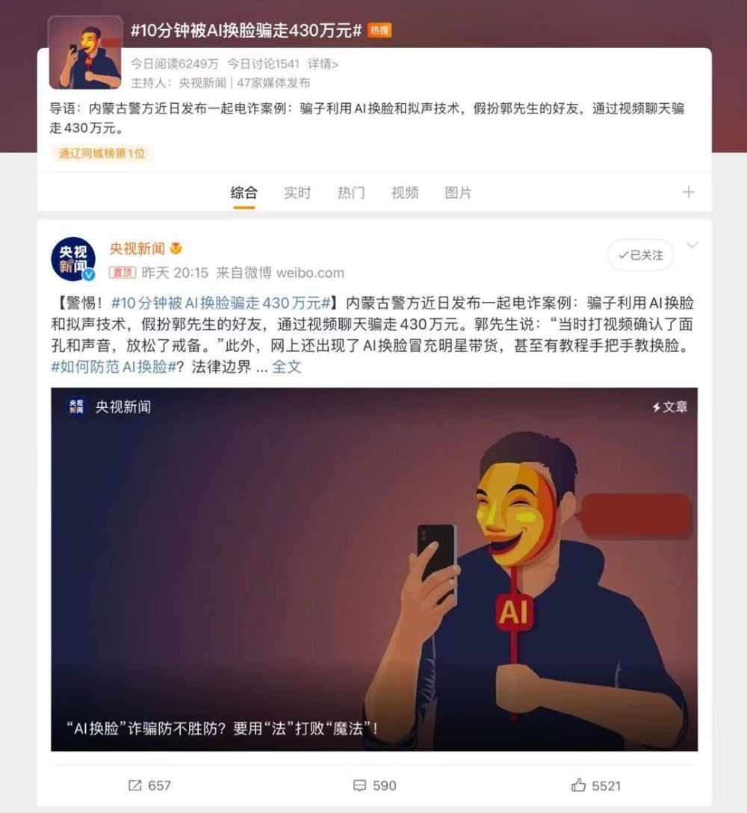

# 又一起AI换脸诈骗：安徽男子9秒被骗132万

继此前“10分钟被AI换脸骗走430万元”事件引发关注之后，5月22日，又一起AI换脸诈骗发生。这次金额达到132万，且整个诈骗过程时间更短，只有9秒钟。

_男子被骗过程_

5月22日，安徽安庆的何先生接到熟人视频电话，让他帮忙转一笔账。但9秒之后，对方以“在开会”为由，迅速挂断了电话，还称“微信和电话不能说，加一下QQ”。

“因为打了视频电话，又是熟人，我就没多想，就转账了”。事发时，何先生放松了警惕。发现被骗之后，何先生迅速报警，专案民警第一时间冻结相关账户，连夜赶赴北京市抓获3名涉诈嫌疑人，追回何先生被骗的132万元。

_此前媒体报道类似AI诈骗事件_

此前，央视曾报道一起金额高达430万元的AI换脸诈骗，过程与此案基本相似，诈骗分子都运用到了AI换脸以及拟声技术：4月20日，福建某科技公司法人代表郭先生突然接到“好友”微信视频，对方称自己的朋友在外地竞标，需要430万元保证金，郭先生见视频中的面孔和声音确实是“好友”，于是放松了警惕，仅在10分钟之内就向对方转账430万元。在福建、包头两地警方、银行的帮助下，其中300多万元被拦截，目前仍有90多万还在追查中。

_小红书已有相关提示_

澎湃记者了解到，目前AI换脸技术不仅被运用于电信诈骗，还出现在明星直播带货中。据此前网友反映，有主播盗用明星的脸进行商业带货，“点进直播间一看，‘迪丽热巴’居然在直播卖货”，定睛一看才识出破绽。

_应用商店已有多款AI换脸软件上架_

澎湃新闻记者在应用商店搜“AI换脸”，随即发现市面上已有一批软件的换脸技术，几乎可以以假乱真。某短视频平台还推出一款“AI随拍”玩法，用户可以将自己的脸带入明星身上，即可发布视频。

那么，面对这些防不胜防的诈骗技术，有什么方法可以识别呢？

据光明日报报道，专家提示，“AI假脸”的纹理特征存在破绽。例如，伪造后的视频人物的眼睛或牙齿轮廓细节容易不一致；两只眼睛瞳孔的颜色不一样或瞳孔中心反射的细节不一样；或是很多伪造视频由于视频分辨率低于原始视频分辨率，伪造出来视频的牙齿边缘过于整齐等。

另外，“AI假脸”有可能不符合正常人的生理特征，比如，一个健康成年人一般间隔2-10秒眨一次眼，每次眨眼用时0.1-0.4秒，而在伪造视频中，人的眨眼频率可能不符合上述规律。

最后，由于人嘴部的运动是最为频繁且快速的，因此AI软件无法真实准确地渲染连续动作。因此，“AI假脸”的嘴部特征有可能辨别出真假。此外，伪造后的视频会造成一定的视频抖动，导致视频出现帧间不一致情况。

