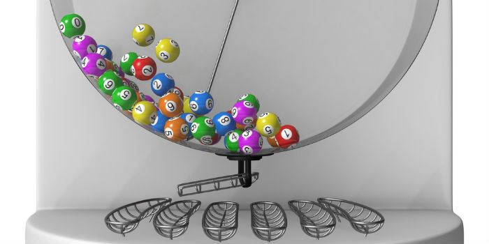

# 彩票卖疯了！4月全国共销售彩票503.26亿元，增长62%

**经济观察网 记者 杜涛**
财政部25日公布了2023年4月份全国彩票销售情况。4月份，全国共销售彩票503.26亿元，同比增加192.54亿元，增长62.0%。其中，福利彩票机构销售155.97亿元，同比增加36.28亿元，增长30.3%；体育彩票机构销售347.29亿元，同比增加156.26亿元，增长81.8%。

财政部称，主要原因是受体育赛事带动效应和彩票游戏促销等因素影响，竞猜型彩票和即开彩票增长较快。

从数据上看，福彩已经连续三月同比增幅达50%以上；体彩则延续世界杯开赛后的增长趋势，2022年11月至2023年4月期间，除去2023年1月同比增幅32%左右，其余月份同比增幅均在75%以上。

一位匿名的彩票专家告诉记者：“体彩增长主要来自竞彩，去年世界杯后竞彩销量开始大幅增长。”

该专家认为，今年彩票销量连续增长的原因主要来自两方面：“首先是世界杯后竞彩销售潜能被进一步激发，新增了一些年轻的新进购彩者；其次是即开彩票等游戏品种促销力度较大，使得销量能维持较高的增长。”

财政部数据也印证了专家的看法。数据显示，1-4月竞猜型彩票销售814.35亿元，同比增加447.77亿元，增长122.1%；即开型彩票销售304.26亿元，同比增加72.65亿元，增长31.4%。

对于连续三个月同比增幅达50%以上的福彩而言，上述匿名专家认为，“首先有疫情因素影响，2023年属于报复性反弹；其次便是‘口红效应’，经济下行压力加大，彩票销售增加。”

所谓“口红效应”是指因经济萧条而导致口红热卖的一种经济现象，也叫“低价产品偏爱趋势”。

“经济下行压力加大后，大家的主要娱乐消费受到影响，而彩票则成为了一种廉价的替代娱乐消费方式。”上述匿名专家称，因为收入下降了，就要寻找新的挣钱门路，而买彩票争取中奖是门槛最低的一种方式。

