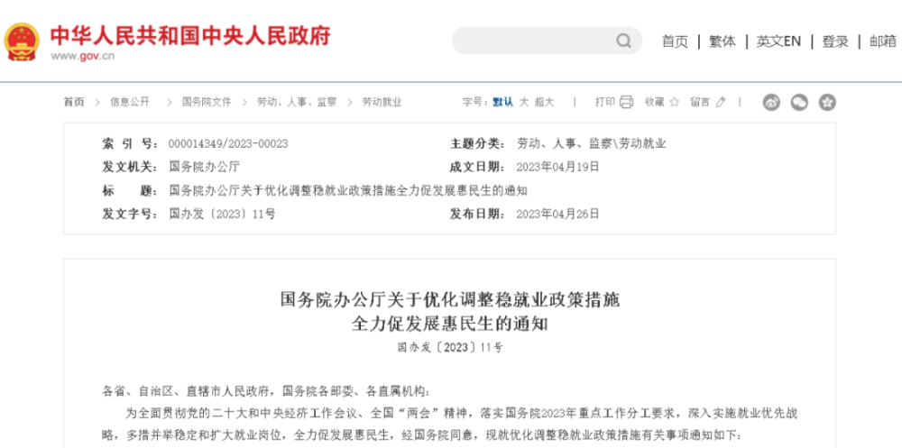
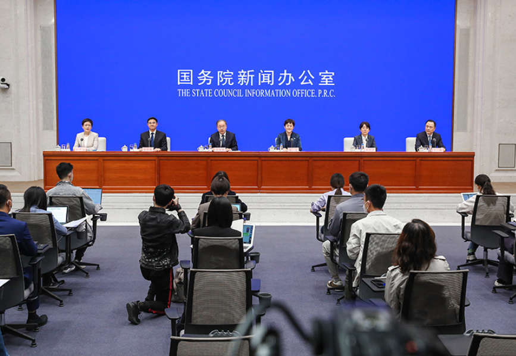
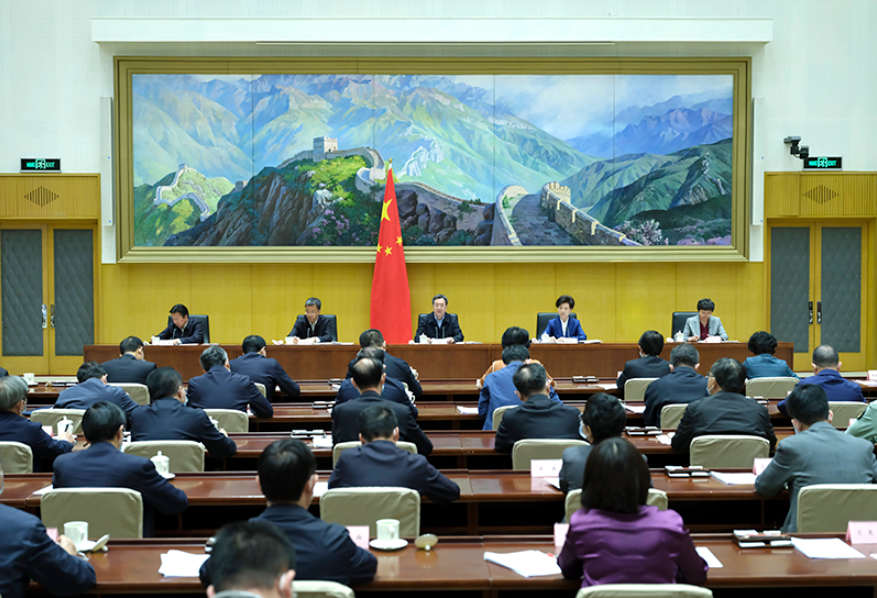
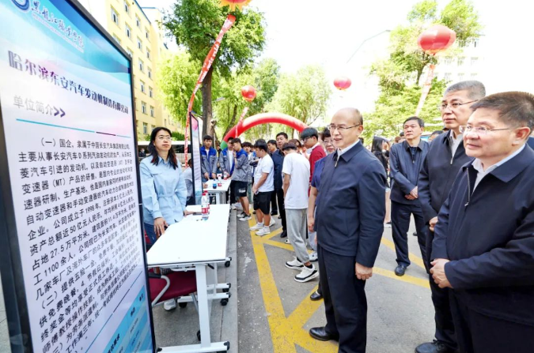

# 抢抓时间节点！中央确定的优先任务，多位省委书记有新动作

**撰文 | 高语阳**

5月24日，黑龙江省委书记许勤到哈尔滨市调研就业工作，并主持召开就业工作座谈会。

**许勤说，要全面落实就业优先政策，抓住主要矛盾，紧盯重点群体，抢抓时间节点，充分挖掘潜力，加强供需对接。**

稳就业是今年从党中央、国务院到地方的一项重要工作。

在中央提要求、国务院作部署以后，多个省份省委书记有新动作。

就业优先

**二十大报告中指出，要实施就业优先战略。**

2022年12月15日至17日，中央经济工作会议在北京举行，习近平出席会议并作重要讲话。

在部署2023年经济工作时，会 **议指出，要突出做好稳增长、稳就业、稳物价工作。**

**落实落细就业优先政策，把促进青年特别是高校毕业生就业工作摆在更加突出的位置。**

3月13日上午，刚当选国务院总理的李强出席总理记者会与中外记者见面。

在谈到就业问题时，
**李强说：“我们会全面落实就业优先的战略，进一步加大相关的政策支持力度，特别是就业服务、技能培训。”同时，要扩大和稳定就业岗位，对新的就业形态既要支持也要规范发展。**

“我看今年网上比较关心大学生就业，因为今年大学毕业生在中国再创新高，预计今年毕业的大学生规模是1158万人，对就业增加了一定压力。”

李强表示，下一步，将广开就业渠道，帮助支持年轻人通过自己的劳动和奋斗去实现自己更加美好的人生价值。

**4月14日，李强主持召开国务院常务会议，研究优化调整稳就业政策措施。**

会议指出， **要进一步强化政策引导，在保持稳就业政策总体稳定的同时，有针对性优化调整阶段性政策并加大薄弱环节支持力度，确保就业大局稳定。**

**要突出稳存量、扩增量、保重点**
，既有力有效实施稳岗支持和扩岗激励措施，更大程度调动企业用人积极性，又认真做好高校毕业生、农民工等重点群体就业服务，进一步稳定政策性岗位规模，多渠道拓宽就业空间。

**要着力破解结构性就业矛盾** ，采取务实管用措施稳定制造业、外贸企业等就业规模，突出就业导向优化高校专业设置，面向市场需求提升职业教育和技能培训质量。

“更加突出位置”

前文提到，2022年底举行的中央经济工作会议上指出， **把促进青年特别是高校毕业生就业工作摆在更加突出的位置。**

政知君梳理，国务院以及国家部委、地方等多个层面，都推出具体措施，落实促进高校毕业生等青年就业创业工作要求。

**4月26日，国务院办公厅发布《关于优化调整稳就业政策措施全力促发展惠民生的通知》。**
为深入实施就业优先战略，多措并举稳定和扩大就业岗位，《通知》从“激发活力扩大就业容量”、“拓宽渠道促进高校毕业生等青年就业创业”、“强化帮扶兜牢民生底线”、“加强组织实施”4个方面共推出15条举措，稳定和扩大就业岗位。

在“拓宽渠道促进高校毕业生等青年就业创业”部分， **《通知》指出，实施2023年百万就业见习岗位募集计划。**
动员各类企事业单位、社会组织等，募集不少于100万个青年见习岗位，对吸纳就业见习人员的给予见习补贴，对见习期未满与见习人员签订劳动合同的，各地可给予剩余期限见习补贴。

4月27日，国新办举行国务院政策例行吹风。人力资源和社会保障部副部长俞家栋介绍，今年以来，就业形势稳中有升。同时，
**外部环境复杂多变，就业形势稳中承压、稳中有忧，高校毕业生等青年就业压力依然较大，部分高技能人才、复合型创新型人才短缺，劳动者在就业领域还面临一些难题。**

俞家栋还表示，人社部将主要从五方面做好就业工作，包括稳定就业基本盘、拓展就业增长点、保障重点群体、促进供需匹配、提升就业质量。

其中， **在“保障重点群体”方面，要抓紧实施高校毕业生等青年就业创业推进计划，稳定毕业生就业水平。**

**5月11日，全国高校毕业生等青年就业创业工作电视电话会议举行。中共中央政治局常委、国务院副总理丁薛祥、国务委员谌贻琴出席会议并讲话。**

丁薛祥指出， **党中央、国务院高度重视高校毕业生就业创业工作，各地各部门各高校要再动员、再部署，确保完成今年高校毕业生就业目标任务。**

在“全面落实就业优先政策”方面，丁薛祥表示，用足用好各类政策性岗位，稳住各级各类事业单位招聘规模，确保央企国企接收高校毕业生人数不低于去年；实施好基层就业项目，引导高校毕业生到城乡社区就业。

同时，依法规范市场招聘秩序，严厉打击虚假招聘等违法行为，防范、纠正就业歧视。

多位省委书记有新动作

在地方，近期，黑龙江、吉林、江西等省份省委书记都已经围绕就业开展调研、召开专题会议。

**5月24日，黑龙江省委书记许勤到哈尔滨市调研就业工作，并主持召开就业工作座谈会。**

_许勤在哈尔滨调研_

许勤前往社区、黑龙江职业学院、哈尔滨理工大学等地调研。在黑龙江职业学院，许勤还前往正在进行中的校园招聘现场，了解用人企业、招聘岗位、就业意向等情况，并在学院工匠楼与正在开展实训的学生交流。

在随后召开的就业工作座谈会上， **许勤表示，全面落实就业优先政策，要把就业工作摆在更加突出的位置，抓紧抓实抓出成效。**

同时，要强化就业供需对接，树立市场化观念，加强就业供给和需求结构分析，调整优化高校专业和课程设置，有针对性加强技能人才培训，着力提升就业能力和社会需求匹配度。

**同天，吉林省委书记景俊海在长春调研稳就业工作情况。**

景俊海前往经开区人力资源市场正在举办的中小微企业专场招聘会现场，随机走访用人单位展位，了解用人需求，并听取求职群众对岗位、薪资等方面要求。

**景俊海说，** 要加强人力资源市场监管，为广大劳动者提供更稳定的工作岗位、更公平的就业环境、更可靠的权益维护。
**各级党委政府要持续强化就业优先政策，促进高质量充分就业。**

此外， **5月22日，江西省委书记尹弘主持召开全省就业工作专题会，研究部署稳就业工作。**

**尹弘指出，全面落实党中央、国务院决策部署，大力实施就业优先战略。其中，要全力以赴做好重点群体就业工作。**

要突出抓好高校毕业生就业，充分用好政策性岗位资源，引导毕业生到企业一线、到基层就业，精心组织校园招聘，积极搭建供需对接平台，结合市场需求优化学科设置和学生培养模式，进一步增强高校毕业生实践能力和就业能力；

要切实抓好农民工就业，加强对农民工外出、回流动态监测，以市场需求为导向加强技能培训，培养更多技术型、成熟型农民工；

要加强困难群体就业帮扶，统筹做好下岗失业人员等再就业工作，扩大公益性岗位托底安置。

**资料 ｜ 中国政府网 新华社 黑龙江日报 江西日报等各省份党报**

**【版权声明】本文著作权归政知新媒体独家所有，未经授权，不得转载。**

