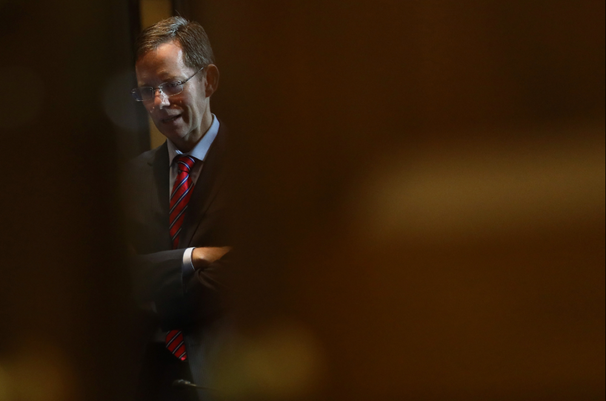

# 美媒披露：“美国务院负责中国事务最高官员”华自强即将离职

【环球网报道 记者 张晓雅】彭博社当地时间24日披露，美中关系陷入动荡之际，美国国务院负责中国事务的最高官员、副助理国务卿华自强（Rick
Waters）将离职。

报道援引美国务院官员消息披露，华自强当天在一次工作会议上表示，他计划在6月底离职。

_华自强
资料图_

彭博社提到，2022年12月16日，美国国务院成立“中国事务协调办公室”（非正式名称为“中国组”），并由华自强主管，他还自2021年6月起担任美国国务院负责中国大陆和台湾地区事务的副助理国务卿。

彭博社及路透社均提到，卸任有关中国事务的职位后，华自强仍将在美国国务院内部任职。

有关华自强主管的“中国组”，在设立之初就有专家表示，美国各部门成立的中国组执行的是已确定下来的涉华政策，旨在为落实美对华竞争的目标服务。外交学院国际关系研究所教授李海东2022年12月18日在接受《环球时报》采访时表示，拜登政府不同部门都有中国组，所有工作组的核心职能都不是决策，而是执行、落实相关涉华政策，“这些涉华政策无一不是以竞争为主导，美国务院发言人在谈及国务院成立的中国组时也指明是着眼于与中国竞争而成立，并没有提及合作。因此所有这些中国组成立目的不是寻求改变或突破美对华竞争为主导的政策，而是为了落实美对华竞争不同维度这一目标而服务。”

“华自强将离职是处理美中关系的官员最近一系列变动中的最新一例”。彭博社提到，今年2月，白宫国家安全委员会宣布，负责中国事务的高级官员罗森伯格将离职。本月早些时候，美国国务院“二号人物”、担任常务副国务卿的舍曼宣布将于6月底离职退休。

而就在这一最新消息出现之际，美媒及白宫本月多次放风称，华盛顿正考虑安排国务卿布林肯、财长耶伦、商务部长雷蒙多等高层官员访华，就实质问题与中国接触。中国外交部发言人汪文斌4月11日就美试图重启与中方对话有关问题回应说，美方应停止干涉中国内政，停止损害中国利益，停止一边声称要为中美关系加装“护栏”，一边破坏两国关系的政治基础，应同中方相向而行，推动中美关系重回健康稳定发展正轨。有关耶伦即将访问北京的问题，汪文斌5月19日对此回应称，中美之间保持着必要沟通。

