# 67岁演员罗京民去世，曾出演《士兵突击》，张译朱一龙王鹤棣悼念

5月26日，演艺圈突传噩耗，知名演员罗京民凌晨在西安因病去世，享年67岁。不少网友得知消息后，纷纷表示难以置信，不忍接受这个惨痛的噩耗。

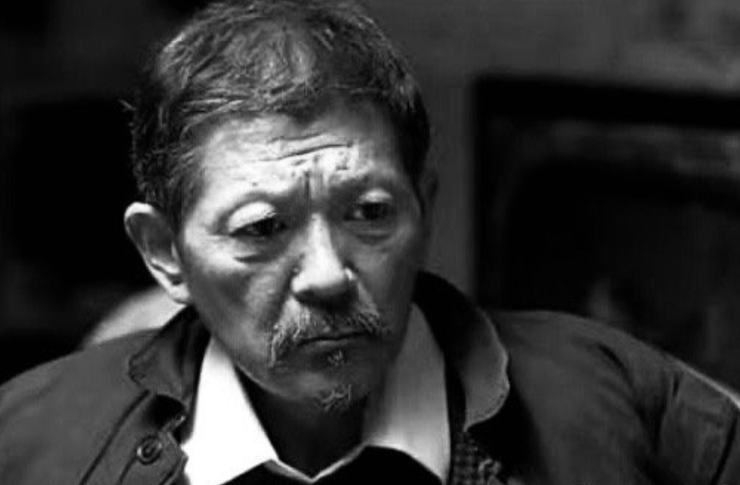

在得知罗京民去世的消息后，圈内不少演员纷纷发文悼念，其中，与其一起拍摄《士兵突击》的张译发文哀悼，字里行间流露出对罗老师的不舍之情。

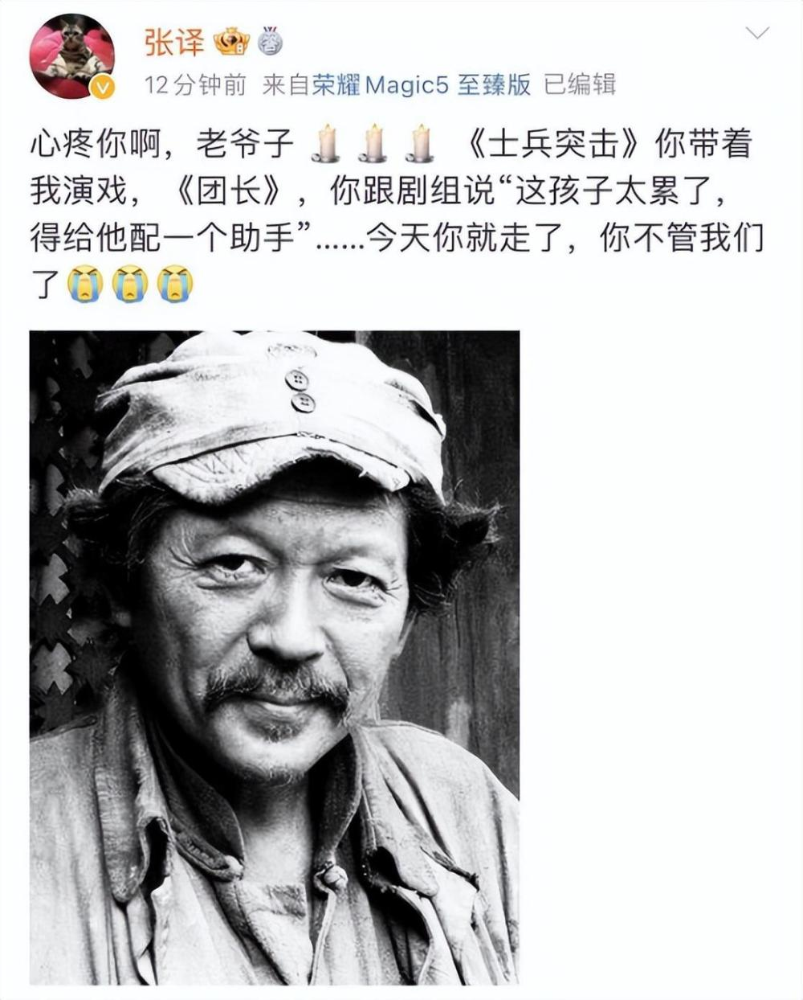

在文中，张译提到当初拍摄《士兵突击》之际，正是罗老师手把手地带着自己演戏，在拍摄《我的团长我的团》之际，也是罗老师最能体恤自己的不易，向剧组人员主动申请给他配备助手，面对罗老师的猝然离世，张译流露出孩子般的悲痛与心绪。

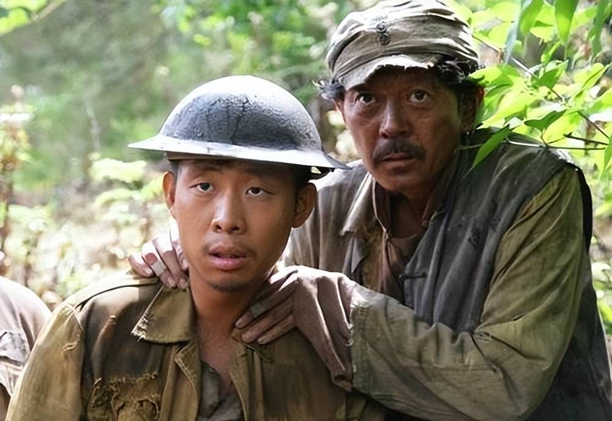

据悉，张译与罗京民老师曾合作了多部戏，除了上文提到的两部代表作之外，两人在《温州一家人》《生死线》等作品中也有密切合作。

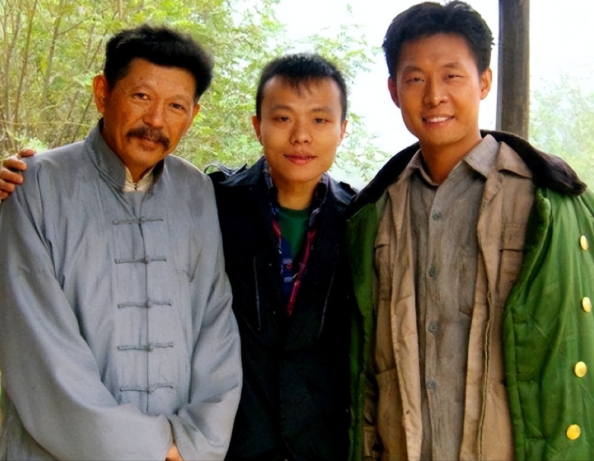

此外，演员张国强与刘天佐都先后发文表示缅怀，可以看出在片场的罗京民是一位值得钦佩的长辈与师者，他塑造的角色每一个都深入人心，活灵活现，给大家留下了难以磨灭的深刻影响，真正做到了“人戏合一，戏比天大”。

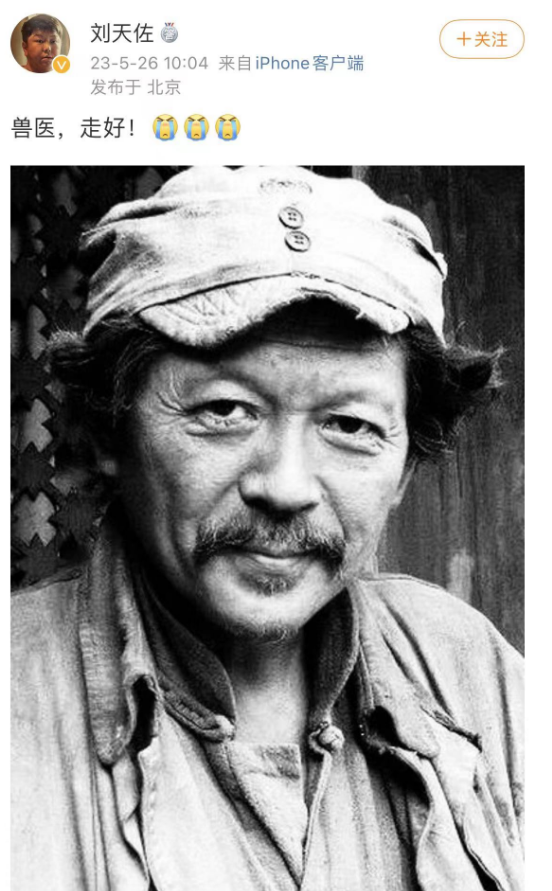

演员朱一龙也发文表示哀悼，字里行间流露出不舍与悲痛。据悉，两人在电影《人生大事》中扮演一对性格执拗的父子。

演员王鹤棣得知后也悲痛写下：“罗老师，一路走好。”

据悉，罗京民因为演技精湛老道，曾被誉为中国版的“摩根弗里曼”，34岁的他出道演戏，第一部作品便是潘欣欣执导的生活剧《平凡的世界》，此后的罗京民一直活跃在荧屏之上，陆续出演了作品《步入辉煌》《至高权力》《家在远方》等作品。

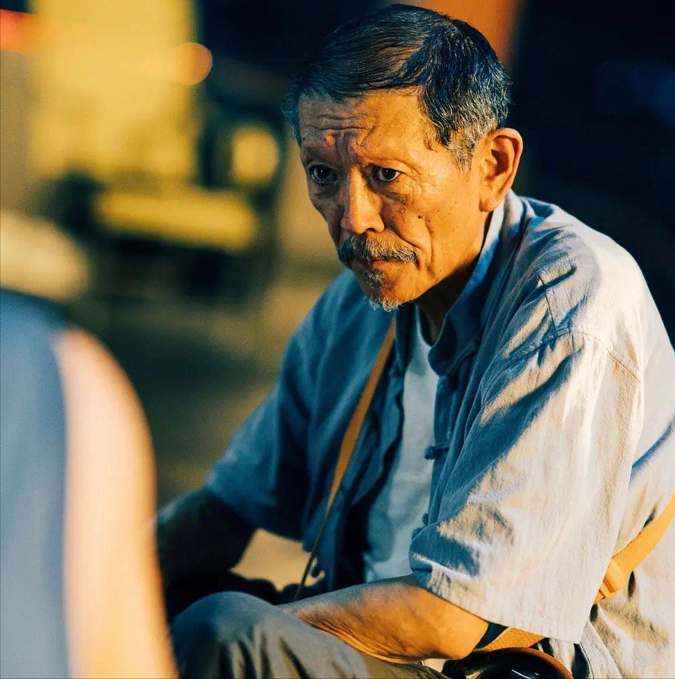

2006年，罗京民受邀参演了口碑剧作《士兵突击》，在剧中的他饰演许三多的父亲，虽然出场戏份并不多，但出色传神的演技让罗京民被更多观众所熟知。

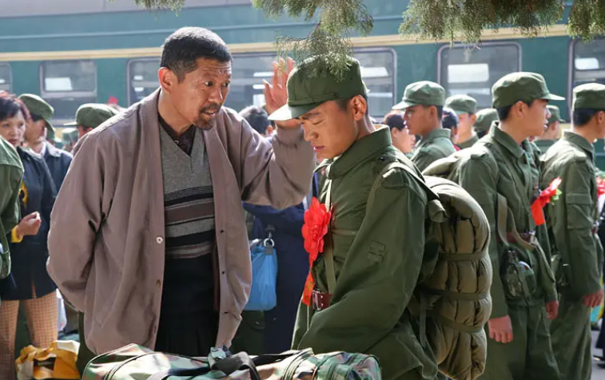

这次经历也让罗京民的演艺事业到达新的高度，此后的他得到契机出演更多优质力作，例如《生死线》《山海情》等，值得一提的是，2012年，罗京民领衔主演的电影《孙子从美国来》让他捧回一座金灿灿的奖杯，获得了北京大学生电影节最佳低成本男演员奖。

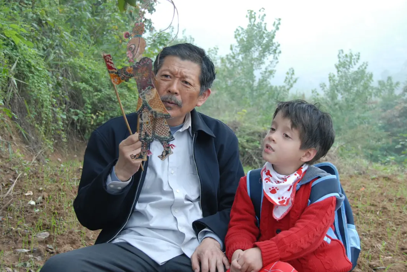

去年，罗京民参演的电影《人生大事》同样票房成绩喜人，在不少观众心目中，罗京民已经成为地道的父亲专业户。

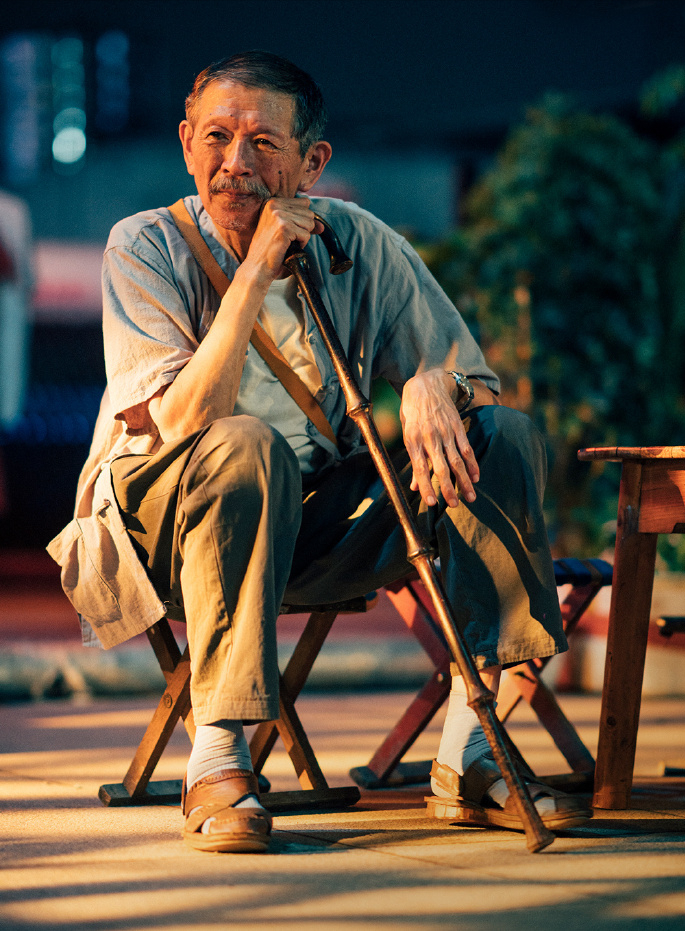

2023年，罗京民主演的多部作品也陆续面世，其中《情满九道湾》这部剧还在央视黄金档播出，6月10日，其主演的电影《极寒之城》也会与观众见面，只可惜罗老师俨然没有机会等到影片上映的那一天。

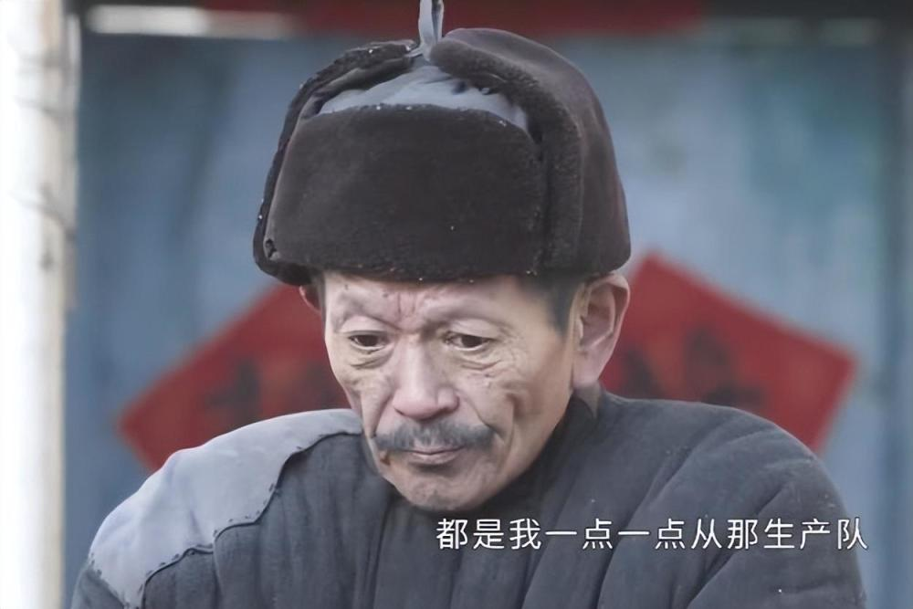

生活方面，罗京民曾经有一次失败婚姻经历，与前妻离婚之后，罗京民带着女儿一直孤独度日，在最为艰难的日子里，表演给予他足够的自信与能力，也让他能够有机会迎接自己的崭新人生。

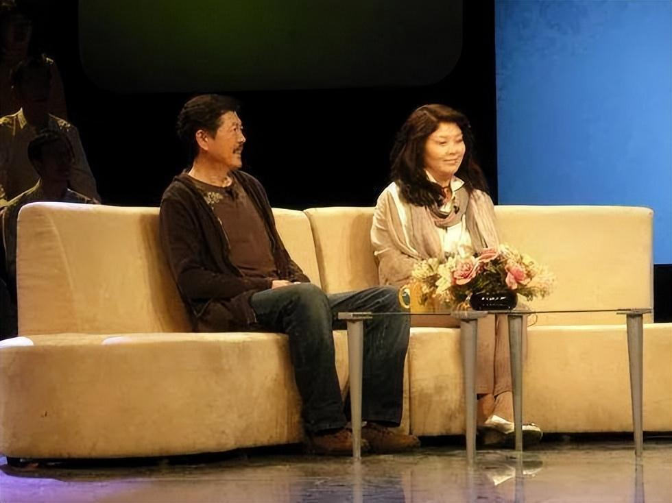

在缘分促使下，罗京民认识了后来的妻子王小庆，在女儿的全力支持下，两人相识不到20天便决定闪婚，婚后一同在北京安家生活，为了照顾女儿的情绪，夫妻俩最终考虑不再生育。

近年来罗京民在幸福婚姻的滋润下放开手脚打拼事业，在偌大的演艺圈中找到自己的归属，没想到命运就是这般无常，罗老师的人生竟这样提早谢幕。

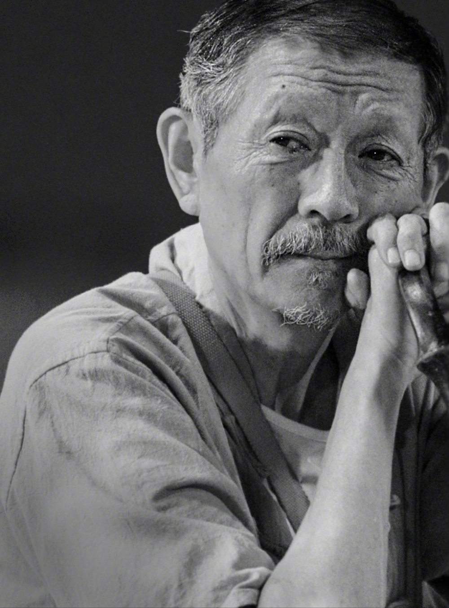

斯人已去，回忆永驻，希望在天之灵的罗京民老师能够感知到大家对他的敬爱与怀念，在另个世界生活安宁，实现自己未尽的遗憾。

